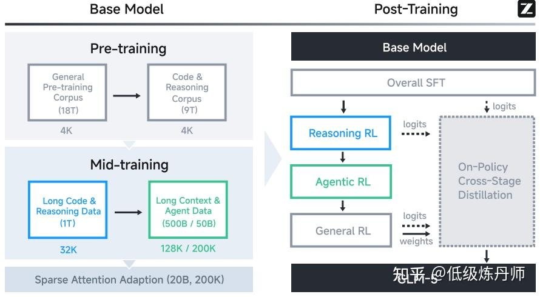
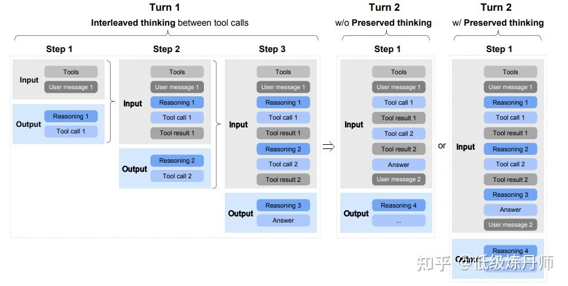
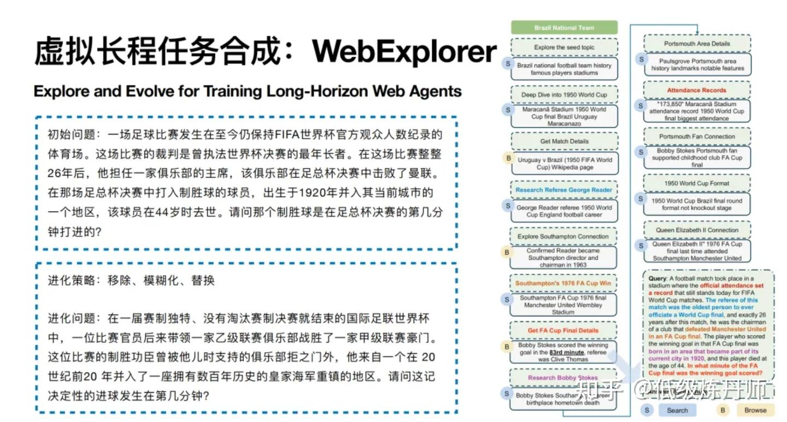
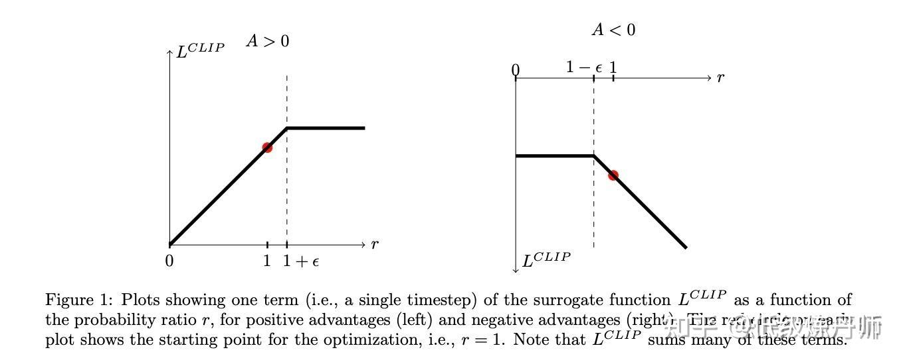
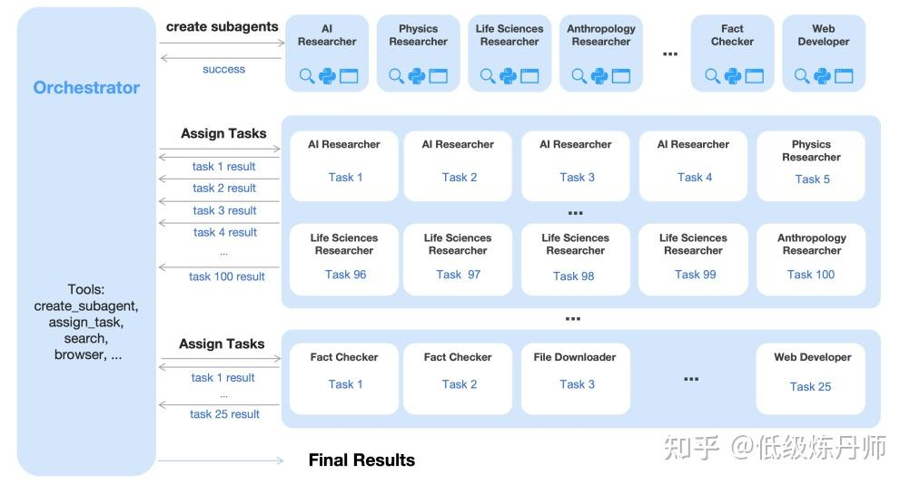

> 转载自知乎专栏原文: [https://zhuanlan.zhihu.com/p/2015552122071037375](https://zhuanlan.zhihu.com/p/2015552122071037375)
> 作者: 低级炼丹师
> 简介: ​关注欠阿贝尔两块钱、KaiH 等 407 人赞同了该文章
> 时间: 编辑于 2026-03-14 07:15・上海

这次分享主要围绕 **Agent 时代的基座大模型训练方法** 展开，**重点以 GLM-5 为主线，[MiniMax M2](https://zhida.zhihu.com/search?content_id=271383233&content_type=Article&match_order=1&q=MiniMax+M2&zhida_source=entity) 和[Kimi K2.5](https://zhida.zhihu.com/search?content_id=271383233&content_type=Article&match_order=1&q=Kimi+K2.5&zhida_source=entity)为支线**，系统梳理一个基模从预训练到后训练对齐、从数据构造到强化学习优化的完整链路。

内容上，首先会介绍 GLM-5 的整体训练流程，包括 **[Pre-Training](https://zhida.zhihu.com/search?content_id=271383233&content_type=Article&match_order=1&q=Pre-Training&zhida_source=entity)、[Mid-Training](https://zhida.zhihu.com/search?content_id=271383233&content_type=Article&match_order=1&q=Mid-Training&zhida_source=entity)、[SFT](https://zhida.zhihu.com/search?content_id=271383233&content_type=Article&match_order=1&q=SFT&zhida_source=entity)、[Reasoning RL](https://zhida.zhihu.com/search?content_id=271383233&content_type=Article&match_order=1&q=Reasoning+RL&zhida_source=entity)、Agentic RL、General RL 以及 Cross-Stage Distillation** 等关键阶段。接着，会进一步拆解其基础模型训练中对**代码、推理、coding场景** 的定向强化思路，以及后训练阶段如何通过多阶段 RL 逐步提升模型的 reasoning、coding 和 agent 执行能力。

在此基础上，分享还会重点讨论 **agentic 数据合成**。这里不仅包括传统意义上的文本合成，更包括 **任务合成、环境合成、反馈合成与轨迹合成**。以 GLM-5 和 MiniMax M2 为例，会分别分析 **SWE、Terminal、Search** 三类典型 agent 任务是如何从真实世界素材出发，被构造成可执行、可验证、可用于 SFT/RL 的训练样本。

最后，分享会结合 GLM-5 与 Kimi K2.5 等案例，进一步讨论大模型在 RL 阶段面临的几个核心训练挑战，包括 **训练—推理不一致、异步框架带来的 off-policy 问题，以及kimi k2.5的多智能体并行执行中的调度与奖励设计**。整体上，这次分享希望回答一个核心问题：

**一个真正具备 Reasoning、Coding 和 Agent 能力的现代大模型，究竟是如何被分阶段训练出来的。**

## 1、以 GLM-5 为例来看基模训练流程



*GLM-5训练流程*

GLM-5 的整体训练流程可以分为两大阶段：

**一、Base Model Training（基础模型训练）**

-   Pre-Training
-   Mid-Training

**二、Post-Training（后训练）**

-   SFT
-   Reasoning RL
-   Agentic RL
-   General RL
-   On-Policy Cross-Stage Distillation（跨阶段蒸馏）

**各阶段作用**

<table data-draft-node="block" data-draft-type="table" data-size="normal" data-row-style="normal"><tbody><tr><td>阶段</td><td>子阶段</td><td>主要作用</td><td>关键训练内容</td></tr><tr><td>Base Model Training</td><td>Pre-Training</td><td>学习通用语言、知识、代码与基础表征，构建统一基座模型</td><td>基于大规模 Web、Code、Math &amp; Science 语料进行自回归预训练；优化数据筛选、去重与质量控制；减少低质量合成推理数据引入</td></tr><tr><td>Base Model Training</td><td>Mid-Training</td><td>面向目标能力进行定向增强，提升长上下文建模、Agent 场景适配与软件工程理解能力</td><td>分阶段扩展上下文长度至 200K；引入长文档自然数据与合成数据；强化 repo-level code、issue、PR、commit diff 等软件工程序列建模</td></tr><tr><td>Post-Training</td><td>SFT</td><td>建立任务遵循、推理表达、工具使用与多轮交互的行为先验</td><td>使用 General Chat、Reasoning、Coding &amp; Agent 数据进行监督微调；训练 interleaved/preserved/turn-level thinking；对错误轨迹进行保留并在监督损失中掩蔽</td></tr><tr><td>Post-Training</td><td>Reasoning RL</td><td>进一步提升复杂问题上的推理正确性与稳定性</td><td>在数学、科学、代码及 TIR 等可验证任务上进行强化学习；采用结果导向奖励信号优化推理性能</td></tr><tr><td>Post-Training</td><td>Agentic RL</td><td>提升模型在外部环境中的多步决策、执行与工具调用能力</td><td>在 coding、search、terminal 等可验证环境中生成交互轨迹；基于测试结果或任务完成度给予奖励；通过 group-wise policy optimization 更新策略</td></tr><tr><td>Post-Training</td><td>General RL</td><td>优化通用场景下的正确性、交互质量与人类偏好一致性</td><td>围绕基础正确性、情感智能和任务特定质量 这三个方面进行强化学习；结合 rule-based rewards、ORMs、GRMs 及高质量人工答案</td></tr><tr><td>Post-Training</td><td>On-Policy Cross-Stage Distillation</td><td>融合不同阶段获得的能力，缓解多阶段训练带来的能力遗忘</td><td>以 SFT、Reasoning RL、General RL 等阶段的优质 checkpoint 为教师；在 on-policy 数据上进行跨阶段蒸馏，实现能力整合与恢复</td></tr></tbody></table>

可以把它理解成这样一条链路：

> **海量通用语料打底 → 长上下文和 Agent 数据强化 → 用监督学习塑形 → 用多阶段 RL 提升推理和执行能力 → 最后用蒸馏把各阶段能力重新“缝合”起来，避免遗忘**

这其实反映出一个很重要的趋势：

> **现代大模型的训练，不再是“一个阶段解决所有问题”，而是“不同能力分阶段建模、分阶段强化、最后统一收敛”。**

## 1.1 第一阶段：Base Model Training —— 先把“底座能力”练扎实

GLM-5 的基础模型训练分成两个阶段：

-   Pre-Training（预训练）
-   Mid-Training（中期训练）

这两个阶段加起来，总共使用了 **28.5万亿 tokens**，相当于把人类历史上所有文本、所有知识灌进去。

损失是交叉熵的 next-token loss，对全量通用文本做语言建模。

这里比很多模型更值得注意的一点是：它不是一次性把所有数据灌进去训练，而是**有计划地**改变训练目标。因为 GLM-5 的目标不是传统聊天模型，而是面向 ARC（Agentic, Reasoning, Coding） 的统一模型。所以在基础阶段，它就不是平均对待所有数据，而是早期就优先注重代码和 reasoning 能力。

* * *

### 1.1.1 Pre-Training：建立通用语言、代码和知识能力

> **学习通用语言、知识、代码的基础表征，构建统一基座模型**

预训练阶段的目标是构建一个强大的通用基础模型。

它的训练起点是一个规模非常大的语料集合，重点覆盖：

**① Web 数据**

```text
在 GLM-4.5 的基础上，GLM-5 进一步优化了网页数据筛选流程。它通过新的质量分类器挖掘更多高质量网页，同时用专门的知识分类器保留长尾知识，并尽量从中等质量数据中提取高信息密度内容。
这说明他们不只是做简单清洗，而是在想办法从噪声中保留真正有价值的知识。
```

**② Code 数据**

```text
代码数据是 GLM-5 的重点之一。论文提到，他们更新了主要代码平台的数据快照，扩充了含代码网页，并让去重后的唯一 token 数提升了 28%。同时，还修复了部分代码元数据问题，并提升了低资源编程语言的数据质量。
这背后的思路很明确：不是单纯增加代码量，而是提升代码语料的完整性、准确性和语言覆盖面，为后续 coding agent 打基础。
```

**③ Math & Science 数据**

```text
为了增强推理能力，GLM-5 还加入了高质量的数学和科学数据，来源包括网页、书籍和论文。数据处理上，他们优化了文档解析流程，并利用大模型对内容进行质量打分，尽量保留更有“教育价值”的部分，同时严格过滤低质量或模板化内容。
这意味着他们希望模型学到的不是表面形式，而是真正有助于推理的知识结构。
```

**预训练目标：**基座大模型预训练的目标，就是通过大规模自监督学习，让模型掌握通用的语言模式、知识和以及表征能力，成为后续各种任务的基础。

### 1.1.2 Mid-Training：定向语料强化

> **面向目标能力进行定向增强，提升长上下文建模、Agent 场景适配与软件工程理解能力**

如果说预训练阶段解决的是模型的通用知识与基础能力问题，那么 Mid-Training 的作用，则是围绕具体目标对模型进行进一步强化，重点包括以下三个方面：

1、长上下文处理能力
2、Agent 场景下的任务流程适配能力
3、复杂软件工程任务中的上下文建模能力

之所以单独设置 Mid-Training 阶段，原因在于这些能力在通用语料上学的不够好。

> 模型在普通长度文本上的表现良好，并不意味着它在 128K 甚至 200K 的上下文条件下仍然稳定；具备代码生成能力，也不意味着它能够理解真实软件工程场景中跨文件、Issue、PR 和 commit 之间的复杂关联；能够完成单轮问答，也不意味着它可以在长链路的 Agent 任务中持续保持一致性与连贯性。

因此，GLM-5 没有将这些目标完全留到后训练阶段处理，而是在基础模型训练之后增加了一个独立的 Mid-Training 阶段，用于面向长上下文、Agent 数据和软件工程数据进行定向强化。

* * *

**（1）上下文长度的逐步扩展**

在 Mid-Training 阶段，GLM-5 采用分阶段扩展上下文长度的策略（预训练只有4K），训练设置为：

-   **32K：1T tokens**
-   **128K：500B tokens**
-   **200K：50B tokens**

这一阶段将上下文长度逐步扩展到 200K，并引入更多长上下文 agent 数据，以提升模型在复杂工作流中的稳定性。这样逐步做的原因在于，上下文长度如果提升过快，容易带来训练不稳定，以及模型在超长序列上的性能退化。

**（2）软件工程数据的重点强化**

Mid-Training 的另一个重点是强化软件工程数据。训练样本会将 repo-level code files、commit diffs、GitHub issues、pull requests 以及 relevant source files 组织到同一序列中。

这样模型看到的就不再是孤立代码，而是更接近真实软件工程任务的上下文。这部分 issue–PR 数据最终约为 **160B tokens**，为后续 Agentic coding 能力提供了重要基础。

（**3）长上下文数据来自自然数据和合成数据**

GLM-5 的长上下文训练数据同时包含自然数据和合成数据。自然数据主要来自书籍、论文和长文档语料，经过筛选和清洗后用于提升模型对长文本的理解能力。合成数据则构造更强的长距离依赖和多轮记忆场景，进一步增强模型在长上下文任务中的表现。

* * *

## 1.2、第二阶段：Post-Training

GLM-5 的 post-training 阶段旨在将 base model 转变为一个具备强大 reasoning、coding 和 agentic 能力的高性能基模。整个 pipeline 采用了一种渐进式的 alignment 策略：

1、首先通过SFT引入更复杂的thinking模式；

2、随后进入针对 reasoning 和 agentic tasks 的RL阶段；

3、接着以 general RL 阶段完成更接近 human-style 的 alignment。

4、最后通过将 on-policy cross-stage distillation 作为最后的精炼步骤，GLM-5 能够有效地进一步优化整体能力。

* * *

### 1.2.1 SFT

> **建立任务遵循、推理表达、工具使用与多轮交互的行为先验**

GLM-5 的 SFT 数据主要覆盖三大类内容：

-   General Chat：包括问答、写作、角色扮演、翻译、多轮对话和长上下文交互
-   Reasoning：包括数学推理、编程推理和科学推理
-   Coding & Agent：包括前端和后端工程代码、tool calling、coding agents、search agents，以及通用型 agents

```text
在 General Chat 方面，GLM-5 对于 role-playing 任务，收集和构造了一个相当丰富丰富的数据集，覆盖多语言和不同角色配置。为了控制数据质量，他们还定义了多个评估维度，包括 instruction following、语言表现力、创造性、逻辑连贯性和长对话一致性，并结合自动筛选和人工筛选对数据进行清洗。
在 Reasoning 方面，GLM-5 增强了推理深度，具体来说，在逻辑推理场景中，团队构造了很多可验证的问题，并通过 rejection sampling 合成高质量数据。对于数学和科学问题，则采用基于难度的筛选方式，只保留那些真正具有挑战性的问题。
在 Coding & Agent 方面，GLM-5 构建了大量 execution environments，用于获取高质量 trajectories，重点覆盖真实场景和长流程任务。一个比较关键的细节是：对于 trajectory 中的错误片段，GLM-5并没有直接删除，而是选择保留这些内容，但在 loss function 中将其 mask 掉。这样做的好处是，模型仍然可以学习错误修正的过程，但不会因为这些错误动作而被错误监督信号强化。
```



*Interleaved Thinking和Preserved Thinking*

除此之外，GLM-5 在 SFT 阶段还支持**三种不同的 thinking 特性**：

-   Interleaved Thinking（交错式思考）：模型会在每次回复和 tool call 之前进行思考，从而提升指令遵循能力和生成质量。本质就是形成一个Thought-Action-Observation的思维链循环，相当于给后续react流程打个草稿。
-   Preserved Thinking（保留式思考）：在 coding agent 场景下，模型会自动保留多轮对话中的 thinking blocks，复用已有推理过程，而不是每一轮都重新推导。这种方式可以减少信息丢失和前后不一致，更适合长流程、复杂任务
-   Turn-level Thinking（轮次级别思考）：模型支持在同一 session 中按轮次控制是否启用 reasoning。对于简单请求可以关闭 thinking，以降低延迟和成本；对于复杂任务则可以开启 thinking，以提升准确性和稳定性

> **Preserved Thinking：**
> 在 GLM-5 的官方 API 调用中，是否启用 **Preserved Thinking** 由参数控制。
> **动态思考能力：**
> 提供参数用于控制是否开启思考能力。开启后，不同模型的行为如下：
>
> **glm-4.6、glm-4.5**：由模型自行判断当前任务是否需要进行思考。
> **glm-5、glm-4.7、glm-4.5v**：开启后将强制进入思考模式。

从这个设计可以看出，GLM-5 的 SFT 已经不只是传统意义上的“指令微调”，而是在行为层面提前为复杂任务做准备。模型不仅要学会回答问题，还要学会在工具调用和多轮交互过程中保持更稳定的推理模式。

整体来看，GLM-5 的 SFT 阶段承担了两个任务：一方面，它继续完成基础的行为对齐；另一方面，它也在为后续的 Reasoning RL、Agentic RL 以及更复杂的 tool-use 场景提前搭建行为模板。换句话说，这一阶段并不是简单地“把模型调得更像助手”，而是在为一个能够执行复杂任务的 agent 打基础。

* * *

### 1.2.2 RL

### 1.2.2.1 Reasoning RL：先强化推理能力

> **在数学、科学、代码及 TIR 等可验证任务上进行强化学习；采用结果导向奖励信号优化推理性能**

在完成 SFT 之后，GLM-5 的下一步不是立刻进入通用对齐，而是先单独进行 Reasoning RL。这一步的目标很明确：进一步提升模型在复杂任务上的推理能力，为后续的 Agent 能力训练打基础。

从整体流程上看，这个顺序是合理的。因为无论是代码执行、工具调用还是长流程任务规划，本质上都建立在推理能力之上。如果模型本身的推理链条不够稳定，那么后续 Agent 阶段即使加入更多环境和工具，也很难真正提升任务完成质量。

在训练数据上，GLM-5 的推理强化学习采用了混合领域训练，训练主要覆盖四个方向：数学、科学、代码、Tool-Integrated Reasoning（TIR）。在奖励设计上，这一阶段主要输出0和1的reward。也就是说，模型最终关注的是结果是否正确，是一个标准的RLVR（可验证奖励强化学习）任务。

从整个训练流程来看，这一步的作用非常关键。SFT 主要负责建立基本行为模式，而推理强化学习则进一步把模型在复杂问题上的“思考”的能力拉高，为后面的 Agentic RL 打下基础。

**数据样例：**

```text
{
  "prompt": "如果 3x + 2 = 11，求 x。请逐步思考，并最终只输出答案。",
  "ground_truth": "3",
  "reward_rule": "模型最终答案等于 3 则奖励为 1，否则为 0"
}
```

* * *

### 1.2.2.2 Agentic RL：让模型真正学会“执行任务”

> **提升模型在外部环境中的多步决策、执行与工具调用能力**

在 GLM-5 的 post-training 流程中，**Agentic RL** 是一个非常关键的阶段。

如果说前面的 **Reasoning RL** 主要解决的是“模型能不能想清楚”，那么 **Agentic RL** 要解决的就是另一个更难的问题：

> 模型能不能在真实环境里，把事情一步一步做出来。

这一步的训练目标，已经不再只是生成一段更好的答案，而是让模型在复杂任务中具备更稳定的行动能力，例如：

-   在 coding agent 场景中完成长链路的软件工程任务
-   在 search agent 场景中执行多步搜索、浏览和信息整合
-   在 terminal 环境中完成带有执行反馈的操作任务

* * *

总体步骤如下：

**Step 1：准备任务和可验证环境**

本质就是先构建可执行的任务、可交互的环境以及验证方式：

-   软件工程环境

-   基于真实 GitHub issue / PR构建任务
-   自动搭建 repo 环境
-   有 test script

-   terminal 环境

-   构建可执行任务
-   自动搭建 repo 环境
-   有 test script

-   search 环境

-   构造多跳搜索问题
-   agent 需要 search / open / extract/ python
-   根据最终答案和证据是否正确来给 reward

* * *

**Step 2：rollout 生成 agent 轨迹**

对每个任务，模型不是一次性输出，而是生成整条交互轨迹：

例如code agent：

-   读 issue
-   思考
-   打开文件
-   修改代码
-   执行测试
-   看失败日志
-   继续修复
-   最终完成

每条轨迹可以记成： y = (r\_1, a\_1, o\_1, r\_2, a\_2, o\_2, ..., r\_n, a\_n, o\_n)

其中：

-   r\_i ：reasoning / thinking
-   a\_i ：action / tool call
-   o\_i ：observation / 环境反馈

* * *

**Step 3：环境打分**

任务结束后，环境根据结果给 reward。

比如：

-   SWE：测试是否通过
-   Search：答案是否正确
-   Terminal：脚本是否通过

环境都是**verifiable environment**， reward 也都是使用测试脚本进行打分。

* * *

**Step 4：用 group-wise policy optimization 更新模型**

对同一个问题 x ，采样 K 条轨迹 \\{y\_1, \\ldots, y\_K\\} ，每条轨迹都有环境返回的 reward r(x, y\_i) 。

然后不直接使用原始 reward，而是构造一个**组内相对优势（advantage）**：

A(x, y\_i) = r(x, y\_i) - \\bar{r}(x)

其中： \\bar{r}(x) = \\frac{1}{K}\\sum\_{i=1}^{K} r(x, y\_i)

这里的 A(x, y\_i) 表示该轨迹在同一任务下相对于组内平均表现的**优势值**：

-   A(x, y\_i) > 0 ：该轨迹比组内平均更好，会被鼓励
-   A(x, y\_i) < 0 ：该轨迹比组内平均更差，会被压制

这种做法本质上是用组内平均 reward 作为 baseline 来构造 advantage，和 GRPO 类似，只少一个组内归一化。损失也是PPO/GRPO 风格的importance ratio乘上advantage，再配合 clipping构成。

> 训练的时候只有模型生成的 token 用于优化，环境反馈 token 不参与 loss。
> 即 observation 是条件输入，作为context可见但不直接作为学习目标。

* * *

### 1.2.2.3 General RL

> **优化通用场景下的正确性、交互质量与人类偏好一致性**

在完成 **Reasoning RL** 和 **Agentic RL** 之后，GLM-5 还引入了一个单独的 **General RL** 阶段。这个阶段的目标，不再局限于推理能力或 agent 执行能力本身，而是进一步优化模型在更广泛使用场景中的整体表现，使其更接近一个高质量、稳定、符合人类偏好的通用基模。

论文将 **General RL** 的优化目标拆分为三个相互补充的维度。

> 第一类是**基础正确性**。
> 这是整个 **General RL** 的基础，主要关注那些会直接影响回答可用性的核心问题，包括 **instruction-following 错误、逻辑不一致、事实性错误、知识幻觉以及语言不流畅等**。论文里强调，这一层优化的目标，是先把模型输出中的明显错误率降下来，让回答至少达到“可用”的水平。因为如果一个回答在事实或理解上已经出现根本性偏差，那么即使表达再自然，也可能对用户造成误导。
> 第二类是**情绪智能**。
> 在基础正确性之上，GLM-5 进一步优化模型的交流体验，希望它在回答中表现出更好的共情能力、更自然的语气和更接近人类的表达方式。也就是说，General RL 不只是追求“答对”，还希望模型“说得更像一个自然交流的助手”。
> 第三类是**特定任务质量**。
> 这一部分针对不同任务类型做更细粒度的优化。论文中提到，GLM-5 希望在 **写作、文本处理、主观和客观问答、角色扮演、翻译** 等不同任务上，都能从“基本正确”进一步提升到“质量更高”。这也意味着，不同任务需要不同形式的奖励信号，而不能只依赖一种统一标准。

围绕这三个目标，GLM-5 设计了一套 **hybrid reward system**，将三类奖励信号结合起来使用：

-   **rule-based reward functions**
-   **outcome reward models（ORMs）**
-   **generative reward models（GRMs）**

这三种奖励各有优缺点。

> **rule-based rewards** 的优点是明确、可解释，适合那些可以被规则准确描述的维度；但它的覆盖范围有限，很多复杂质量维度无法完全写成规则。
> **ORMs** 是只看答案的奖励模型，特点是信号方差低、训练效率高，但更容易被 reward hacking 利用，也就是模型学会钻评分规则的空子，而不是真正提升能力。
> **GRMs** 则通常由语言模型生成评分或结构化评价，相对更不容易被简单 exploit，不容易被钻漏洞，但问题是方差更高、稳定性更差。

因此，GLM-5 没有依赖单一奖励，而是采用混合设计，希望在精确性、训练效率和鲁棒性之间取得平衡。这也是 **General RL** 的一个关键特征：它面对的是非常多样化的通用任务目标，奖励系统必须足够灵活。

**高质量专家数据**

除了 reward 设计之外，GLM-5还提到一个比较有意思的点：**human-in-the-loop style alignment**。

他们并没有只用模型自己生成的回答来做优化，而是显式引入了高质量的人类撰写答案，作为风格和质量上的锚点。原因在于，如果完全依赖模型生成的数据不断自我优化，模型往往会越来越呈现出一种典型的“AI味”，比如 **过度冗长、表达套路化、缺少自然的人类写作细节**。通过加入 **expert human responses**，GLM-5 可以在优化过程中更好地靠近真实的人类表达风格，而不是只在模型自己的分布里循环强化。

* * *

**General RL的目标：的提升通用场景下的综合表现**

整体来看，**General RL** 解决的问题和前两个 RL 阶段并不相同。

**Reasoning RL** 主要关注推理深度，**Agentic RL** 主要关注任务执行，而 **General RL** 是从 **基础正确性、交流体验和单项任务质量**三个层面，提升模型作为通用 assistant 的整体可用性。

* * *

### 1.2.3 **On-Policy Cross-Stage Distillation**：防止一路训练一路遗忘

**1、什么要做这个**

多阶段训练是按不同目标顺序优化的。
这种优化容易出现一个问题：后面阶段学新东西时，会把前面阶段已经学好的能力削弱，形成能力的退化。

所以GLM-5在最后加了一个 **On-Policy Cross-Stage Distillation** 阶段，专门做“能力回收”。它的核心目标是：

在多阶段SFT+RL（如 Reasoning RL、General RL）训练后，用“在线蒸馏”把前面阶段学到的能力重新蒸回来，防止后续阶段把早期能力冲掉。也就是说，最后再做一轮训练，让当前模型去对齐前面各阶段的“老师模型”。

**2、Teacher 是谁，数据从哪来**

前面各训练阶段的最终 checkpoint 都可以当 teacher，包括：

-   earlier SFT stage
-   Reasoning RL stage
-   General RL stage

也就是：把之前各阶段最好的模型都当老师。

训练时的prompt不是随便来的，而是：

-   从对应 teacher 的训练集里采样
-   再按合适比例混合

所以本质上是：

> 用不同阶段各自擅长的数据分布，去让当前最终模型重新学习这些阶段的行为。

**3、算法流程：**

**输入：**

-   当前待优化模型 student policy \\pi\_\\theta
-   多个前序阶段 teacher checkpoints
-   各 teacher 对应的训练 prompt 集合

**训练流程：**

1.  从不同teacher 的训练集按比例采样 prompt x
2.  用当前 student policy 在这些 prompt 上生成样本 y （on-policy）
3.  对于生成序列中的每个 token：

-   计算 teacher 概率 \\pi^{infer}\_{\\theta\_{teacher}}(y\_t \\mid x, y\_{<t})
-   计算 student 概率 \\pi^{train}\_{\\theta}(y\_t \\mid x, y\_{<t})

4、构造advantage： \\hat A\_t = \\mathrm{sg}\\left\[\\log \\pi\_{teacher} - \\log \\pi\_{student}\\right\]

token级advantage是： \\hat A\_{i,t} = \\mathrm{sg}\\left\[\\log \\frac{\\pi^{infer}\_{\\theta\_{teacher}}(y\_{i,t} \\mid x, y\_{i,<t})}{\\pi^{train}\_{\\theta\_{student}}(y\_{i,t} \\mid x, y\_{i,<t})}\\right\]

其中：

-   x ：输入 prompt
-   y\_{i,t} ：第 i 个样本的第 t 个 token
-   \\pi^{infer}\_{\\theta\_{teacher}} ：teacher 在这个 token 上的概率
-   \\pi^{train}\_{\\theta\_{student}} ： student 在这个 token 上的概率
-   `sg`：stop gradient，表示这个 advantage 本身不反向传播

5、将这个 advantage 替换进原先的策略优化损失。

6、更新 student 参数

7、重复直到模型恢复并融合前序阶段能力

**4\. 这个 advantage 直觉上是什么意思**

这个式子本质上是： \\log p\_{teacher} - \\log p\_{student}

即：**teacher 比 student 更认可这个 token 的程度**。

于是：

-   如果某个 token 上 teacher 概率高、student 概率低
    → advantage 为正
    → 训练会推动 student 提高这个 token 的概率
-   如果 student 已经比 teacher 更高
    → advantage 为负
    → 训练会推动 student 降低这个 token 的概率

> 本质：是在 student **自己生成**的 token 序列上，蒸馏 teacher 对这些 token 的概率分布。

所以，On-Policy Distillation之所以更能避免知识遗忘，核心原因在于它让模型在自己的轨迹上学习，并且由教师提供密集、逐步的纠错信号，来重新对齐之前的各教师模型。

**On-Policy Distillation的未来展望：持续学习新范式**

在持续学习中，模型需要在获得新知识的同时尽量保持已有能力。传统 SFT 和一般 RL 都难以单独满足这一目标。

off-policy训练（如SFT） 的问题在于，它直接拟合新任务标注分布，容易把模型参数过度拉向新数据，从而破坏原有能力并导致灾难性遗忘。尤其是在知识注入场景下，SFT 往往缺乏对旧能力的显式约束，因此容易出现“学会新知识、忘掉旧能力”的现象。

一般 RL 虽然由于采用 on-policy 采样，通常比 SFT 更不容易遗忘，但它主要依赖稀疏奖励来优化行为，擅长“让模型做得更对”，却不擅长细粒度、密集地传递新知识。因此，RL 往往训练成本更高、样本效率更低，也较难高效完成知识注入。

相比之下，OPD 结合了两者的优点。它让学生模型先按照自己的当前策略生成轨迹，再由教师在这些学生真实会访问到的状态上（甚至可以提供答案级别的特权信息）提供逐 token 的监督信号。这样，OPD 一方面保留了 on-policy 训练更不易遗忘的特点，另一方面又利用蒸馏提供了高密度的知识传递。

因此，OPD 非常有望成为持续学习的新范式，因为它能够更好地统一两个核心目标：既减少旧知识遗忘，又更高效地吸收新知识。

## 2、数据合成，以GLM-5和MiniMax M2为例

> agentic 数据合成，不是生成几条“工具调用样例”这么简单，而是把任务、环境、验证器、轨迹采集、数据的筛选和迭代优化串成一条完整生产线。

它的核心目标是：

> 1、给模型构造真实可执行的任务环境
> 2、让模型在环境中真实交互，产生长轨迹
> 3、用可验证反馈筛出高质量轨迹
> 4、把这些轨迹变成 SFT/RL 可用的数据

换句话说，agentic 数据合成的关键不是“合成文本”，而是：

> **合成任务 + 合成环境 + 合成反馈 + 合成轨迹**

* * *

GLM-5中agentic 数据主要围绕三类任务构建：

> **软件工程环境（SWE environments）**
> 基于真实 Issue-PR对来构建可执行修复任务
> 目标是训练 coding agent
> **终端环境（Terminal environments）**
> 构造需要在 shell / Docker / 文件系统里操作的任务
> 目标是训练 terminal agent
> **搜索任务（Search tasks）**
> 构造多跳检索、多网页证据聚合的问题
> 目标是训练 search agent

## 2.1 Agentic 数据合成的标准流水线

> **Step 1：选择种子任务**

首先需要确定任务来源，作为后续数据合成的起点。
种子任务通常来自两类来源：一类是真实世界数据，如 GitHub Issue-PR、真实终端操作场景、网页语料等；另一类是模型早期探索过程中产生的轨迹数据，如 search agent 访问过的 URL、已有工具调用链等。
这一步的目标是为后续任务构造提供真实、丰富且有扩展价值的原始素材。

* * *

> **Step 2：转化为可执行任务**

在获得种子任务后，需要将其从原始素材转化为结构化、可执行的任务。
一个标准任务对象通常应包含：任务描述、输入上下文、可用工具、环境依赖以及验证脚本或判定标准。
这一步的目标是把原始问题从“自然语言描述”变成“模型可交互、系统可执行”的任务单元。

* * *

> **Step 3：构建可验证环境**

在完成任务结构化之后，下一步不是立刻让模型开始执行，而是要先为任务配置一个可交互、可自动验证的环境。

对于 agentic 数据合成而言，环境可以理解为 agent 执行任务时所面对的外部空间及其交互规则，它定义了 agent 能观察什么、能采取什么动作、动作会如何改变状态，以及系统如何验证任务结果。

更具体地说，一个环境通常包含以下几个部分：

**初始状态（initial state）**：任务开始时系统所提供的上下文和资源，例如代码仓库的当前版本、终端中的文件系统、网页集合、数据库内容、API 状态等。

**可执行动作空间（action space）**：agent 在该环境中被允许采取的操作，例如读写文件、运行命令、调用搜索工具、访问网页、编辑代码、调用外部 API 等。

**观测（observation）**：agent 每执行一步后能够看到什么，例如命令行输出、网页内容、工具返回结果、测试报错、日志信息等。

**状态转移（state transition）**：agent 的动作会如何改变环境，例如修改代码后测试结果变化、执行命令后产生新文件、浏览网页后获得新证据。

**验证与反馈机制（verification）**：系统如何根据最终状态或中间结果自动判断任务是否完成，以及是否给出奖励、错误信号或其他监督信息。

* * *

> **Step 4：执行任务并采集轨迹**

在环境搭建完成后，需要让 agent 在其中实际执行任务，并记录完整交互轨迹。
这里采集的不是单轮输入输出，而是包含思考、工具调用、环境观察、决策修正和最终提交结果的长时程过程数据。
这一步的目标是获取能够反映 agent 真实行为模式的样本轨迹。

* * *

> **Step 5：筛选、过滤与修复**

原始采集轨迹通常不能直接用于训练，因此需要进行质量控制。
常见处理包括：结果正确性验证、环境稳定性检查、捷径或 exploit 检查、一致性检查、任务难度过滤，以及样本去重和分布平衡。
必要时，还需要对任务本身或轨迹内容进行修复。
这一步的目标是确保最终保留下来的数据在正确性、稳定性和训练价值上都满足要求。

* * *

> **Step 6：转化为训练数据**

通过筛选后的任务和轨迹，最终被组织为可直接进入训练阶段的数据。
通常会分为两类：一类用于监督微调（SFT），保留高质量轨迹，并可对错误和低质量片段进行 masking；另一类用于强化学习（RL），保留任务和环境，用于agentic RL。
这一步的目标是将前述环境交互结果转化为可直接驱动模型优化的训练样本。

* * *

## 2.2 SWE 数据合成：从真实 Issue-PR 到可执行软件工程环境

> SWE 是 Software Engineering 的缩写，是让模型像真实开发者一样去处理代码仓库中的问题，它和普通的代码生成不太一样。

SWE 数据合成的核心，不是把 issue 文本和最终 patch 直接拼成一条监督样本，而是把一次真实的软件修复过程，重建成一个模型可以亲自执行的任务环境。这样模型面对的不是“请输出正确代码”，而是一个真实存在问题的代码仓库，它需要自己理解需求、定位问题、修改实现，并通过测试验证是否修复成功。在SWE的数据合成上，GLM-5和MiniMax的做法是类似的。

* * *

> 下面可以用一个更完整的例子来说明。

### 案例：修复用户注册接口的空用户名问题

### 1\. 原始素材（种子任务来源）：

**Issue: \[#123\] Registration API returns 500 when username is empty string**
描述：用户调用注册接口时，如果传入 username=""，系统当前会抛出未处理异常，最终返回 HTTP 500 Internal Server Error。期望行为是返回 HTTP 400 Bad Request，并给出明确错误信息，例如 “Username cannot be empty”。

**PR: \[#456\] Fix empty username handling in registration**
改动（概念层面）：

1.  在注册入口增加对空用户名的输入校验，避免请求继续进入后续创建用户流程。
2.  调整错误处理链路，将该场景从“内部异常”转为“标准化参数错误”。
3.  新增一个专门覆盖空用户名场景的测试。
4.  确保原有正常注册、登录等功能测试继续通过。

### 2\. 转化为可执行任务：

系统识别到这个 Issue-PR 对满足条件：问题描述清晰、修复目标明确、仓库可运行、并且存在可自动验证的测试信号，因此将其标记为一个候选 SWE 任务。

**任务描述：**
“修复注册接口问题：当 username 参数为空字符串时，应返回 HTTP 400 错误和提示信息，而不是 HTTP 500。”

**输入上下文：**

1.  完整的 Issue 文本描述。
2.  修复前的代码库快照：系统会将仓库恢复到 PR \[#456\] 合并之前的状态，也就是 Bug 仍然存在的版本。此时注册接口仍会在空用户名场景下返回 500。
3.  可用工具：Agent 可使用代码查看器、代码编辑器、终端/Shell、测试运行工具、版本差异查看工具等。
4.  环境依赖：该 Python Web 项目的运行环境，包括 Python 版本、依赖包、数据库或其他服务组件。通常会封装为可复现的容器化环境。
5.  测试标准：

1.  Fail-to-Pass (F2P) 测试：与空用户名问题直接相关的测试。其关键要求是：修复前失败，修复后通过。
2.  Pass-to-Pass (P2P) 测试：例如正常注册、正常登录等原本就通过的测试，修复后必须继续通过，用于防止回归。
3.  成功标准：指定测试集全部满足预期，即目标缺陷被修复，同时未破坏既有功能。

### 3\. 构建可验证环境

对于 SWE 任务，通常需要根据项目的依赖配置和运行要求构建一个容器化环境。具体做法可能是复用仓库已有的 Dockerfile，或根据 requirements.txt、environment.yml 等依赖信息在容器内完成依赖安装和初始化，以及将代码仓库恢复到指定的修复前快照。这样可以把任务封装成一个隔离、可复现的执行空间，保证 Agent 每次面对的都是一致的环境。

结合这里“修复注册接口空用户名问题”的案例，这个环境可以按前面定义的几个部分来理解：

-   **初始状态（initial state）**：容器中放入修复前的代码仓库快照，也就是空用户名仍会返回 500 的版本；同时提供 Issue 描述、项目依赖、数据库或服务初始化状态，以及对应测试脚本。
-   **可执行动作空间（action space）**：Agent 可以查看和搜索代码、编辑注册接口相关文件、运行测试命令、查看日志或错误信息。
-   **观测（observation）**：Agent 每次操作后会看到代码内容、命令行输出、测试失败信息，例如空用户名请求当前返回 500 而不是 400。
-   **状态转移（state transition）**：指 Agent 每执行一个 action 后，容器内环境状态发生的变化。例如修改注册接口代码后，容器内文件内容会被更新；运行测试后，会生成新的测试结果、日志或缓存；再次请求接口时，返回结果也可能从 500 变成 400。
-   **验证与反馈机制（verification）**：系统通过自动化脚本测试判断任务是否完成。这里主要看两类测试：一类是空用户名场景的 **F2P 测试**，要求修复前失败、修复后通过；另一类是正常注册、登录等 **P2P 测试**，要求修复后仍然通过。

所以，这一步的重点不是单纯把代码跑起来，而是为这个 bug 修复任务搭建一个 **可执行、可交互、可验证** 的环境，让 Agent 能真正完成“定位问题—修改代码—运行测试—确认修复”的完整过程。

### 4\. 执行任务并采集轨迹：

将上述任务描述、输入上下文、工具信息和环境交给 Agent。Agent 随后在真实环境中执行任务，并产生多步交互轨迹。长轨迹数据比单轮“问题-答案”更有价值，因为它能反映模型在搜索、修改、验证和纠错中的真实行为模式。

**Agent 的典型过程如下：**

1.  理解问题：阅读 Issue，确认目标是把空用户名场景从 500 改为 400。
2.  定位问题：查看注册接口相关文件，分析参数是如何进入业务流程的，识别缺少输入校验的位置。
3.  深入排查：如有必要，继续查看用户创建逻辑、异常处理链路和错误映射方式，确认 500 的根因。
4.  制定修复方案：决定在更合适的入口层做校验，并让错误以项目已有规范返回。
5.  修改实现：通过编辑器更新相关文件。
6.  运行测试：执行目标测试与相关回归测试，观察结果。
7.  根据反馈调整：如果目标测试通过但正常注册失败，说明修复引入了副作用，需要继续修改。
8.  再次验证：直到目标问题修复且原有功能不受影响。

**系统会记录完整轨迹，包括：**

1.  Agent 的每一步思考、动作、观测。

（1）查看了哪些文件、编辑了哪些文件。

（2）每次测试命令的输出。

（3）环境返回的报错、失败信息。

1.  最终提交的修改结果和反馈

这种“任务—环境—执行—反馈”的采集方式，正是 agentic 数据合成的核心，它不是只生成几条工具调用样例，而是采集可验证的、多步骤执行过程。

### 5\. 数据筛选、过滤与修复

原始轨迹通常不能直接进入训练，需要经过质量控制与筛选。常见处理包括：结果正确性验证、环境稳定性检查、轨迹逻辑一致性检查、去重、难度分层与分布平衡等。

**对应到这个案例，系统会做：**

1.  结果正确性验证：确认目标测试通过，且正常注册、登录等回归测试继续通过。
2.  环境稳定性检查：确保环境能稳定复现，测试结果不是偶发成功。
3.  捷径 / exploit 检查：避免 Agent 通过删代码、绕过逻辑、禁用测试等方式“假修复”。
4.  一致性检查：确保轨迹中的分析、修改与测试结果彼此一致。
5.  任务难度过滤：过于简单或无法稳定评测的任务可能被剔除。
6.  样本去重：避免大量高度相似的修复任务影响训练分布。
7.  必要时修复轨迹：如果轨迹局部存在无价值噪声，但整体结果可靠，可做裁剪或 masking。

### 6\. 转化为训练数据：

通过筛选后的任务和轨迹，会被整理成可直接用于训练的数据。通常分为两类：SFT 数据和 RL 数据。

**SFT 数据：**

-   保留通过验证的高质量完整轨迹。
-   轨迹中的步骤（思考、工具调用、观察）来作为一个训练样本。
-   如果轨迹中有错误步骤但最终成功，错误步骤可以被 Masking 掉，只学习正确的部分。

示例 SFT 样本 (片段):

-   User (问题): 修复注册接口问题：当 username 参数为空字符串时...
-   Assistant (思考): 我需要找到处理用户注册的代码。先搜索包含 'register' 的文件。
-   Assistant (工具调用): view file: api/register.py
-   Environment (观察): \[显示 api/register.py 内容\]
-   Assistant (思考): 函数 register\_user 直接使用了 username。应该在这里加校验。
-   Assistant (工具调用): edit file: api/register.py \[插入 if not username: return... 代码\]
-   ...

**RL 数据：**

-   保留任务描述、环境、Agent 的完整轨迹（可选）、环境的反馈（测试脚本）。
-   这些用于计算奖励信号（例如：通过所有 F2P 和 P2P 测试得高奖励，只通过部分得低奖励，破坏 P2P 测试得负奖励）。

**RL数据示例：**

```text
{
  "task_id": "swe_registration_empty_username_123",
  "task_type": "swe_fix",
  "source": {
    "issue_id": "#123",
    "pr_id": "#456",
    "seed_type": "issue_pr_pair"
  },
  "instruction": "修复注册接口问题：当 username 参数为空字符串时，应返回 HTTP 400 错误和提示信息，而不是 HTTP 500。",
  "context": {
    "issue_text": "Registration API returns 500 when username is empty string ... expected HTTP 400 with message 'Username cannot be empty'.",
    "repo_state": "pre_pr_456_snapshot",
    "environment": {
      "language": "python",
      "runtime": "containerized",
      "tools": [
        "file_viewer",
        "file_editor",
        "shell",
        "test_runner",
        "diff_viewer"
      ]
    }
  },
  "validation": {
    "f2p_tests": [
      "tests/test_registration.py::test_register_empty_username_returns_400"
    ],
    "p2p_tests": [
      "tests/test_registration.py::test_register_success",
      "tests/test_auth.py::test_login_success"
    ],
    "success_criteria": "All F2P and P2P tests pass"
  },
  "trajectory": [
    {
      "step": 1,
      "role": "assistant",
      "thought": "先定位注册接口和 username 的处理位置。"
    },
    {
      "step": 2,
      "role": "assistant",
      "action": {
        "tool": "shell",
        "input": "grep -R \"def .*register\\|register.*username\\|username\" -n app/ api/ tests/"
      }
    },
    {
      "step": 3,
      "role": "environment",
      "observation": "api/register.py:12:def register_user(request):\napi/register.py:16:username = request.json.get('username')\nservices/user_service.py:8:def create_user(username, password):"
    },
    {
      "step": 4,
      "role": "assistant",
      "thought": "查看注册入口实现，判断是否缺少输入校验。"
    },
    {
      "step": 5,
      "role": "assistant",
      "action": {
        "tool": "file_viewer",
        "input": "api/register.py"
      }
    },
    {
      "step": 6,
      "role": "environment",
      "observation": "def register_user(request):\n    username = request.json.get('username')\n    password = request.json.get('password')\n    user = create_user(username, password)\n    return JsonResponse({'id': user.id}, status=201)"
    },
    {
      "step": 7,
      "role": "assistant",
      "thought": "注册入口直接把 username 传给 create_user，空字符串会进入后续流程，符合 Issue 描述。应在入口层返回标准 400。"
    },
    {
      "step": 8,
      "role": "assistant",
      "action": {
        "tool": "file_viewer",
        "input": "services/user_service.py"
      }
    },
    {
      "step": 9,
      "role": "environment",
      "observation": "def create_user(username, password):\n    normalized = username.strip()\n    ...\n"
    },
    {
      "step": 10,
      "role": "assistant",
      "thought": "如果 username 是空字符串，strip 后可能触发异常或非法状态。最佳修复点仍是 API 入口。"
    },
    {
      "step": 11,
      "role": "assistant",
      "action": {
        "tool": "file_editor",
        "input": {
          "path": "api/register.py",
          "patch": "def register_user(request):\n    username = request.json.get('username')\n    password = request.json.get('password')\n\n    if username == \"\":\n        return JsonResponse({'error': 'Username cannot be empty'}, status=400)\n\n    user = create_user(username, password)\n    return JsonResponse({'id': user.id}, status=201)\n"
        }
      }
    },
    {
      "step": 12,
      "role": "assistant",
      "thought": "补充专门覆盖空用户名的测试，并执行目标测试与回归测试。"
    },
    {
      "step": 13,
      "role": "assistant",
      "action": {
        "tool": "file_editor",
        "input": {
          "path": "tests/test_registration.py",
          "patch": "def test_register_empty_username_returns_400(client):\n    resp = client.post('/register', json={'username': '', 'password': 'pass123'})\n    assert resp.status_code == 400\n    assert resp.json['error'] == 'Username cannot be empty'\n"
        }
      }
    },
    {
      "step": 14,
      "role": "assistant",
      "action": {
        "tool": "test_runner",
        "input": "pytest tests/test_registration.py::test_register_empty_username_returns_400 -q"
      }
    },
    {
      "step": 15,
      "role": "environment",
      "observation": "1 passed"
    },
    {
      "step": 16,
      "role": "assistant",
      "action": {
        "tool": "test_runner",
        "input": "pytest tests/test_registration.py::test_register_success tests/test_auth.py::test_login_success -q"
      }
    },
    {
      "step": 17,
      "role": "environment",
      "observation": "2 passed"
    }
  ],
  "result": {
    "status": "success",
    "modified_files": [
      "api/register.py",
      "tests/test_registration.py"
    ],
    "final_summary": "在注册入口增加空用户名校验，返回 HTTP 400 和明确错误信息；新增测试并确认正常注册、登录未回归。"
  },
  "reward": {
    "strategy": "test_based",
    "score": 1.0,
    "details": {
      "f2p_passed": true,
      "p2p_passed": true,
      "all_checks_passed": true
    }
  }
}
```

> 从这个例子可以看得更清楚，SWE 数据合成真正要做的，不是把“问题—答案”压成静态样本，而是把真实开发历史变成一个模型可以反复交互和验证的任务环境。

只有这样，模型学到的才不是表面的 patch 生成能力，而是更接近真实软件工程的执行能力。

* * *

## 2.3 Terminal 数据合成：怎么批量构造终端任务

> 除了软件工程环境，GLM-5 还专门构造了大量 Terminal 任务，用来训练模型在命令行环境中完成真实操作。

这里训练的重点不是“记住某条命令怎么写”，而是让模型学会在终端里连续执行任务：查看文件、修改内容、运行脚本、处理报错、根据结果继续调整，直到把任务真正完成。

这部分主要用了两种构造方式。

> **第一种方式，是从已有任务种子出发扩展。**

先准备一批真实的软件工程和终端操作场景作为起点，再让模型围绕这些任务生成更多新的终端任务草稿。接着，用一个专门的构造 agent 把这些草稿落地成标准任务，包括任务描述、Docker 化运行环境和对应的测试脚本。这样一来，一个原本只是描述性的任务想法，就变成了一个可以真正执行的终端任务。生成之后，还会再经过一个 refine agent 做检查和修正，重点看三件事：环境能不能稳定构建，测试和任务要求是否一致，以及任务里有没有可以投机取巧绕过去的漏洞。经过这套流程，最终可以稳定产出成千上万个可运行、可验证的 terminal 任务。

> **第二种方式，是从网页内容自动构造任务。**

先从大量技术网页中筛出高质量、和代码或命令行操作强相关的页面，再从里面挑出适合改写成 terminal task 的内容。之后，把这些网页内容和统一的任务格式要求一起交给 coding agent，让它自动生成完整的终端任务。这里有一个很关键的设计：生成完之后，agent 还要自己运行验证脚本检查任务是否合法；如果没通过，就继续修改，直到通过为止。也就是说，构造任务的 agent 同时承担了第一轮自检工作，只有那些通过自动验证的任务才会被保留下来。

简单总结一下，Terminal 数据合成做的其实就是三件事：

> 1、先找到合适的任务来源
> 2、再把任务变成可运行的 Docker 环境和可验证的测试脚本
> 3、最后通过自动检查把真正能用的样本筛出来

这样得到的数据才不仅能教模型“会不会写命令”，更能教模型“能不能把终端里的事做成”。

* * *

## 2.4、Search 数据合成：怎么构造高难多跳检索任务

### 2.4.1 GLM-5构造流程

> Search 数据合成的目标，不是生成普通问答数据，而是构造一批必须经过搜索、浏览和多跳推理才能完成的任务。

如果一个问题只靠模型记忆，或者一次搜索就能解决，那么它对 search agent 的训练价值其实有限。真正有价值的是那些需要跨网页检索、整合证据链、最后再完成推理的问题。

**下面我们结合一个实例来聊Search数据合成：**

我先给出一个最终问题：

> **问题：**
> “2022 年带领阿根廷赢得世界杯冠军的队长，目前效力于哪家俱乐部？这家俱乐部所在城市的 NBA 球队主场球馆叫什么名字？”

这个题为什么合适？
因为它表面上看是一个普通问题，但实际上要经过至少 4 跳：

1.  先识别“2022 年带领阿根廷赢得世界杯冠军的队长”是谁；
2.  再查这个人目前效力的俱乐部；
3.  再查这家俱乐部所在城市；
4.  再查这座城市的 NBA 球队；
5.  再查这支 NBA 球队的主场球馆名称；
6.  最后输出答案。

也就是说，它不是一搜就能直接命中的题，而是一个比较典型的**跨体育项目、跨网页、多跳检索题**。

**以下是Search数据合成步骤：**

* * *

> **1\. 从早期 search agent 的轨迹中收集网页**

这种数据不是在一开始就靠人工直接编题。
更合理的方式，是先让早期 search agent 去做大量真实世界问答，然后把它访问过的网页保留下来。

比如 agent 在处理与梅西相关的问题时，可能访问过这些页面：

-   世界杯报道页：确认 2022 年阿根廷夺冠、队长是谁
-   梅西人物介绍页：确认目前效力俱乐部
-   俱乐部官网：确认俱乐部所在城市
-   NBA 球队官网或百科页：确认该城市对应的 NBA 球队
-   球馆介绍页：确认主场名称

这些 URL 会先被记录下来，再做去重和清洗，筛掉质量差、广告页、聚合噪音页，保留信息密度高、结构稳定、可重复访问的页面。

**为什么这一步重要**
因为这些网页不是人工主观挑出来的，而是**真实 agent 在解决问题时会访问的网页**。
所以基于这些网页生成出来的问题，更接近真实 search 场景，而不是人为拼接出来的假题。

* * *

> **2\. 构建网页知识图谱（WKG）**

收集到网页之后，不会直接出题，而是先做结构化处理。
这里的核心是构建网页知识图谱（WKG）：从网页中抽取实体、属性和关系，并对这些信息做对齐、归一化和清洗。

这样做的目的，是为了让后续问题生成不再是随意拼接，而是基于明确的关系链来构造多跳问题。

在这个例子里，可以从网页中抽出下面这些实体和关系：

-   阿根廷国家队 —— 2022 世界杯冠军 —— true
-   梅西 —— 身份 —— 阿根廷队长
-   梅西 —— 当前效力 —— 迈阿密国际
-   迈阿密国际 —— 所在城市 —— 迈阿密
-   迈阿密 —— NBA 球队 —— 迈阿密热火
-   迈阿密热火 —— 主场球馆 —— Kaseya Center

* * *

> **3\. 基于知识图谱生成多跳问题**

有了知识图谱之后，系统会从中采样一些低频到中频的实体作为起点，再向外扩展它们的多跳邻域，形成一小块子图。
随后，再把这块子图改写成自然语言问题。

这里最关键的一点是：问题表面上看起来是一个普通问句，但背后实际上隐含了一条多跳关系链。
也就是说，模型如果想答对，通常必须经过多步搜索和浏览，而不能直接依赖参数记忆。

这里的起点是“2022 年带领阿根廷夺冠的队长”，

多跳链条是：

-   2022 世界杯阿根廷队长
-   梅西
-   当前俱乐部：迈阿密国际
-   所在城市：迈阿密
-   NBA 球队：热火
-   主场球馆：Kaseya Center

然后把这条图谱关系改写成自然语言问题：

> **“2022 年带领阿根廷赢得世界杯冠军的队长，目前效力于哪家俱乐部？这家俱乐部所在城市的 NBA 球队主场球馆叫什么名字？”**

* * *

> **4\. 过滤掉过于简单的问题**

问题生成出来以后，还不能直接拿去训练，还要过滤。

第一层过滤：去掉“不用搜索也能答”的题
如果问题是：

> “2022 年带领阿根廷赢得世界杯冠军的队长是谁？”

这种题大模型可能直接靠记忆就答出“梅西”，
那它对 search agent 的训练价值就不高。

第二层过滤：去掉“一次搜索就能解决”的题
比如：

> “梅西目前效力哪家俱乐部？”

这种题虽然需要外部信息，但通常一次搜索就能直接命中答案。
这种题对训练多跳检索也不够有价值。

为什么这个题能留下来
因为它至少要跨越多个实体类型：

-   世界杯人物
-   足球俱乐部
-   城市
-   NBA 球队
-   球馆

而且这些信息通常不会集中在同一个网页里完整给出。
所以模型必须做多次检索与页面跳转，不能靠一次搜索就结束。

* * *

> **5\. 做答案与证据的一致性验证**

难度高还不够，还要保证题目本身可靠。

因此最后还要加入验证环节，检查：

-   答案是否唯一；
-   证据链是否闭合；
-   不同页面之间是否冲突；
-   中间跳转是否存在歧义。

**验证 agent 需要确认：**

1.  “2022 年带领阿根廷夺冠的队长”唯一指向梅西；
2.  梅西当前俱乐部确实是迈阿密国际；
3.  迈阿密国际所在城市确实是迈阿密；
4.  迈阿密对应的 NBA 球队是热火；
5.  热火主场球馆确实叫 Kaseya Center。

如果某一步有多个候选，比如“某城市不止一支 NBA 球队”，或者球馆名称因赞助商更名而冲突，就要做时间对齐和证据消歧。
只有当最终答案明确、证据一致，这个问题才会被保留下来。

* * *

```text
这个例子的完整答案与推理：
题目  ：
“2022 年带领阿根廷赢得世界杯冠军的队长，目前效力于哪家俱乐部？这家俱乐部所在城市的 NBA 球队主场球馆叫什么名字？”

完整推理链条
1. 2022 年阿根廷赢得世界杯冠军，队长是梅西。
2. 梅西目前效力的俱乐部是迈阿密国际（Inter Miami CF）。
3. 迈阿密国际所在城市是迈阿密。
4. 迈阿密对应的 NBA 球队是迈阿密热火（Miami Heat）。
5. 迈阿密热火目前的主场球馆叫Kaseya Center。

最终答案
- 俱乐部：迈阿密国际
- NBA 球队主场球馆：Kaseya Center
```

```text
这个例子的sft数据：
{
  "id": "search_sft_messi_001",
  "system": "你是一个具备搜索和网页浏览能力的助手。请先逐步拆解问题，再逐步检索，最后依据证据回答。",
  "user": "2022年带领阿根廷赢得世界杯冠军的队长，目前效力于哪家俱乐部？这家俱乐部所在城市的NBA球队主场球馆叫什么名字？",
  "assistant_trajectory": [
    {
      "thought": "先确定2022年阿根廷世界杯冠军队长是谁。",
      "action": "search",
      "input": "2022 阿根廷 世界杯 冠军 队长"
    },
    {
      "observation": "结果显示阿根廷在2022年卡塔尔世界杯夺冠，队长是梅西。"
    },
    {
      "thought": "接着确认梅西目前效力的俱乐部。",
      "action": "search",
      "input": "梅西 目前 效力 俱乐部"
    },
    {
      "observation": "结果显示梅西目前效力于迈阿密国际（Inter Miami CF）。"
    },
    {
      "thought": "然后确认迈阿密国际所在城市。",
      "action": "search",
      "input": "Inter Miami CF 所在城市"
    },
    {
      "observation": "结果显示迈阿密国际所在城市为迈阿密。"
    },
    {
      "thought": "再查迈阿密对应的NBA球队。",
      "action": "search",
      "input": "迈阿密 NBA 球队"
    },
    {
      "observation": "结果显示迈阿密的NBA球队是迈阿密热火。"
    },
    {
      "thought": "最后查询迈阿密热火主场球馆名称。",
      "action": "search",
      "input": "迈阿密热火 主场 球馆"
    },
    {
      "observation": "结果显示迈阿密热火主场球馆为Kaseya Center。"
    }
  ],
  "assistant_final": "2022年带领阿根廷赢得世界杯冠军的队长是梅西。梅西目前效力于迈阿密国际（Inter Miami CF），这家俱乐部所在城市迈阿密的NBA球队是迈阿密热火，其主场球馆叫Kaseya Center。"
}
```

```text
这个例子的RL数据：
{
  "episode_id": "search_rl_messi_001",
  "question": "2022年带领阿根廷赢得世界杯冠军的队长，目前效力于哪家俱乐部？这家俱乐部所在城市的NBA球队主场球馆叫什么名字？",
  "environment": {
    "tools": ["search", "open_url", "extract", "finish"],
    "max_steps": 10
  },
  "gold_answer": {
    "club": "Inter Miami CF",
    "arena": "Kaseya Center"
  },
  "gold_evidence_chain": [
    "2022年世界杯阿根廷冠军队长是梅西",
    "梅西目前效力于Inter Miami CF",
    "Inter Miami CF所在城市为迈阿密",
    "迈阿密的NBA球队是迈阿密热火",
    "迈阿密热火主场球馆为Kaseya Center"
  ],
  "trajectory": [   # 可选
    {
      "step": 1,
      "action": "search",
      "input": "2022 阿根廷 世界杯 队长",
      "result": "识别出梅西",
      "reward": 0.2
    },
    {
      "step": 2,
      "action": "search",
      "input": "梅西 当前俱乐部",
      "result": "找到Inter Miami CF",
      "reward": 0.2
    },
    {
      "step": 3,
      "action": "search",
      "input": "Inter Miami CF city",
      "result": "确认城市为迈阿密",
      "reward": 0.15
    },
    {
      "step": 4,
      "action": "search",
      "input": "迈阿密 NBA 球队",
      "result": "找到迈阿密热火",
      "reward": 0.15
    },
    {
      "step": 5,
      "action": "search",
      "input": "Miami Heat arena",
      "result": "找到Kaseya Center",
      "reward": 0.2
    },
    {
      "step": 6,
      "action": "finish",
      "input": {
        "club": "Inter Miami CF",
        "arena": "Kaseya Center"
      },
      "result": "答案正确且证据链完整",
      "reward": 1.0
    }
  ]
}
```

### 2.4.2 MiniMax M2 构造流程

> minimax也做了很多关于search场景的数据构造工作，核心思想包含两部分：第一步是通过智能体自由探索构建信息丰富的种子问题；第二步是迭代式地进行 Query 进化来提升问题复杂度。



展开一个例子：对于 WebExplorer 来说，最开始只有一个随机种子，比如“巴西国家队”。模型通过搜索找到 1950 年世界杯及“马拉卡纳惨案”。比赛信息中提到裁判叫 George Reader，他多年后在英格兰俱乐部担任主席，该俱乐部在 1976 年足总杯击败曼联夺冠，制胜球由 Bobby Stokes 打进。

模型最后将搜索链路的线索综合，生成一个信息丰富的初始问题。

生成问题后，我们会发现这个问题虽然信息量大，但有明显的搜索入口。进化的策略包括移除、模糊化和替换。比如：

-   把具体的比赛信息模糊化为“赛制独特、没有淘汰赛的世界杯”；
-   把“足总杯击败曼联”这种显著信息改为“带领乙级联赛俱乐部战胜甲级豪门”，增加搜索难度；
-   把球员去世年龄等容易在 Wiki 搜到的信息移除。

最终进化出的 Query 相比初始问题复杂得多，没有明显的搜索入口，模型必须根据线索一步步探索。这样大大增加了任务难度。

**具体方案：**

**第一步**先给模型一个种子实体，比如 “Brazil National Team”，再给它一些示例 QA，然后让它像一个网页智能体一样自己反复做：

-   search
-   browse
-   根据新发现的信息继续 search / browse

这样模型会围绕这个种子，自主扩展出一个“信息空间”。

对应到这个例子里，过程大致是：

“巴西国家队”
→ 搜到 1950 世界杯、马拉卡纳惨案
→ 看到裁判 George Reader
→ 再搜到他后来当过 Southampton 主席
→ 再搜到 Southampton 在 1976 足总杯赢了曼联
→ 再看到 Bobby Stokes 打进制胜球
→ 再补充 Bobby Stokes 的出生地、年龄等信息
→ 最后把这条搜索链路串成一个信息丰富的初始问题

这一步的重点不是直接“出题”，而是先让**模型围绕种子主题自由探索，收集一串可以连接起来的事实链**，再基于这条链合成一个初始 QA。这样的初始 QA 通常有几个特点：

-   信息量很丰富
-   需要跨多个网页
-   需要多步推理
-   但通常还不够难，因为搜索入口比较明显

**第二步**是在这个初始问题的基础上，继续做迭代式 Query 进化。思路不是不断往题里添加新信息，而是反过来做 **long-to-short evolution**：从一个信息很全、比较长的问题出发，逐步删掉、模糊化、替换掉那些过于显眼的线索，让题目更难搜。

主要有三种进化方式：

1.  **removing salient information**
    去掉显著线索
2.  **strategic obfuscation**
    把日期、地点、专有名词等具体信息模糊化
3.  **alternative descriptions / replace**
    可替代的描述移除

放到这个例子里，就是：

-   把“1950 世界杯决赛”改成“没有淘汰赛决赛的独特世界杯赛制”
-   把“1976 足总杯击败曼联”改成“带领乙级俱乐部战胜甲级豪门”
-   把“球员去世时 44 岁”这种很容易检索到的线索直接删掉

这样做之后，问题就不再给出特别明确的搜索入口，模型不能靠几个关键词直接命中答案，而是必须根据线索一步步探索。

## 3 训练策略-常见问题的解决方案

## 3.1 训推不一致问题

> 在RL训练大模型时，一个很常见但又很容易被忽视的问题叫做：训练-推理不一致

简单说就是：

> 训练时，模型更新参数用的是一种分布，而采样生成时，轨迹却可能来自另一种分布，这两者不一致，就会导致优化目标（梯度估计）“偏了”。

尤其在大模型 RL 里，训练往往不是直接拿当前模型实时生成的所有 token 来更新，而是先用某个“旧策略”采样，再拿这些样本训练当前策略。这样一来，就会出现：

> 训练看到的 token 分布和实际推理出来的 token 分布并不完全一致。

如果这个偏差太大，就会带来几个问题：

-   梯度估计不稳定；
-   奖励优化方向失真；
-   RL 训练效果变差，甚至越训越坏。

* * *

### 3.1.1 IcePop

> GLM-5的 RL 算法在 GRPO的基础之上，结合了蚂蚁的IcePop思想，以缓解训练—推理不匹配问题。

该方法显式地区分：

-   训练策略 π\_{train} ：用于梯度更新；
-   推理策略 π\_{infer} ：用于采样轨迹。

损失为： L(\\theta) = -\\mathbb{E}\_{x \\sim \\mathcal{D}, \\{y\_i\\}\_{i=1}^{G} \\sim \\pi\_{\\theta\_{\\text{old}}}^{\\text{infer}}(\\cdot \\mid x)} \\left\[ \\frac{1}{G} \\sum\_{i=1}^{G} \\frac{1}{|y\_i|} \\sum\_{t=1}^{|y\_i|} \\textcolor{red}{ \\operatorname{pop}(\\rho\_{i,t}, 1/\\beta, \\beta) } \\cdot \\min \\left( r\_{i,t}\\hat{A}\_{i,t}, \\operatorname{clip}(r\_{i,t}, 1-\\epsilon\_{\\text{low}}, 1+\\epsilon\_{\\text{high}})\\hat{A}\_{i,t} \\right) \\right\]

其中，训练—推理不匹配比率定义为：

\\rho\_{i,t} = \\frac{ \\pi\_{\\theta\_{\\text{old}}}^{\\text{train}}(y\_{i,t}\\mid x, y\_{i,<t}) }{ \\pi\_{\\theta\_{\\text{old}}}^{\\text{infer}}(y\_{i,t}\\mid x, y\_{i,<t}) }

这个比率衡量的是：同一个 token，在训练策略下的概率和在推理策略下的概率相差有多大。

pop(·) 会抑制那些不匹配比率偏离过大的样本：

\\operatorname{pop}(\\rho\_{i,t}, 1/\\beta, \\beta) = \\begin{cases} \\rho\_{i,t}, & 1/\\beta \\le \\rho\_{i,t} \\le \\beta, \\\\ 0, & \\text{otherwise}. \\end{cases}

如果这个比率太偏，也就是训练策略和推理策略在这个位置上的判断差异太大，那么 IcePop 就通过这个 pop(⋅) 函数，把这类样本的贡献压低，甚至直接置零。

也就是说，那些训练和推理严重不一致的 token，不让它们过度影响优化。

> IcePop 方案的最大好处，是相比把所有生成 token 一股脑拿来训练，IcePop 会过滤掉那些训练分布和推理分布偏差过大的 token，只保留更可信的部分参与更新。

这样做可以明显减少异常梯度和训练震荡，降低模型学偏、熵塌缩或性能突然下滑的风险，尤其对长链推理任务更有帮助，因为这类任务中前面一点偏差就可能一路传导到后面。简而言之，IcePop 提升了 RL 的稳定性、样本利用效率，以及训练结果与真实推理行为的一致性。

为什么可以修正分布差异

这个的数学解释是，我们想要计算期望值 E\_{x\\sim p(x)}\[f(x)\] ，但从分布 p(x) 直接采样困难或成本高昂，我们有另一个容易采样的分布 q(x) ，希望用它来估计原期望值 E\_{x\\sim p(x)}\[f(x)\] = \\int f(x)p(x)\\,dx = \\int f(x)\\frac{p(x)}{q(x)}q(x)\\,dx = E\_{x\\sim q(x)}\\left\[f(x)\\frac{p(x)}{q(x)}\\right\]

其中 \\frac{p(x)}{q(x)} 就是重要性权重。

之所以修正权重（不匹配比率）是train的old策略除以rollout的old策略，是因为ppo的公式里已经做过train的current对train的old的修正了。

* * *

3.1.2 DSA带来的不一致问题

### 3.1.2 DSA带来的不一致问题

> 除了策略层面的训练-推理不一致，GLM-5 还特别提到了 DSA 中 top-k 检索带来的额外不一致问题。

DSA 的核心机制是：先通过一个 indexer，从长上下文中为当前 token 检索出最相关的 top-k 历史 key-value，再只对这些被选中的位置做稀疏注意力计算。换句话说，top-k 检索结果本身就决定了模型“真正看到了哪些上下文”。

这意味着，如果训练时和推理时 top-k 选出来的结果不一致，那么即使输入文本完全一样，模型实际利用的上下文子集也可能不同，后续注意力计算、token 概率分布，甚至整条推理链都会跟着变化。对于普通推理来说，这种差异也许只是输出略有波动；但在 RL 场景里，这会直接破坏训练和 rollout 之间的一致性，因此问题会被明显放大。

> 这个现象可以类比到 MoE 模型中的 route replay。

在 MoE 里，每个 token 会先经过 router，选择 top-k experts 参与计算。为了避免训练和推理时路由结果不一致，常见做法是记录前向时的路由选择，并在后续阶段复用，也就是所谓的 route replay。它的本质是：尽量保证同一个 token 在训练和推理中走的是同一条计算路径。

从这个角度看，DSA 其实也可以设想一个类似的 indexer replay：把 rollout 时每个 token 对应的 top-k 检索结果全部记录下来，训练时直接重放，这样就能保证训练和推理阶段关注的是同一批上下文 token。理论上这当然可行，但在工程上几乎不可接受。

原因在于，DSA 的 top-k 规模要比 MoE 路由大得多。报告中提到，DSA indexer 的 k=2048，而且这是对每一个 token 位置都要记录的。如果在长上下文场景下保存所有这些索引，存储成本会非常惊人；更麻烦的是，在 GLM-5 的异步 RL 框架里，推理引擎和训练引擎本来就是解耦的，如果还要把这些 top-k 结果在两边同步传输，通信开销也会非常高。

所以，GLM-5 并没有采用显式 replay 的方案，而是换了一个更务实的思路：从源头上让 top-k 检索结果尽量保持确定性。他们发现，一些高性能的 CUDA 或 TileLang top-k 实现虽然速度更快，但存在非确定性，同样输入下可能给出略有差异的 top-k 结果；而 torch.topk 虽然稍慢，却是确定性的，能够保证相同输入下输出一致。

实验现象也非常直接：如果继续使用这些非确定性 top-k 实现，RL 往往只训练几步就会出现明显性能下降，同时伴随着熵快速下滑，说明模型已经开始不稳定甚至塌缩。相反，换成 torch.topk 之后，DSA 检索结果的一致性明显提高，RL 训练也变得稳定得多。

除此之外，GLM-5 在 RL 阶段还默认冻结 indexer 参数。这样做的目的，是避免在强化学习过程中，检索模块本身也发生剧烈漂移。因为如果 indexer 一边学、一边改 top-k 选择规则，就等于模型的“看哪里”这个机制本身也在不断变化，会进一步加剧训练不稳定。

所以可以把这一整套思路理解成：

> 在 MoE 中，常见办法是通过 route replay 保证专家路由一致；而在 DSA 中，由于显式 replay top-k 检索结果的成本太高，GLM-5 最终选择了 deterministic top-k + 冻结 indexer 这套更实际的方案，用来尽量保证训练和推理中的稀疏检索路径一致。

* * *

## 3.2 异步框架off-policy问题

### 3.2.1 为什么使用异步框架

> 在做 Agentic Task时，一个很大的难点是：轨迹太长、 rollout 太慢，而且每条轨迹耗时差异非常大。

这就导致一个现实问题：如果还像传统同步 RL 那样训练，GPU 会经常“等人”。

有的样本很快跑完，有的样本可能因为要多轮工具调用、长代码修改、环境执行等操作，拖很久才结束。结果就是：

> 1、训练端在等 rollout
> 2、rollout 端在等训练更新
> 3、大量 GPU 空转

所以主流基模训练时候都会使用异步 RL框架。

也就是把：推理引擎和训练引擎拆开，各自跑在不同 GPU 上。推理端持续生成 agent 轨迹；训练端拿到足够多的轨迹后就直接更新模型。这样吞吐量会高很多，特别适合长时程 agent 任务。

> 但异步 RL 为什么会带来 Off-Policy 问题？

问题恰恰出在“异步”这两个字上。在同步 RL 里，通常可以认为：采样轨迹的策略和更新模型的策略 基本是一致的，或者至少差得不远。但在异步 RL 里不是这样。

因为 rollout 在持续生成数据的同时，训练端也在不断更新参数。于是就会出现：

> 早一点生成的轨迹，用的是旧模型，而晚一点生成的轨迹，用的是新一点的模型。等这些轨迹真正送到训练端时，当前模型可能又变了。

也就是说，生成数据的 policy 和训练时的 policy 不一致。这就是典型的 off-policy。

更夸张地说，不但不同 trajectory 可能由不同版本的policy生成，甚至一条长 trajectory 内部，rollout engine 在中途同步了新权重，导致同一条轨迹的前后 token 都可能来自不同 policy。这比普通的 off-policy 还更麻烦，因为它不是简单的“这批数据来自旧策略”，而是可能一条样本内部都混杂了多个策略版本。

off-policy带来的核心问题是：你优化的目标和你采样的数据分布不一致了。会使得模型在用“现在的参数”去学习“旧策略生成的数据”，更新方向可能会偏，梯度不准确。

* * *

### 3.2.2 GLM-5对此的解决方法是：

> **1\. 周期性同步权重，尽量“近似 on-policy”**

最直接的一层办法，就是定期把训练端的新权重同步给 rollout 端。

流程大概是：

> rollout engine 持续采样，training engine 收到一批轨迹后更新模型，每隔 K 次梯度更新，把最新权重推回 rollout engine。

这样做的目标很明确：

> 虽然做不到完全同步，但至少让 rollout policy 和 current policy 不要差太远。

论文里还提到一个细节：
因为 rollout policy 一直在变，相当于优化目标也在变，所以他们在每次给 inference engine 更新权重之后，重置 optimizer的一二阶动量，避免优化器还沿着旧分布的惯性继续跑，减轻策略漂移带来的影响。

* * *

> **2、重要性采样近似和裁剪**

**重要性采样近似**

首先异步RL框架一般都会做简化版本的重要性采样。
标准做法里的重要性采样，一般是训练策略的新老策略用来做除法。

但异步 agent RL 有个麻烦：

> rollout 过程中模型版本可能变很多次，如果严格计算并保存当时的训练策略得到的log-prob，就得增加更多的计算量，成本太高。

所以 GLM-5 采用了一个更工程化的方法：直接复用 rollout 时记录下来的 log-prob，作为旧策略log-prob的近似。

然后计算重要性比率：

r\_t(\\theta)=\\frac{\\pi\_\\theta(a\_t\\mid s\_t)}{\\pi\_{\\text{rollout}}(a\_t\\mid s\_t)}

分子：当前模型对这个动作的概率
分母：rollout 时那个模型给这个动作的概率

这本质上是一种简化版 importance sampling，接受一点近似误差，换来更高可实现性和更稳定的工程系统。

**双边裁剪：太离谱的 token 直接不学**

有了重要性比值之后，GLM-5 还加了一层非常关键的稳定器：double-sided clipping。

它不是像 PPO 那样简单做单边或 min-clip，而是设定一个区间：

\[1-\\epsilon\_l,\\;1+\\epsilon\_h\]

如果某个 token 的 importance ratio 落在这个区间内，就保留；
如果超出这个范围，这个 token 直接 mask 掉，不参与梯度计算。

这一步很重要，因为异步设置下，最危险的就是那些

-   明显过时的数据
-   和当前策略偏差特别大的 token
-   容易带来极端梯度的样本

GLM-5 的做法不是“硬要校正所有 off-policy 数据”，而是很务实地选择：

> 能救的就救，太偏的直接丢掉，不是追求理论上最完美的 off-policy 校正，而是追求大规模 agent 训练中的稳定和可落地。

**额外解释：为什么ppo clip是单边的**

L=\\min\\Big(rA,\\;\\mathrm{clip}(r,1-\\epsilon,1+\\epsilon)A\\Big), \\qquad r=\\frac{\\pi\_\\theta(a\\mid s)}{\\pi\_{\\theta\_{\\text{old}}}(a\\mid s)}



1\. 优势 A>0 ：封上界

说明：

-   在右侧 r > 1+ε 时，目标被截到 (1+ε)A
-   所以正优势时，封的是上界

2\. 优势 A<0 ：封下界

说明：

-   在左侧 r < 1-ε 时，目标被截到 (1-ε)A
-   所以负优势时，封的是下界

* * *

> **3、丢掉太旧的轨迹**

除了 token 级别裁剪，GLM-5 还在样本级别做过滤。他们会记录每个 response 在 rollout 时经历过哪些模型版本，比如： (w\_0,\\ldots,w\_k) ，其中最老的版本是 w\_0 ，当前训练版本是 w' 。如果发现： w' - w\_0 > \\tau ，说明这条样本离当前策略已经太远了，就直接丢弃。

这一步特别适合异步 RL，因为长轨迹很容易“陈旧化”。与其勉强利用这些严重过期的数据，不如主动过滤掉，减少训练噪声。可以把它理解成一个简单但有效的 freshness control。

> 这些操作的最终目标不是完全消灭 off-policy，而是让异步 RL 在采样效率和梯度估计的准确性之间取得平衡。

* * *

## 3.3 Kimi K2.5的Agent Swarm

### 3.3.1 为什么要用 Agent Swarm 这样的结构？

很多现有的智能体模型，本质上还是依赖工具调用的串行执行：一步一步思考、一步一步调工具。这个结构在简单、短链路任务上通常够用，但一旦任务变复杂，比如要做大规模检索、跨很多网页查资料、处理多分支推理，就会遇到明显瓶颈：推理时间基本会随着任务长度线性增长，延迟很快就会变得难以接受。

> Agent Swarm 想解决的就是这个问题：延迟和可扩展性。

它的核心思路是，把复杂任务拆成异构的子问题并发执行。这样，大任务不再只能沿着一条长链往前走，而是尽量转成并行处理。报告里提到，在 wide-search 场景下，相比单智能体基线，整体延迟最多可以降低 4.5×，而且任务效果还能继续提升。

* * *

### 3.3.2 它是怎么做的？



*k2.5 swarm*

Kimi K2.5 的做法不是简单加几个 worker，而是设计了一个明确的框架：“a trainable orchestrator and frozen subagents”。也就是有一个可训练的调度者（orchestrator），负责拆任务、创建子代理、分配任务；而下面那些subagents 是冻结的，它们来自固定的中间策略 checkpoint。

这里最关键的一点，是它没有做端到端一起训。原文说这是为了避免两个核心问题：信用分配模糊和训练不稳定。

因为多智能体环境里，最终结果好，不代表每个 subagent 都做对；最终失败，也不代表每个 subagent 都错了。如果全都一起优化，训练会非常不稳定，credit 很难分清。所以他们选择：只训练 orchestrator，把 subagent 的输出当成环境观察的一部分，而不是可训练的决策点。

另外，Agent Swarm 还有一个很有意思的点：它不是预设“并行一定更好”。原文强调：

> “parallelism is not presumed to be inherently advantageous”

也就是说，什么时候并行、要不要并行、怎么并行，都是通过环境反馈和 RL 探索学出来的，而不是人去事先规定。

* * *

### 3.3.3 奖励是怎么设计的？

这是 Agent Swarm 最值得看的地方之一。PARL 的奖励函数：

r\_{\\mathrm{PARL}}(x,y)=\\lambda\_1\\cdot r\_{\\mathrm{parallel}}+\\lambda\_2\\cdot r\_{\\mathrm{finish}}+r\_{\\mathrm{perf}}(x,y).

这四部分：

-   r\_{\\mathrm{PARL}}(x,y) ：任务最终表现，也就是 task-level outcome，衡量这个任务做得好不好。
-   r\_{\\mathrm{parallel}} ：并行奖励，鼓励去实例化 subagent，防止模型偷懒，退化成单 agent 串行执行。
-   r\_{\\mathrm{finish}} ：子任务有效性奖励，奖励子任务真的完成，防止无效的并行，也就是表面上开了很多 subagent，实际上没有有效拆解任务，只是在刷并行指标。
-   r\_{\\mathrm{perf}}(x,y) ：整个任务层面的最终结果奖励。

这套设计很聪明。因为如果只看最终结果，模型可能根本不愿意尝试并行；但如果只奖励并行，又容易出现“乱开 agent”的 reward hacking。所以他们加了两个辅助奖励，一个鼓励敢拆，一个鼓励拆得有效。最后为了不让模型过度依赖这些辅助项，到训练后期的时候，这两个辅助奖励会逐渐衰减到 0，最终还是回到最核心的任务目标上。

* * *

### 3.3.4 Context Management

> Agent Swarm 最妙的一点：它不只是并行，也是 context management。

传统方法像 Hide-Tool-Result、Summary、Discard-all，本质上都是上下文太长了以后再去裁剪、压缩，是reactive 的。而 Agent Swarm 不一样，它在一开始就把长任务拆成多个语义隔离的子任务，每个 subagent 在自己的局部上下文里工作。

也就是说，它不是简单截断上下文，而是把上下文“分片”。subagent 不会把完整轨迹全塞回 orchestrator，只返回 task-relevant outputs。这样能保留高层协调所需的信息，又避免全局上下文被污染。Kimi K2.5 的报告里认为，这种方式比 Discard-all 更好，准确率和效率都更优。
