> 来源: [https://zhuanlan.zhihu.com/p/2027886729370112995](https://zhuanlan.zhihu.com/p/2027886729370112995)
> 作者: Aurora
> 简介: ​关注52 人赞同了该文章
> 时间: 编辑于 2026-04-15 23:25・北京

## 1\. 背景

**问题**：对多轮 / 工具调用 LLM agent 做 [RL](https://zhida.zhihu.com/search?content_id=273180744&content_type=Article&match_order=1&q=RL&zhida_source=entity)，奖励仅在轨迹末尾落地，credit assignment 困难源于四点：工具调用状态多样、中间 turn 无即时奖励、环境重模拟代价高、失败轨迹集中导致 group baseline 坍塌。

我觉得的两个比较关键的点：

-   **探索**：如何获得足够多样的轨迹/中间状态，使信号有区分度。
-   **对比**：如何判断某个action是不是真的好。事实上在开放世界，每个状态的action space非常广，因此评估action的好坏是非常困难的。另一个是可比性，如果无法使用reward model怎么判断状态的好坏呢？如果不同rollout不同轮次时有相同的状态（事实上“相同状态”也很难界定），能否计算优势等。

调研了一下现在的credit assignment方法，大概可以分为以下类：

| 家族 | 核心思路 | 代表工作 |
| --- | --- | --- |
| 分层价值函数 | 训粗粒度 critic（turn 级）指导 token 级策略 | ArCHer、[Turn-PPO](https://zhida.zhihu.com/search?content_id=273180744&content_type=Article&match_order=1&q=Turn-PPO&zhida_source=entity) |
| Turn 级奖励塑形 | 人工 / 规则设计 per-turn 奖励注入 PPO / GRPO | MT-GRPO、RC-GRPO |
| 轨迹内 group-relative | episode + step 锚点双层 relative advantage | GiGPO、CCPO、TreeAdv |
| MC / vine rollouts | 从中间状态重模拟直接估计 value，无需 critic | VinePPO、TSR、ATPO |
| 隐式过程奖励 | 轨迹偏好在线学隐式 PRM，导出稠密 step reward | OPRL、SEEA-R1 |
| 反事实 / Shapley | 反事实 rollout 或 Shapley 博弈估计边际贡献 | HCAPO、SHARP |
| 训练稳定性 | 解决长时程 RL 的 Echo Trap 坍塌，是上述方法的前提 | RAGEN、StarPO |

## 2\. 分层价值函数

**核心思路**：单独训一个粗粒度 critic（turn / utterance 级），由它为每个 turn 给出 value 估计，再指导 token 级策略的 advantage 计算。无需手工规则，无需环境重放，信号来自学到的 critic。挑战在于 critic 本身的训练质量——critic 错了，策略梯度方向就错了。

### 2.1 Turn-PPO

**Turn-PPO**：将 MDP 粒度从 token 级提升到 turn 级，用 turn 级 `GAE` 取代 token 级的均匀 advantage 摊分。

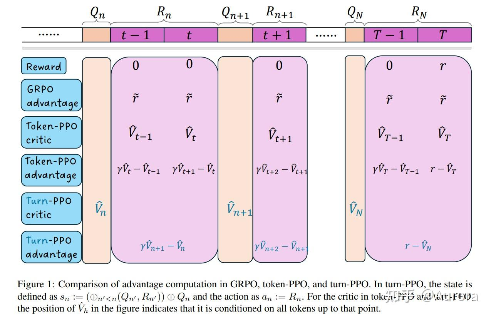

*alt text*

**2.1.1 问题与动机**

Token-PPO 在多轮 agent 场景下有两个根本缺陷：**① %% 状态转移异质性 %%**——轮内是自回归续写，轮间是工具调用/环境响应，混在同一 MDP 里 critic 输入分布不一致；**② Advantage 均摊失效**——`GRPO` 把轨迹奖励均摊到每个 token，不同 turn 重要性差异被抹平。消融分析证实，调整归一化或 KL 项均无法解决 `GRPO` 在 `WebShop`/`Sokoban` 上的训练崩溃。

**2.1.2 核心设计**

**Turn-Level MDP**：状态 $s_h$ = 前 $h-1$ 轮历史 + 当前 query，动作 $a_h$ = 完整响应，奖励 $r_h$ = 轮末环境反馈。状态转移结构统一为"完整响应 → 环境响应 → 下一状态"。

**Turn-Level GAE**：$\delta_h = r_h + \gamma v_{h+1} - v_h$，$A_h = \sum_{k=0}^{H-h-1}(\gamma\lambda)^k \delta_{h+k}$。由于步长是完整 turn，早期 advantage 不会指数级缩减，可自由调 $\gamma,\lambda$（最优：$\gamma=0.99,\lambda=0.9$），而 token-PPO 必须硬设 $\gamma=\lambda=1$。

**Critic**：独立 turn-level value head，MSE 损失拟合折扣回报 $\hat{R}_n^i = \sum_{h=n}^{H}\gamma^{h-n}r_h^i$。

**Clipping**：概率比为整个 response 的 token 连乘 $r_n^i(\theta)=\prod_h \frac{\pi_\theta(a_{n,h}^i|s_{n,h}^i)}{\pi_{\theta_t}(a_{n,h}^i|s_{n,h}^i)}$，整体做一次 clip，触发率更高，步长约束更强，训练更稳。

| 方法 | Advantage 来源 | 概率比粒度 | 参数约束 |
| --- | --- | --- | --- |
| GRPO | 组内相对归一化（无 critic） | token | （隐式） |
| Token-PPO | token 级 GAE | token | 必须 |
| Turn-PPO | turn 级 GAE | turn（response） | 可自由调 |

**2.1.3 实验结果**

在 `WebShop` 和 `Sokoban` 上全面优于 `GRPO`/`Token-PPO`（`GRPO` 在 Sokoban 崩溃）：

| 模型 | 环境 | GRPO | Token-PPO | Turn-PPO |
| --- | --- | --- | --- | --- |
| Qwen2.5-3B | WebShop | 0.72 | 0.73 | 0.75 |
| Qwen3-1.7B | WebShop | 0.78 | 0.77 | 0.80 |
| Qwen2.5-3B | Sokoban | crash | 1.93 | 2.29 |
| Qwen2.5-7B | Sokoban | crash | 2.90 | 3.74 |

**超参数**：critic lr 设为 actor 的 5–10 倍（$1\times10^{-5}$ vs $1\times10^{-6}$）；每题只采 $G=1$ 条轨迹靠多样性提升 batch 质量，与 `GRPO` 倾向大 $G$ 相反。

## 3\. Turn-level reward shaping

**核心思路**：不改变 GRPO / PPO 的训练框架，而是在原有 episode-level 奖励之外，人工设计 per-turn 的即时奖励，将其直接叠加进 advantage 计算。信号来源是人工规则，实现门槛最低，也是工程落地最快的一类。

### 3.1 MT-GRPO

**MT-GRPO**：针对 reasoning-augmented search agent（每轮搜索→阅读→生成答案）场景，将中间奖励直接注入 GRPO 的 advantage 计算。

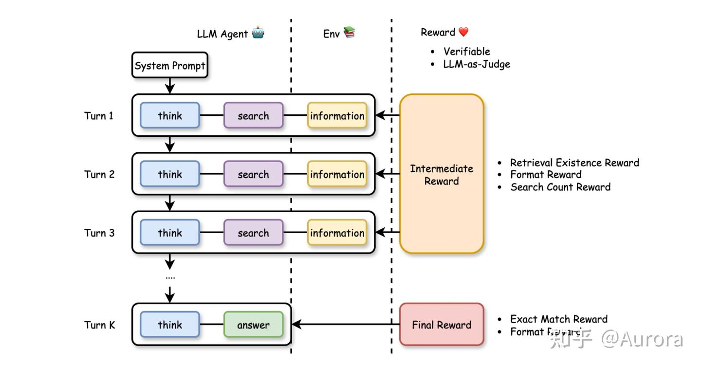

*alt text*

**3.1.1 Turn 级 Advantage 计算**

MT-GRPO 将 $K$ 轮轨迹中每一轮 $k$ 的 advantage 改写为"当前中间信号 + 衰减后续信号"的加权累积：

$$
A^{\text{MT-GRPO}}_{i,(k)} = \sum_{l=k}^{K-1}\alpha^{l-k}\,A^{I}_{i,(l)} + \alpha^{K-k}\,A^{O}_i
$$

其中 $\alpha \in [0,1]$ 控制未来奖励的衰减权重。中间 advantage $A^I_{i,(k)}$ 和最终 advantage $A^O_i$ 均做 group normalization：

$$
A^{I}_{i,(k)} = \frac{R^{I}_{i,(k)} - \mu(R^{I}_{(k)})}{\sigma(R^{I}_{(k)})}, \qquad A^{O}_i = \frac{R^{O}_i - \mu(R^{O})}{\sigma(R^{O})}
$$

同一轮内所有 token 共享同一个 advantage 值 $A^{\text{MT-GRPO}}_{i,(k)}$——切分粒度从 episode 降到 turn。（**注意A的计算有个下标k，也就导致了要求组内所有 rollout 包含相同的 turn 数**）

**两轮 case study。** 核心实验场景：第一轮调用搜索工具，第二轮基于检索结果生成最终答案，中间奖励在第一轮结束后即根据工具执行反馈计算。三组对比的训练曲线结论鲜明：`GRPO-OR` 没有任何中间信号，工具执行奖励始终在极低水平徘徊，说明仅靠稀疏结果奖励模型很难学会正确调用工具；`GRPO-MR` (直接将奖励在sequence level进行相加）虽引入了中间奖励，但将其与结果奖励直接合并为轨迹级信号，曲线震荡明显；`MT-GRPO` 将中间奖励单独作用于第 1 轮 advantage，收敛最快、曲线最平稳，说明 per-turn normalization 能更精准地把工具调用的功劳归到第一轮。

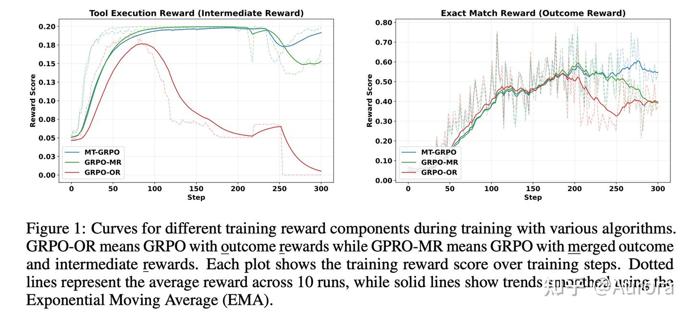

*alt text*

**3.1.2 计算复杂度与 MT-PPO**

MT-GRPO 有两个结构性缺陷：**①** group-relative 归一化要求每个 turn 都有 $G$ 条对比样本，$K$ 轮下总轨迹数为 $G^{K-1}$，随轮数指数增长；**②** group 内所有 rollout 必须包含相同的 turn 数，需在 system prompt 中强制固定轨迹长度，模型无法自主决定何时停止搜索。

论文因此同步提出 **MT-PPO**：在 token 级打稀疏中间奖励，再用 GAE（$\lambda=1, \gamma=1$）计算 advantage，复用 critic 模型绕开指数级 rollout 依赖：

$$
r_t = \begin{cases} R^O & t \text{ 是轨迹末 token} \\ R^I & t \text{ 是某中间轮末 token} \\ 0 & \text{其余位置} \end{cases}
$$

**3.1.3 实验结果**

在 NQ、HotpotQA、2WikiMultiHopQA、MuSiQue 四个 QA 数据集上，MT-PPO 相比纯 outcome reward 的 PPO 稳定提升，格式正确率接近 100%：

| 数据集 | PPO-OR | MT-PPO |
| --- | --- | --- |
| NQ | 0.483 | 0.490 |
| HotpotQA | 0.435 | 0.453 |
| 2WikiMultiHopQA | 0.382 | 0.424 |
| MuSiQue | 0.199 | 0.209 |

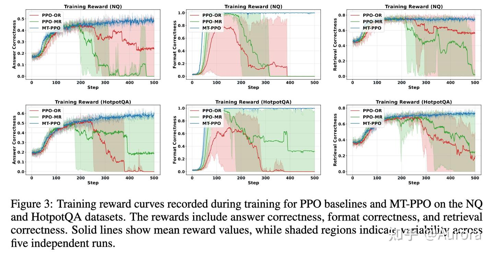

*alt text*

### 3.2 RC-GRPO

**RC-GRPO**（arXiv `2602.03025`）针对的不是"中间奖励如何设计"，而是：**组内奖励方差坍塌（degenerate group）**。

当同一 prompt 的 $G$ 条 rollout 全部成功或全部失败时，组内均值等于每条轨迹的奖励本身，归一化后 advantage 为零，梯度消失，训练停滞。在多轮工具调用场景下，这个问题尤为普遍——难题全失败、易题全成功，两边都训不动。

RC-GRPO 的解法是**把奖励信息条件化进策略本身**，在采样阶段主动制造组内多样性，而不是事后用规则去打补丁。

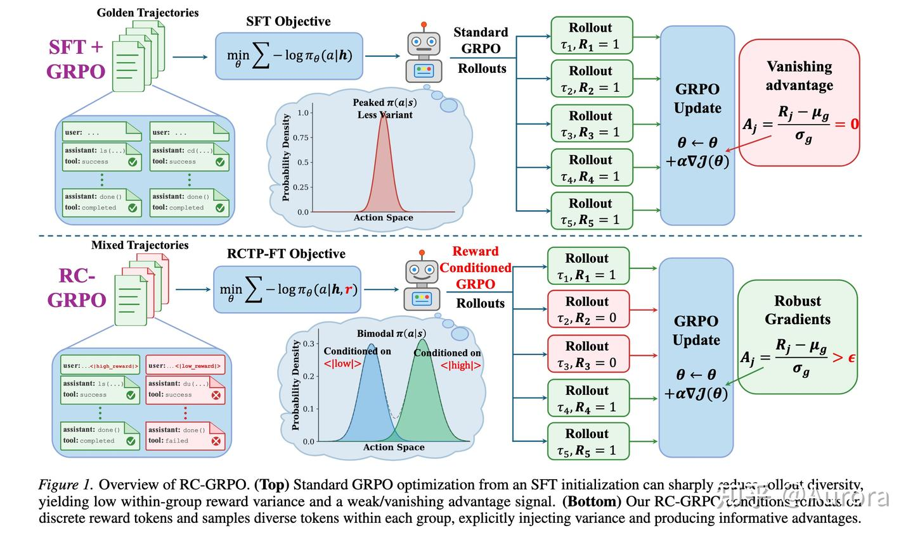

*alt text*

**3.2.1 奖励条件化策略**

RC-GRPO 在 prompt 前端插入一个离散的"奖励目标 token" $r$：

$$
r \in \{\texttt{<|high\_reward|>},\ \texttt{<|low\_reward|>}\}
$$

策略由原来的无条件形式 $\pi_\theta(a_t \mid h_t)$ 变为：

$$
\pi_\theta(a_t \mid h_t,\ r)
$$

对应地，重要性比（importance ratio）改写为：

$$
\rho_j(\theta) = \prod_t \frac{\pi_\theta(a_{t,j} \mid h_{t,j},\ r_j)}{\pi_{\theta_{\text{old}}}(a_{t,j} \mid h_{t,j},\ r_j)}
$$

**核心操作**：采样一组 $G$ 条轨迹时，在 $r$ 的分配上刻意混入高/低奖励目标——既采若干条 `<|high_reward|>` 前缀的轨迹，也采若干条 `<|low_reward|>` 前缀的轨迹。如此即使当前模型在某个 prompt 上能力单一，组内奖励分布也会被人工拉开，advantage 有了梯度。

**3.2.2 两阶段训练**

**第一阶段——RCTP 微调（Reward-Conditioned Trajectory Policy）**
先在混合质量数据上做监督微调，让模型学会按奖励目标 token 的"指令"生成不同质量的轨迹：

$$
\mathcal{L}_{\text{RCTP}} = -\mathbb{E}_{(\tau,\, r)\sim \mathcal{D}}\left[\sum_t \log \pi_\theta(a_t \mid h_t,\, r)\right]
$$

数据集 $\mathcal{D}$ 由约 800 条专家轨迹（打 `<|high_reward|>`）和 800 条失败轨迹（打 `<|low_reward|>`）混合而成。模型在这一阶段学到"高/低奖励 token 是什么意思"，为第二阶段的条件化采样打基础。

**第二阶段——RC-GRPO 强化学习**
以 RCTP 微调后的模型为 $\pi_{\text{ref}}$，启动 RL 训练。每组采样时按比例分配高/低奖励 token，确保组内出现奖励对比：

$$
\mathcal{L}_{\text{RC-GRPO}} = -\mathbb{E}\!\left[\sum_j \min\!\Bigl(\rho_j A_j,\ \mathrm{clip}(\rho_j, 1{-}\varepsilon, 1{+}\varepsilon)\,A_j\Bigr)\right] + \beta\,\mathrm{KL}(\pi_\theta \| \pi_{\text{ref}})
$$

其中 advantage 仍按标准 GRPO 组内归一化计算：

$$
A_j = \frac{R(\tau_j) - \mu_g}{\sigma_g + \varepsilon_{\text{stab}}}
$$

只不过此时 $\mu_g,\,\sigma_g$ 是在条件化后的混合组内估计的，不再坍塌到零。

**3.2.3 实验结果**

在 Berkeley Function Calling Leaderboard v4（**BFCLv4**）多轮工具调用基准上：

| 模型 | Base | SFT + GRPO | RCTP + RC-GRPO |
| --- | --- | --- | --- |
| Qwen2.5-7B-Instruct | 11.25% | 48.75% | 85.00% |
| LLaMA-3.1-8B-Instruct | 0.00% | 35.00% | 48.75% |

**Qwen2.5-7B 的 85% 超过了所有测试中的闭源 API 模型**（最高 61.25%），是该榜单上开源模型的 SOTA。

**Q1：和 Multi-Turn Tool Call 的关系**：多轮工具调用让 degenerate group 问题更严重，原因只有一个：任务更难、轨迹更长，奖励更稀疏，自然采样出的 rollout 更容易全部失败。所以这个场景是个很好的 stress test，但方法本身并不是专门针对多轮结构设计的。

**Q2: 梯度消失的情况分析**:两种 degenerate case: 如果梯度信号消失，应该说明模型已掌握/未掌握，对于已掌握的问题，说明数据太简单了；对于没掌握的问题，这个方法也不会有帮助，不知道理解得是否正确 。

## 4\. Group-Relative & 树形 Advantage

**核心思路**：GRPO 的 group baseline 只做 episode 级比较，完全忽略了同一轨迹内"访问相似状态"的多个 step 之间的差异。这一类方法在 episode-level advantage 之外，再引入 step 级的 group-relative advantage，将两者加权合并。无需学习 critic，也无需环境重放，信号完全来自 rollout 内部的比较。

### 4.1 GiGPO

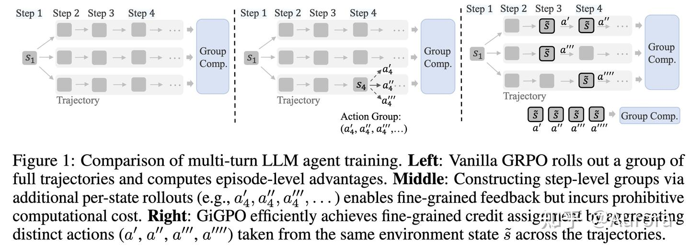

*alt text*

**GiGPO**：**如果多条 rollout 在某个中间时刻恰好访问了相同的环境状态，这些 step 之间天然可以做 group-relative 比较**，而完全不需要 critic 或额外的环境重放。

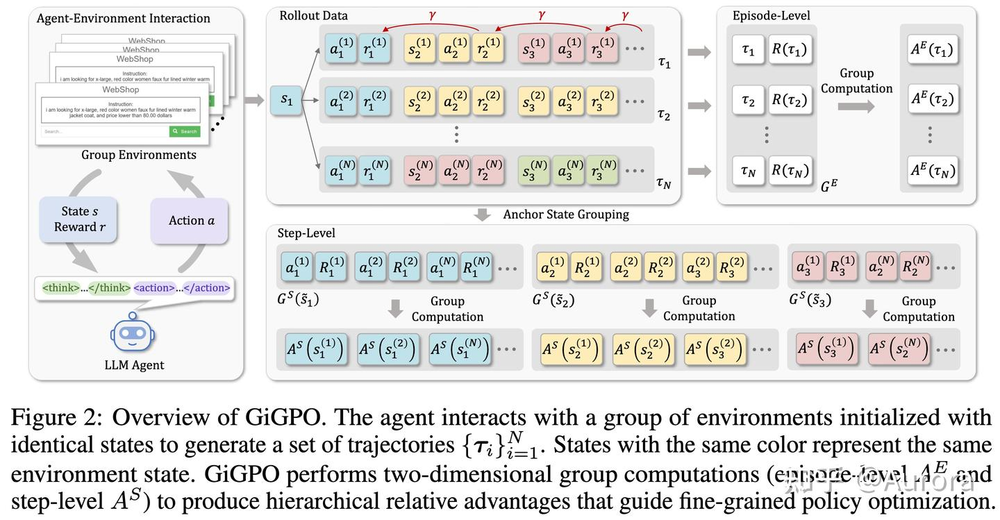

*alt text*

**4.1.1 双层分组机制**

**Episode-level advantage（外层）** 与 GRPO 完全一致：对同一 prompt 的 $N$ 条完整轨迹，按完整 return 归一化：

$$
A^E(\tau_i) = \frac{R(\tau_i) - \mu(\{R(\tau_j)\}_{j=1}^N)}{F_{\text{norm}}(\{R(\tau_j)\}_{j=1}^N)}
$$

其中 $F_{\text{norm}}$ 可以是标准差（标准 GRPO），也可以固定为 1（无偏估计变体）。

**Step-level anchor state grouping（内层）** 对所有 $N$ 条轨迹，扫描每个 $(i, t)$ 位置的环境状态 $s_t^{(i)}$；若多条轨迹在不同时刻访问了同一状态 $\tilde{s}$，则把这些 step 聚成一个锚点组：

$$
G^S(\tilde{s}) = \bigl\{(a_t^{(i)},\, R_t^{(i)}) \;\big|\; s_t^{(i)} = \tilde{s},\; 1\le i\le N,\; 1\le t\le T\bigr\}
$$

组内每个元素的折扣 return 从该 step 起算：

$$
R_t^{(i)} = \sum_{k=t}^{T} \gamma^{k-t}\, r_k^{(i)}
$$

在同一锚点组内做 group-relative 归一化，得到 step-level advantage：

$$
A^S(a_t^{(i)}) = \frac{R_t^{(i)} - \mu\!\left(\{R_t^{(j)} \mid (a_t^{(j)}, R_t^{(j)}) \in G^S(\tilde{s})\}\right)}{F_{\text{norm}}\!\left(\{R_t^{(j)} \mid \cdots\}\right)}
$$

**稀疏奖励下的退化形式。** 当仅在终止步 $T$ 给出二元奖励 $r_T \in \{0,1\}$（其余步 $r_t=0$）时，折扣 return 简化为：

$$
R_t^{(i)} = \gamma^{T-t}\, r_T^{(i)}
$$

越早到达同一锚点状态，$\gamma^{T-t}$ 越小，$R_t$ 越低——这正是不同 turn 产生不同 reward 的根本原因。

**不同 turn 数下的语义一致性。** 不同 rollout 到达同一锚点状态的 turn index 可以不同，但这不影响比较的合法性。背后的隐含假设是环境的 **Markov 性**：$\tilde{s}$ 已完整描述当前局面，未来收益只取决于从这里往后怎么走，而不取决于第几步到达。

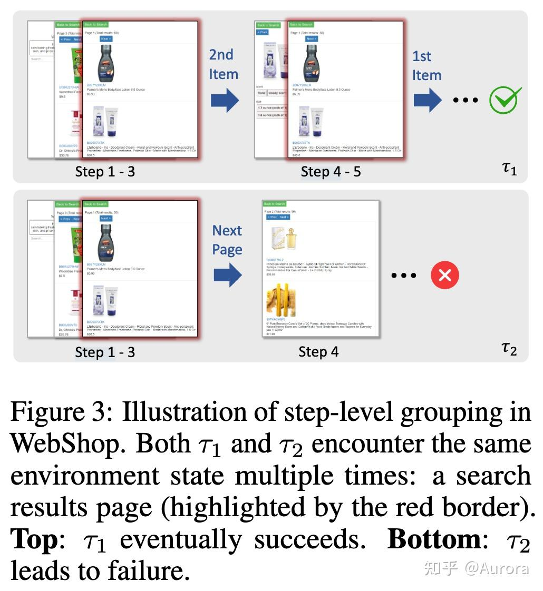

*alt text*

**WebShop 具体案例（来自论文 Figure 3）。** 锚点状态 $\tilde{s}$ 是某商品搜索结果页。$\tau_1$ 先后两次经过该页面，$\tau_2$ 也经过同一页面但最终失败：

```text
τ₁: [搜索页 t=1, 选 2nd Item] → 返回 → [搜索页 t=3, 选 1st Item] → 成功 R=1
τ₂: [搜索页 t=1, 点 Next Page] → ... → 失败 R=0
```

锚点组共聚合三条记录（$\tau_1$ 经过搜索页两次，贡献两条）：

$$
G^S(\tilde{s}) = \{(\text{2nd Item},\; R^{\tau_1}_{t=1}),\;\; (\text{1st Item},\; R^{\tau_1}_{t=3}),\;\; (\text{Next Page},\; R^{\tau_2}_{t=1})\}
$$

由于折扣，$\tau_1$ 在 $t=3$ 选 1st Item 距成功更近，折扣 return 高于 $t=1$ 选 2nd Item；$\tau_2$ 最终失败，Next Page 的 return 为 0。三者归一化后得到严格的偏序：

$$
A^S(\text{1st Item}) > A^S(\text{2nd Item}) > A^S(\text{Next Page})
$$

这正是 step-level group 能捕捉到、而纯 episode-level baseline 完全忽视的细粒度信号——$\tau_1$ 整体成功，若只用 episode advantage，它的两次经过搜索页的 step 会拿到完全相同的 advantage，无法区分"好选择"和"差选择"。

**4.1.2 加权合并与优化目标**

两层 advantage 线性叠加：

$$
A(a_t^{(i)}) = A^E(\tau_i) + \omega \cdot A^S(a_t^{(i)})
$$

其中 $\omega$ 平衡两层信号的强度（论文默认 $\omega = 1$）。对于未命中任何锚点组的 step，$A^S$ 项直接置零，退化为纯 episode-level advantage。

最终策略梯度目标沿用 PPO 的 clipped surrogate + KL 正则：

$$
J_{\text{GiGPO}}(\theta) = \mathbb{E}\!\left[\frac{1}{NT}\sum_{i,t} \min\!\Bigl(\rho_\theta^{(i,t)}\, A(a_t^{(i)}),\; \mathrm{clip}(\rho_\theta^{(i,t)}, 1\pm\varepsilon)\, A(a_t^{(i)})\Bigr)\right] - \beta\, D_{\mathrm{KL}}(\pi_\theta \| \pi_{\mathrm{ref}})
$$

其中 $\rho_\theta^{(i,t)} = \pi_\theta(a_t^{(i)} \mid s_t^{(i)}) / \pi_{\theta_{\mathrm{old}}}(a_t^{(i)} \mid s_t^{(i)})$ 为重要性比。**全程无 critic，无额外 rollout，计算开销与 GRPO 几乎相同（实测额外耗时 < 0.002%）。**

**4.1.3 实验结果**

在两个经典 agent 基准上（`Qwen2.5-7B`）：

| 基准 | GRPO | GiGPO | 提升 |
| --- | --- | --- | --- |
| ALFWorld（成功率） | 77.6% | 90.2% | +12.6% |
| WebShop（得分） | 79.3 | 86.2 | +6.9 |
| WebShop（成功率） | 66.1% | 75.2% | +9.1% |

搜索增强 QA 上（4 数据集均值，`Qwen2.5-7B`）：GiGPO 47.2% vs. Search-R1 38.5%。消融实验显示去掉 $A^E$ 或 $A^S$ 任意一层性能都大幅下滑，两层信号互补而非冗余。

**方法边界**：致命前提是锚点状态能在多条 rollout 中**反复出现**。在 ALFWorld / WebShop 这类有限状态空间中，房间名、商品页面 URL 等天然可以作为精确锚点；但对开放式搜索、浏览等工具调用，每次观察结果几乎唯一，锚点命中率接近零，$A^S$ 项几乎永远为零，GiGPO 退化为 GRPO。

### 4.2 ATPO

**ATPO**的出发点是：多轮对话里的 RL 难题，根子上是一个**长时程 credit assignment 问题——对话第一轮里"多问了一个关键问题"，功劳如何传递到十轮之后的最终诊断？**

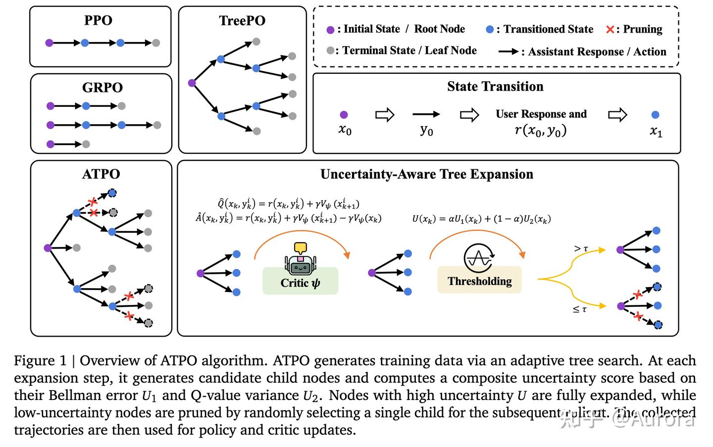

*alt text*

GRPO 在这里失效的原因很具体：（1）group 内全失败时 advantage 为零；（2）标准 PPO critic 面对"每轮生成几百 token、共十几轮"的长序列时，value 估计方差爆炸、收敛不稳定。ATPO 的解法是把轨迹结构建模成**分层 MDP（H-MDP）**，再用一棵**自适应展开的 rollout 树**从"真正不确定的状态"榨取稠密的 TD 信号。

**4.2.1 问题建模：分层 MDP**

ATPO 把多轮对话建模成双层嵌套的决策结构：

-   **宏动作层（turn level）**：每一轮对话的完整回复 $y_k$ 是一个宏动作；状态 $x_k$ 是到第 $k$ 轮为止的完整上下文。
-   **微动作层（token level）**：每个 token 是一个微动作；token 级策略 $\pi_\theta$ 按自回归展开。
    形式上，H-MDP 定义为 $\mathcal{M} = (\mathcal{X}, \mathcal{Y}, P, r, \gamma)$，其中 $\mathcal{X}$ 是对话上下文空间，$\mathcal{Y}$ 是回复空间，$r(x_k, y_k)$ 是每轮奖励，$\gamma$ 是折扣因子。这一建模把 credit assignment 的粒度显式锁定在 **turn 级**：后续所有 advantage 估计都以 $(x_k, y_k^{(i)})$ 为基本单位，而非单个 token。

**4.2.2 不确定性驱动的自适应树展开**

ATPO 的核心创新是一个**不花冤枉钱的 rollout 预算分配方案**：在 critic 对某状态的估计很确定时，只展开一条分支；在不确定时，才花 $N$ 条 rollout 精确估计。这需要一个可靠的不确定性度量。
ATPO 用两个互补的信号合成不确定度：

**Bellman 误差 $U_1$**——critic 的预测值与单步前向 $Q$ 估计之间的绝对偏差：

$$
U_1(x_k) = \left|V_\psi(x_k) - \frac{1}{N}\sum_{i=1}^{N} \hat{Q}(x_k, y_k^{(i)})\right|
$$

其中 $\hat{Q}(x_k, y_k^{(i)}) = r(x_k, y_k^{(i)}) + \gamma V_\psi(x_{k+1}^{(i)})$。这个项度量的是 **critic 自身的系统性偏差**——预测值与实测回报差多远。
**$U_1$ 的 motivation：Bellman 方程的自洽性检验。** 一个训练充分的 critic 应满足：

$$
V_\psi(x_k) \approx \mathbb{E}_{y_k}\!\left[r(x_k, y_k) + \gamma V_\psi(x_{k+1})\right]
$$

$U_1$ 就是在问"critic 的直接预测，和真正走一步观测到的结果，差多远"。$U_1$ 大说明 Bellman 方程在此处不成立，critic 不可信，必须多展开分支来修正估值；$U_1$ 小说明 critic 自洽，一条 rollout 就够。这比用输出置信度或预测方差更直接——它专门检查的是"我能不能信任这个 value 估计"。

**动作价值方差 $U_2$**——同一状态下 $N$ 条 rollout 的 $Q$ 值散布程度：

$$
U_2(x_k) = \frac{1}{N}\sum_{i=1}^{N}\left(\hat{Q}(x_k, y_k^{(i)}) - \bar{Q}\right)^2
$$

这个项度量的是**环境随机性与策略摇摆性**——从这个状态出发，不同动作会带来多大差异。

两者线性加权得到复合不确定度：

$$
U(x_k) = \alpha\, U_1(x_k) + (1-\alpha)\, U_2(x_k)
$$

**自适应展开规则**：对树中每个节点 $x_k$，

$$
\text{分支数} = \begin{cases} N & \text{若 } U(x_k) > \tau \text{（高不确定性，充分展开）} \\ 1 & \text{若 } U(x_k) \le \tau \text{（低不确定性，只展一条）} \end{cases}
$$

为保持探索多样性，"只展一条"时以 10% 概率随机旁路。$\tau$ 是控制预算分配松紧的超参数，直接决定每次 rollout 实际展开的节点总数。

**直觉**：$U_1$ 大说明 critic 在骗自己（bias 高），这个状态的估计不可信，必须实际跑一跑；$U_2$ 大说明选择不同动作的后果差异巨大，这里是真正的"岔路口"，值得把每条路都试一试。只有两者都小（critic 预测可信且行为已收敛）才允许省略采样。

**4.2.3 反向值传播与 Advantage 估计**

**反向 pass 计算目标值。** 树构建完毕后，从叶节点往根节点递推：

$$
\hat{V}(x_k) = \begin{cases} r(x_k, y_k) & \text{（叶节点）} \\ \dfrac{1}{B(x_k)}\displaystyle\sum_{i=1}^{B(x_k)}\!\left[r(x_k, y_k^{(i)}) + \gamma\,\hat{V}(x_{k+1}^{(i)})\right] & \text{（内部节点）} \end{cases}
$$

其中 $B(x_k)$ 是该节点实际展开的分支数（等于 $N$ 或 1）。这一递推在树结构上实现了 TD($\lambda$) 的多步展开效果，同时借助对话的 Markov 假设保证合法性。

**Turn 级 advantage 估计**。每个宏动作 $(x_k, y_k^{(i)})$ 的 advantage 用 critic 做单步 TD 展开：

$$
\hat{A}(x_k, y_k^{(i)}) = r(x_k, y_k^{(i)}) + \gamma\,V_\psi(x_{k+1}^{(i)}) - V_\psi(x_k)
$$

与纯 episode-level 的 GRPO baseline 相比，这里的 $\hat{A}$ 是**每一轮独立估计的**——第三轮提问问得好，第三轮的 advantage 就高；不会因为后面几轮拖后腿而被平均掉。

**策略梯度目标**。采用 PPO clipped surrogate，重要性比在 turn 粒度上计算：

$$
J_{\text{ATPO}}(\theta) = \mathbb{E}\!\left[\sum_{k} \min\!\left(\rho_k\,\hat{A}(x_k, y_k),\; \mathrm{clip}(\rho_k, 1\pm\varepsilon)\,\hat{A}(x_k, y_k)\right)\right]
$$

其中 $\rho_k = \pi_\theta(y_k \mid x_k) / \pi_{\theta_\text{old}}(y_k \mid x_k)$，为宏动作级重要性比（在 token 级对数概率上求和再取指数）。同时按访问次数 $C(x_k)$ 与回复长度 $L(y_k)$ 做归一化，防止频繁访问的节点或长回复垄断梯度。

**工程优化**：树展开时共享前缀的 KV cache，避免相同上下文被重复推理；多分支异步并发执行；在实测中，ATPO 的 rollout 阶段虽多耗约 20% 计算，但 critic 训练更稳定，整体训练时间（2.22 h）比 PPO 变体（3.02 h）反而更短。

**4.2.4 结论**

**复杂度上界是 $N^K$。** 每一轮每个活跃节点要么保留 $N$ 条分支（高不确定性），要么保留 1 条（低不确定性）。最坏情况下所有节点都展开，叶节点数随轮数 $K$ 指数增长。论文能跑起来依赖两个前提：（1）医疗对话 $K$ 约为 5–10 轮，轮数本身很短；（2）训练中期以后 critic 趋于自洽，$U < \tau$ 的节点占多数，树实际上很稀疏。对于几十轮的长时程 agent 轨迹，这套方案直接不可行。

**判断不确定性本身也要采样。** 即使最终只保留 1 条分支，计算 $U_1$ 和 $U_2$ 也必须先对当前节点采 $N$ 条一步 rollout——这是无法省掉的隐性开销，异步并发和 KV cache 只能降延迟，不能减采样次数。

**Markov 假设与 critic 冷启动。** 在开放域工具调用场景中，Markov 假设通常成立，但 critic 的训练数据量往往不足，导致 $U_1$ 估计本身不可靠，预算分配策略随之失效。

**4.2.5 总结**

PPO：对每个 prompt 均匀采样 $N$ 条完整轨迹，所有状态分到相同的 rollout 预算，critic 用这些轨迹的 TD return 更新。

ATPO：把轨迹展开成一棵树，用 critic 自身的估计误差（$U_1$）来判断"这里的 critic 是否可信"——$U_1$ 高说明 critic 在当前状态预测不准，于是多采 $N$ 条分支来修正它；$U_1$ 低则只走一条，省下预算留给真正难的节点。

critic 的质量决定了采样策略，而更好的采样又反过来提升 critic 的质量。 而在选中的这段公式里，$U_2$（方差）补了 $U_1$ 的盲区——即使 critic 此刻预测不偏（$U_1$ 小），但如果不同动作的后果差异巨大（$U_2$ 大），这里也是值得多探索的分叉点。

### 4.3 SEEA-R1

**SEEA-R1**面向的是**具身智能（Embodied AI）** 场景下的长时程多步推理任务。具身 agent 面临的 credit assignment 难题比对话 agent 更为极端：动作要操控真实（或模拟）环境，奖励信号几乎全部集中在任务末尾，中间绝大多数步骤是"纯粹的操控序列"，与任何即时奖励无关。标准 GRPO 在这种设置下几乎无效——episode 太长、奖励太稀疏，一组 rollout 里常常全部失败，group-relative baseline 退化为零，梯度消失。

SEEA-R1 的核心答案是**把 MCTS（蒙特卡罗树搜索）嵌进 GRPO 的 rollout 阶段**：用树搜索把稀疏结果奖励"稠密化"成每一步的过程奖励（`process reward`），再用这些过程奖励驱动策略梯度更新。配套地，它还训了一个**多模态生成式奖励模型（MGRM）**来替代人工设计的奖励函数，二者形成一个**闭环自进化**的框架：更强的策略产生更高质量的 MCTS 搜索树，更精准的奖励模型反过来提升策略训练效果。

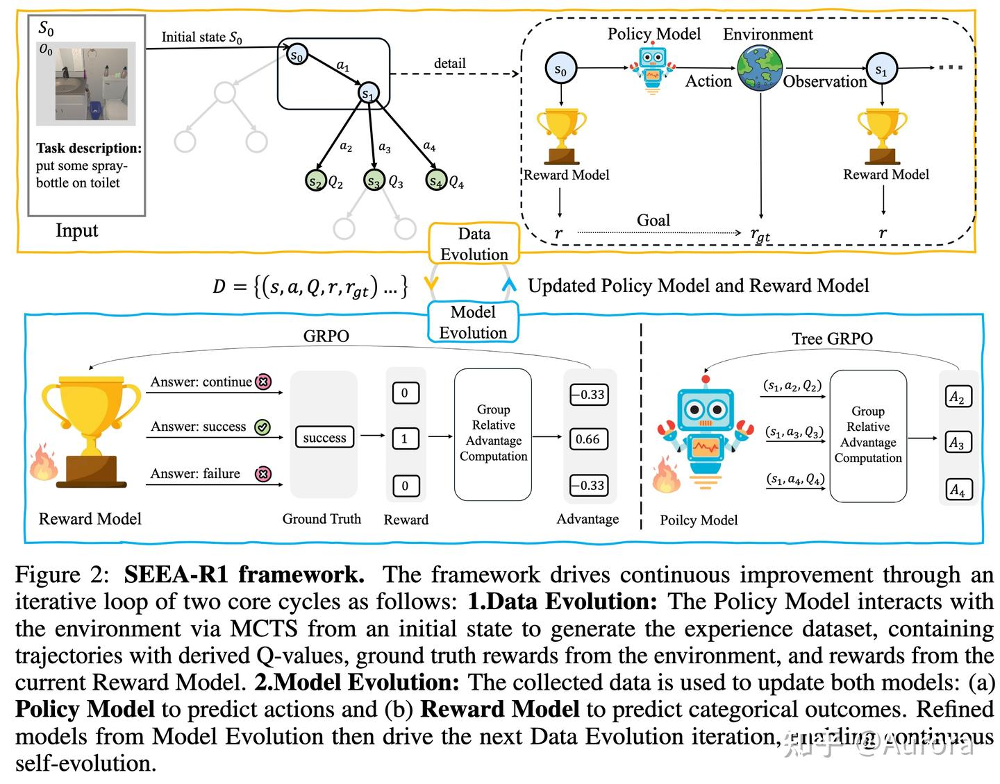

*alt text*

**4.3.1 Tree-GRPO：把稀疏结果奖励转化为过程奖励**

标准 GRPO 对每个 prompt 采样 $G$ 条完整轨迹，再按 episode-level 奖励做 group-relative 归一化。问题在于：具身任务失败率极高，一个 group 里很可能全部失败，归一化后 advantage 全为零，梯度消失。

SEEA-R1 的解法是用 **MCTS** 替换掉标准的平行 rollout，把树搜索过程中产生的 $Q$ 值直接当作过程奖励。MCTS 分四个阶段循环执行：

**Selection（选择阶段）**——UCB 策略挑选当前节点的最优动作：

$$
a_t = \arg\max_{a_{t,i}} \left[Q(s_t, a_{t,i}) + c\sqrt{\frac{\ln N(s_{t-1}, a_{t-1})}{1 + N(s_t, a_{t,i})}}\right]
$$

其中 $Q(s_t, a_{t,i})$ 是动作的估计价值，$N(\cdot)$ 是访问次数，$c$ 是探索系数。分子的对数项保证少被探索的分支有更高的 UCB 值，平衡利用与探索。

**Backup（回溯阶段）**——从叶节点往根节点积累折扣回报，更新沿途每个节点的 $Q$ 值：

$$
R^{(j)}(s_t, a_t) = r(s_{t+1}^{(j)}) + \gamma r(s_{t+2}^{(j)}) + \cdots + \gamma^{T-t-1} r(s_T^{(j)})
$$

$$
Q(s_t, a_t) = \frac{\sum_{j=1}^{N(s_t,a_t)} R^{(j)}(s_t, a_t)}{N(s_t, a_t)}
$$

每次访问都更新 $Q$ 值，迭代若干轮后，树中每个节点的 $Q(s_t, a_{t,i})$ 就成为一个经过多次 Monte Carlo 模拟估计的**步级价值信号**，比单次采样的 episode return 方差小得多。

**Tree-GRPO 优化目标**将这些 $Q$ 值转化为标准化 advantage，注入 PPO 目标：

$$
\mathcal{J}(\theta) = \mathbb{E}\!\left[\frac{1}{\sum_{i=1}^G|a_{t,i}|}\sum_{i=1}^G\sum_{k=1}^{|a_{t,i}|}\min\!\Bigl(\rho_{t,i,k}\,\hat{A}_{t,i,k},\ \mathrm{clip}(\rho_{t,i,k}, 1-\varepsilon_{\text{low}}, 1+\varepsilon_{\text{high}})\,\hat{A}_{t,i,k}\Bigr)\right] - \beta\, D_{\mathrm{KL}}[\pi_\theta \| \pi_{\text{ref}}]
$$

两个关键量的定义：

-   **重要性比**（token 粒度）：$\rho_{t,i,k} = \dfrac{\pi_\theta(a_{t,i,k} \mid s_t, a_{t,i,<k})}{\pi_{\theta_\text{old}}(a_{t,i,k} \mid s_t, a_{t,i,<k})}$
-   **过程 advantage**（step 粒度）：$\hat{A}_{t,i,k} = \dfrac{pr_{t,i} - \mathrm{mean}(\{pr_{t,i}\}_{i=1}^G)}{\mathrm{std}(\{pr_{t,i}\}_{i=1}^G)}$，其中 $pr_{t,i}$ 直接取自 MCTS 回溯后的 $Q(s_t, a_{t,i})$。

与标准 GRPO 相比，核心差异只有一处：**advantage 的来源从 episode-level return 换成了 MCTS 估计的 step-level $Q$ 值**。在长时程具身任务里，这一替换消除了"全组失败导致 advantage 为零"的根本问题——只要 $Q$ 值在组内有差异，梯度就不会消失。

此外，Tree-GRPO 借鉴 DAPO 的**非对称 clip 上下界** $(\varepsilon_{\text{low}}, \varepsilon_{\text{high}})$，对"过于保守的缩减"和"过于激进的放大"施加不同宽容度，在探索效率与训练稳定性之间取得更好的平衡。

**4.3.2 多模态生成奖励模型（MGRM）**

具身任务最大的工程壁垒之一是**奖励函数难以复用**——不同任务的成功标准完全不同，人工设计奖励函数既费时又不通用。SEEA-R1 训了一个**多模态生成式奖励模型（MGRM）**，以多模态轨迹（视觉观察 + 动作序列）为输入，输出三类状态标签：`{success, continue, failure}`。

MGRM 有两套运行模式，应对有无 ground truth 的场景：

**有 Ground Truth 的监督模式**：在 GT 对齐的轨迹上做监督微调，每 500 个 episode 用真实模拟器结果校准一次，防止奖励模型漂移。

**无 Ground Truth 的自监督模式（TTRL）**：策略通过 MCTS 对初始状态 $s_0$ 生成 $K=10$ 条多样化轨迹，取多数投票结果为伪 GT；再用 GRPO 训练 MGRM，奖励规则为：

$$
r_{\text{MGRM}} = \begin{cases} +1 & \text{若预测结果与多数票伪 GT 一致} \\ 0 & \text{否则} \end{cases}
$$

这一机制使 MGRM 在没有任何任务特定标注的情况下也能持续自我校准。**闭环自进化**的动力学：更强的策略产生质量更高的多数票伪 GT → 更精准的 MGRM → 更好的 process reward 信号 → 进一步增强策略。实验显示，经过若干迭代后，无 GT 自监督模式的 MGRM 最终甚至**超过了有真实 GT 的监督模式**，说明策略自身的探索能力可以弥补标注的缺失。

**4.3.3 计算复杂度优化**

朴素的 MCTS 展开复杂度为 $\mathcal{O}(T \cdot D \cdot K)$，其中 $T$ 是轨迹长度，$D$ 是搜索深度，$K$ 是每节点展开数。SEEA-R1 通过两个剪枝策略将其压缩到 $\mathcal{O}(T \cdot \max(D, K))$：

1.  **概率展开**：每个节点以 50% 概率决定是否完整展开，不展开时只保留一条采样分支。
2.  **路径预算**：限制每棵树最多展开 $L=5$ 条完整路径，超出预算后停止新分支。

两者结合使树在实际训练中保持稀疏，训练耗时降至 36 小时（8×A100），相比标准 PPO 的 48 小时反而更短。

**4.3.4 方法边界**

**MCTS 的前提是可以重复模拟。** UCB Selection 和 Backup 都需要从中间状态重新展开轨迹，这在具身模拟环境（AI2-Thor、ScienceWorld）中默认可行，但对需要真实物理执行或不可重置外部 API 的场景，这一代价直接不可接受，方法根本无法落地。

**伪 GT 的质量上限是策略本身。** 无 GT 模式下，MGRM 的校准目标是"多数票"，而多数票来自当前策略的 rollout。策略强时伪 GT 可靠，但在训练早期策略尚弱时，多数票本身就是噪声，MGRM 可能固化错误的奖励信号——这是一个**冷启动问题**，论文用少量有 GT 数据做热身，但对无任何标注的新任务仍难以绕开。

**树搜索的探索多样性受路径预算 $L$ 约束明显。** $L=5$ 的上限在 ALFWorld 这类约 10 步的短时程任务上足够，但对于动辄几十步的长时程 agent，5 条路径的覆盖极为有限，process reward 的估计方差重新上升，部分抵消了 MCTS 相对 episode-level return 的优势。

### 4.4 Agentic Entropy-Balanced Policy Optimization

**AEPO**（arXiv `2510.14545`）面向的是 **web agent** 场景下的长时程多步推理任务。与 SEEA-R1 那种依赖环境可重放的 MCTS 路线不同，AEPO 的切入点是 **RL 训练本身的采样与梯度两个阶段**：在采样阶段，高熵的工具调用步骤会让分支预算过度集中在少数轨迹上；在梯度阶段，标准 PPO 的 clip 机制又会把这些高熵 token 的梯度提前截断，抑制了真正需要被学习的探索行为。两个问题叠加，使 web agent 训练陷入一种\*\*"越不确定的地方越学不到"\*\*的恶性循环。

AEPO 的核心回答是两个对称的模块：**动态熵平衡 Rollout**（解决采样多样性崩塌）和**熵平衡策略优化**（解决高熵梯度被截断）。

**4.4.1 问题：两处熵崩塌**

**Rollout 阶段的高熵集中（High-Entropy Rollout Collapse）。** 实验观测显示，93.4% 的分支集中在 1–3 条轨迹上。原因是连续出现的高熵工具调用步骤（搜索查询生成、下一步动作规划）会触发大量 branching，迅速耗尽全局分支预算，后续真正需要探索的岔路反而没有预算可用，轨迹多样性崩塌。

**优化阶段的高熵梯度截断（High-Entropy Token Gradient Clipping）。** 标准 PPO 对重要性比 $\delta = \pi_\theta / \pi_{\theta_\text{old}} > 1 + \varepsilon$ 的 token 截断梯度。高熵工具调用 token 天然具有大的分布漂移，更容易超过阈值被截断——恰恰是最需要学习的 token，反而得不到更新。

**4.4.2 动态熵平衡 Rollout**

**Token 熵定义。** 对第 $t$ 步生成 token，模型输出 logit $z_t$，经温度 $\tau$ 缩放后得到分布，其熵为：

$$
H_t = -\sum_{j=1}^{V} p_{t,j} \log p_{t,j}, \qquad p_t = \operatorname{Softmax}(z_t / \tau)
$$

$H_t$ 大说明模型在该位置不确定，对应工具调用规划等高分支决策点；$H_t$ 小说明模型较为自信。

**熵预监控（Entropy Pre-Monitoring）。** 在开始 rollout 之前，先用问题本身的熵 $H_{\text{root}}$ 和历史工具调用步骤的平均熵 $H_{\text{tool}}^{\text{avg}}$ 来分配全局分支预算 $m$（总预算为 $k$）：

$$
H_{\text{tool}}^{\text{avg}} = \frac{1}{N} \sum_{i=1}^{N} H_{\text{tool}}^{i}
$$

$$
m = k \cdot \sigma\!\left(\beta \cdot (H_{\text{root}} - H_{\text{tool}}^{\text{avg}})\right)
$$

其中 $\sigma$ 是 sigmoid，$\beta$ 为灵敏度超参。直觉是：若问题本身比工具调用更不确定（$H_{\text{root}} > H_{\text{tool}}^{\text{avg}}$），则把更多预算分配给全局探索（从 root 出发的多条轨迹），避免所有预算被工具调用阶段的连续分支消耗殆尽。

**熵平衡自适应分支（Entropy-Balanced Adaptive Rollout）。** 在 rollout 执行过程中，对每个时刻是否发起分支，设计了一个考虑连续高熵惩罚的概率：

$$
P_t = \left(\alpha + \gamma \cdot \Delta H_t\right)\!\left(1 - \hat{P}(l)\right), \qquad \hat{P}(l) = \gamma \cdot l
$$

其中 $\alpha$ 是基础分支概率，$\gamma \cdot \Delta H_t$ 是当前步熵变化带来的动态调整，$\hat{P}(l)$ 是连续高熵步数 $l$ 的累积惩罚项——连续出现越多高熵步骤，$P_t$ 越低，避免预算在一段连续不确定的工具调用序列中被耗尽。实际发起分支的动作为：

$$
\text{Action}(P_t) = \begin{cases} \text{Branch}(Z) & \text{若 } P_t > \tau \\ \text{Continue} & \text{否则} \end{cases}
$$

其中 $Z$ 是每次分支产生的子轨迹数，$\tau$ 是触发阈值。

**4.4.3 熵平衡策略优化**

**Entropy Clipping-Balanced 机制：stop-gradient 解耦前向与反向。** 标准 PPO clip 机制对 $\delta > 1+\varepsilon$ 时梯度归零，而高熵 token 的 $\delta$ 恰好最容易超过该阈值。AEPO 通过在 clip 项的上界引入 `stop-gradient`（$\text{sg}(\cdot)$）来解耦：

$$
\mathcal{L} = \mathbb{E}\!\left[\frac{1}{\sum T_j} \sum_j \sum_t \min\!\left(\delta\,\tilde{A}(t),\; \operatorname{clip}\!\left(\delta,\; 1-\varepsilon_l,\; \frac{(1+\varepsilon_h)}{\text{sg}(\delta)} \cdot \delta\right)\tilde{A}(t)\right)\right]
$$

关键在于 clip 上界的处理：前向传播中 $\text{sg}(\delta) \equiv \delta$，上界退化为常数 $1+\varepsilon_h$，行为与标准 PPO 完全一致；反向传播中 $\text{sg}(\delta)$ 被当作常数，对 $\delta$ 的梯度不为零，高熵 token 的梯度得以保留。这等价于将梯度缩放系数改写为：

$$
F_{j,t}(\theta) = \begin{cases} 1 + \varepsilon_h & \text{若 } \delta > 1+\varepsilon_h \text{ 且 } \tilde{A}(t) > 0 \\ 0 & \text{若 } \delta < 1-\varepsilon_l \text{ 且 } \tilde{A}(t) < 0 \\ \delta & \text{否则} \end{cases}
$$

对本来应被截断的高熵高-advantage token（$\delta > 1+\varepsilon_h, \tilde{A} > 0$），梯度被缩放到固定值 $1+\varepsilon_h$，而不是归零——工具调用探索行为的学习信号不再被丢弃。

**熵感知 Advantage 估计（Entropy-Aware Advantage Estimation）。** AEPO 在标准 GRPO 的精度 advantage 之上，叠加了一个熵权重项，让模型在高不确定性位置更积极地学习：

$$
\tilde{A}^{\text{Acc}}(t) = \frac{r_t - \operatorname{mean}(\{R_i\})}{\operatorname{std}(\{R_i\})}, \qquad \tilde{A}^{\Delta H}(t) = \frac{H_t - \operatorname{mean}(\{H_t\})}{\operatorname{std}(\{H_t\})}
$$

$$
\tilde{A}(t) = \tilde{A}^{\text{Acc}}(t) \times \left(1 + a \cdot \tilde{A}^{\Delta H}(t)\right)
$$

其中 $a$ 是熵权重系数。当某 token 的熵高于组内均值（$\tilde{A}^{\Delta H}(t) > 0$），其 advantage 被放大；低于均值时则压缩。梯度更新自然集中在工具调用等决策关键点，而不是被大量低熵的文本生成 token 稀释。

**4.4.4 方法边界**

**高熵 ≠ 重要步骤。** $\tilde{A}^{\Delta H}$ 把信号放大到所有高熵位置，但搜索查询的措辞选择天然高熵却往往无关紧要，论文未给出熵与步骤重要性的相关性分析。

**超参强耦合任务。** $\alpha, \gamma$ 在 web agent 下人工调定；连续高熵步骤的典型长度在代码 agent 或具身 agent 中完全不同，泛化性未知。

**stop-gradient 无理论保证。** 修改后的 clip 目标不再对应任何 trust region 推导，仅实验上显示熵稳定，未证明维持 PPO 的单调改进性质。

### 4.5 TreeGRPO

**TreeGRPO**（[arxiv 2512.08153](https://arxiv.org/abs/2512.08153)）：将扩散模型的去噪过程重构为树状搜索，把 episode-level 奖励分解为步级 advantage，实现细粒度 credit assignment。**关键洞察**：去噪链天然是有序的，不同路径在 ODE 段共享前缀，只在 SDE 窗口处分叉——恰好可以复用计算并隔离贡献。

**4.5.1 整体流程**

**阶段一：树构建（ODE + SDE 混合）**

| 步骤类型 | 作用 | 行为 |
| --- | --- | --- |
| ODE 步骤 | 确定性前进，所有分支共享前缀 | 不分叉，推进所有节点 |
| SDE 窗口 | 引入随机性产生对比分支 | 每个节点生成 个子节点，记录边的 |

SDE 窗口起始位置从截断几何分布采样，参数 $r$ 控制时间偏置（小 $r$ 倾向早期步骤）：

$$
\Pr[i] = \frac{(1-r)\cdot r^i}{1 - r^{T-w}},\quad i \in \{0,\ldots,T-w-1\}
$$

**阶段二：叶节点评估**——解码叶节点生成图像，奖励模型打分并组内归一化：

$$
A_\text{leaf}(\ell) = \frac{S(\ell) - \mu_c}{\sigma_c}, \quad S(\ell) = \sum_k w_k R_k(y(\ell), c)
$$

**阶段三：叶到根回传 Advantage**——后序遍历，用旧策略的 log-prob 做 softmax 加权向上聚合：

$$
w_u(e) = \frac{\pi_{\theta_\text{old}}(e)}{\sum_{e'} \pi_{\theta_\text{old}}(e')}, \qquad A_\text{edge}(e') = \sum_e w_u(e)\cdot A_\text{edge}(e)
$$

当节点只有单子时退化为恒等式，与标准 GRPO 兼容。

**阶段四：策略更新**——仅对 SDE 窗口内的边计算 GRPO 目标：

$$
\mathcal{L} = -\sum_{t\in\mathcal{W}}\sum_{e\in\mathcal{E}_t}\min\!\Bigl(r_t(e;\theta)\cdot A_\text{edge}(e),\ \mathrm{clip}(r_t(e;\theta),1{-}\varepsilon,1{+}\varepsilon)\cdot A_\text{edge}(e)\Bigr)
$$

**4.5.2 与标准 MCTS 的差异**

TreeGRPO **不是** 标准四阶段 MCTS。核心区别：分支点由预设几何分布决定（非 UCB 自适应），ODE 段完全确定（非随机 simulation），回传用 log-prob 加权（非访问计数平均）。优势在于：共享 ODE 前缀大幅减少前向计算，训练速度较标准 GRPO 快 2.4×；劣势在于分支结构静态，无法像 MCTS 那样自适应聚焦高价值路径。

## 5\. 隐式过程奖励

**核心思路**：没有 step-level 人工标注，但又需要稠密的过程奖励。借用 implicit DPO reward 的结论——用 DPO 目标训练的模型，其 log-ratio 本身就是一个隐式 reward model——在线学出一个 PRM，再把 PRM 值作为 step reward 导入策略梯度。完全不依赖规则，也不需要环境重放。

### 5.1 AgentPRM

**AgentPRM**：针对多步 LLM agent 训练设计过程奖励模型。已有方法的缺陷很清晰：**ORM** 只在轨迹末尾打一个整体分，无法区分各步贡献；**PVM** 把最终奖励均摊给每步，完全忽视步骤间的顺序依赖。AgentPRM 的核心思路是把 credit 问题拆成两个正交信号同时建模。

**5.1.1 Promise 与 Progress**

**Promise**（胜算）= 行动价值函数，回答"走了这步，后续成功概率有多高"：

$$
Q^\pi(s_t, a_t) = \mathbb{E}_{\tau \sim \pi(\cdot \mid s_t, a_t)}\bigl[r(u, \tau)\bigr]
$$

**Progress**（进步）= 优势函数，回答"这步比平均动作好了多少"，剥离局面本底后才是这步的真实贡献：

$$
A^\pi(s_t, a_t) = Q^\pi(s_t, a_t) - V^\pi(s_t)
$$

对于稀疏奖励、状态转移确定的 agent 任务（$r_t = 0,\ t < T$），$V^\pi(s_t)$ 可以用 Bellman 方程替换。由 Bellman 方程：

$$
Q^\pi(s_{t-1}, a_{t-1}) = r_{t-1} + \gamma V^\pi(s_t)
$$

稀疏奖励下 $r_{t-1} = 0$，令 $\gamma = 1$，得 $V^\pi(s_t) = Q^\pi(s_{t-1}, a_{t-1})$，代入优势定义：

$$
A^\pi(s_t, a_t) = Q^\pi(s_t, a_t) - V^\pi(s_t) = Q(s_t, a_t) - Q(s_{t-1}, a_{t-1})
$$

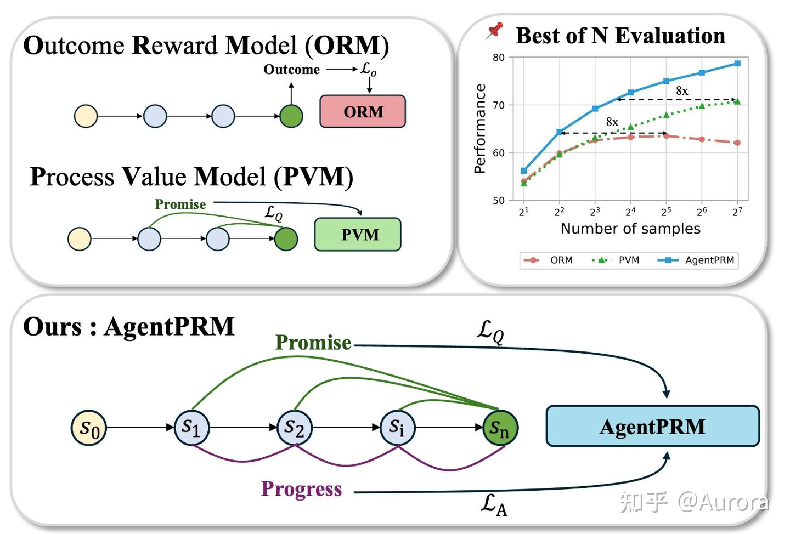

*alt text*

**5.1.2 训练：联合损失与 TD 估计**

令 $\mathcal{M}_\phi$ 为 AgentPRM 模型，输入 $(s_t, a_t)$，输出 Q 值预测。联合损失：

$$
\mathcal{L}_{\text{AgentPRM}}(\phi) = \underbrace{\mathbb{E}\!\left[\tfrac{1}{2}\bigl(\mathcal{M}_\phi(s_t, a_t) - \hat{Q}(s_t, a_t)\bigr)^2\right]}_{\mathcal{L}_Q} + \beta \underbrace{\mathbb{E}\!\left[\bigl(\mathcal{M}_\phi(s_t,a_t)-\mathcal{M}_\phi(s_{t-1},a_{t-1}) - \hat{A}(s_t, a_t)\bigr)^2\right]}_{\mathcal{L}_A}
$$

其中 $\beta = 1.0$。两项约束互补：$\mathcal{L}_Q$ 监督**绝对水平**，让每步预测值逼近 Q 目标；$\mathcal{L}_A$ 监督**增量方向**，要求相邻步差值同时逼近 GAE 优势估计——仅有 $\mathcal{L}_Q$ 时每步各自独立被拉向目标，差值无约束，等于只管每个检查点海拔准确却不管路段坡度。$\mathcal{M}_\phi$ 本质上扮演 **critic（Q-network）** 的角色，但与标准 actor-critic 的区别在于：它独立离线训练，既在训练时作为 PPO 过程奖励插入策略梯度，又在推理时直接导向 beam search——两个用途共用同一个模型。**去掉 $\mathcal{L}_A$ 后所有采样策略下性能均下降**——Progress 信号是 agent 任务的必要项而非可选项。

Q 值目标 $\hat{Q}$ 用 **TD + GAE** 估计，避免 MC 重采样的高环境重放代价。TD 残差为：

$$
\delta(s_t, a_t) = r_t + \gamma\,\mathcal{M}_\phi(s_t, a_t) - \mathcal{M}_\phi(s_{t-1}, a_{t-1})
$$

GAE 沿轨迹展开得到 $\hat{A}$，再重建 Q 目标（末步用实际环境奖励锚定）：

$$
\hat{A}(s_t, a_t) = \sum_{k=0}^{\infty}(\gamma\lambda)^k\delta(s_{t+k}, a_{t+k}), \qquad \hat{Q}(s_t,a_t) = \begin{cases}\hat{A}(s_t,a_t)+\mathcal{M}_\phi(s_{t-1},a_{t-1}) & t<T \\ r(u,\tau) & t=T\end{cases}
$$

取 $\lambda=0.95$，每 query 仅需 $N_{\text{TD}}=16$ 条轨迹迭代更新，比 MC 基线节省 **1.5–2.8× token**。

推理时 $\mathcal{M}_\phi$ 导向 beam search：每步展开 $M$ 个候选，保留 Top-$N$，记作 $@N\times M$。

**5.1.3 算法流程**

**训练算法（Algorithm 1）**

**输入**：初始化的 $\mathcal{M}_\phi$、actor $\pi_\theta$、任务 query 集合 $\{s_0^i\}$、每 query 采样数 $N_{\text{TD}}$、训练轮数 $m$
**阶段一：轨迹采集（一次性，离线）**

从 AgentGym 训练集随机选取 300 条轨迹初始化 $\mathcal{D}_{\text{train}}$，再对每个 query $s_0^i$ 用 $\pi_\theta$（温度=1.0）采样 $N_{\text{TD}}=16$ 条完整轨迹加入 $\mathcal{D}_{\text{train}}$，此后轨迹集合固定不变。

**阶段二：迭代训练（共 $m$ 轮 epoch）**
对 $\mathcal{D}_{\text{train}}$ 中每条轨迹 $\tau = (s_0, a_1, o_1, \ldots, a_T)$：

1.  **一次 forward pass** 得到全轨迹 Q 预测序列：

$$
\mathcal{Q} = [Q_1, Q_2, \ldots, Q_T], \quad Q_t = \mathcal{M}_\phi(s_t, a_t)
$$

1.  **计算 TD 残差**（末步以实际奖励锚定）：

$$
\delta_t = \begin{cases} r(u,\tau) - Q_{T-1} & t = T \\ Q_t - Q_{t-1} & t < T \end{cases}
$$

1.  **GAE 反向展开**得到优势目标（$\lambda=0.95$）：

$$
\hat{A}_t = \sum_{k=0}^{T-t} (\gamma\lambda)^k\, \delta_{t+k}
$$

1.  **重建 Q 目标**：

$$
\hat{Q}_t = \begin{cases} r(u,\tau) & t = T \\ \hat{A}_t + Q_{t-1} & t < T \end{cases}
$$

1.  **计算联合损失并反向传播**：

$$
\mathcal{L} = \underbrace{\sum_t \tfrac{1}{2}(Q_t - \hat{Q}_t)^2}_{\mathcal{L}_Q} + \beta \underbrace{\sum_t \bigl((Q_t - Q_{t-1}) - (\hat{Q}_t - \hat{Q}_{t-1})\bigr)^2}_{\mathcal{L}_A}
$$

每轮 epoch 开始时 $\mathcal{M}_\phi$ 已更新，步骤 1 的 $\mathcal{Q}$ 随之改变，Q 目标在每轮被模型"重新估计"一遍，bootstrap 精度随训练迭代逐步提升。

* * *

**推理算法（Algorithm 2：Step-Level Beam Search）**
**输入**：训练好的 $\mathcal{M}_\phi$、actor $\pi_\theta$、每节点展开数 $M$、beam 宽度 $N$

```text
candidates = {s₀}，共初始化 M 个候选，t = 0
while t < T 且存在未终止路径:
    C_next = 优先队列（空）
    for each sₜ in candidates:
        从 πθ(sₜ) 采样 M 个候选动作 a⁽¹⁾...a⁽ᴹ⁾
        for b = 1 to M:
            s_{t+1} = Concat[sₜ, a⁽ᵇ⁾, 环境响应]
            将 (s_{t+1}, Mφ(s_{t+1})) 加入 C_next
    candidates = C_next 中 Top-N（按 Mφ 分数）
    t += 1
返回 candidates 中分数最高的终止轨迹
```

记号 $@N\times M$：保留 $N$ 个节点、每节点展开 $M$ 个候选。$\mathcal{M}_\phi$ 每步打一次分，一次 forward pass 即可完成当前轮所有候选的评分。

**实验结果**（`WebShop`、`BabyAI`、`TextCraft`）：AgentPRM @8×8 达 76.0%，远超 PVM 的 54.5%，整体计算效率提升 **8×**。PVM 在 beam size 增大后性能饱和甚至下降；AgentPRM 随算力**持续稳定提升**。作为 PPO 过程奖励时收敛同样更稳定，且可迁移至数学推理（GSM8K 73.4% vs PVM 71.2%）。

**与 PPO Critic 的区别**

|  | PPO Critic | AgentPRM |
| --- | --- | --- |
| 估计量 | ，输入状态 | ，输入状态-动作对 |
| 在 PPO 中的角色 | 提供 baseline，计算 advantage | 直接作为 per-step process reward |
| 训练方式 | 与 actor 在线联合更新 | 离线独立训练，actor 冻结 |
| 损失函数 | 仅 TD 损失 | ，额外监督步间增量 |
| 推理时使用 | 否，训完即丢弃 | 是，直接导向 beam search |

**方法边界**：**① 只训练 PRM，不训练 actor。** $\mathcal{M}_\phi$ 用初始策略的轨迹离线训出后即固定，若用其驱动 PPO 训出更强 actor，新策略的状态分布已偏离 PRM 的训练分布，Q 估计随之失准，论文未提出 PRM 与 actor 交替更新的方案。**② 强假设：确定性转移 + 零中间奖励。** $A = Q(s_t,a_t) - Q(s_{t-1},a_{t-1})$ 的推导依赖这两个前提；真实 agent 环境中工具返回通常有随机性、部分任务存在中间奖励，假设失效时简化形式不再成立。

### 5.2 iStar

**iStar**：AgentPRM 的缺陷在于 PRM 只离线训练一次，策略更强后分布偏移导致 Q 估计失准。iStar 的回答是让 PRM 与策略**交替在线更新**：每轮从新策略采样轨迹、重新训练 PRM、再用 PRM 给出的步级 reward 驱动策略梯度，两者互相校准，形成自强化循环——无需任何步级人工标注。

**5.2.1 整体框架**

每轮迭代包含三个阶段：

1.  **轨迹采集**：当前策略 $\pi_\theta$ 对每条 query $x$ 采样若干完整轨迹，环境 verifier（binary 或连续 outcome reward）为每条轨迹打分。
2.  **PRM 更新**：按轨迹分数配对成 $(\tau^+, \tau^-)$，用 multi-turn DPO 更新 Implicit PRM $\pi_\phi$，参考模型取上一轮策略快照 $\pi_{\theta_{\text{old}}}$。
3.  **策略更新**：用更新后的 $\pi_\phi$ 计算每步隐式 reward，与 episode-level outcome reward 叠加成复合 advantage，以 PPO clip 目标更新 $\pi_\theta$。

循环结束后令 $\pi_{\theta_{\text{old}}} \leftarrow \pi_\theta$，进入下一轮。

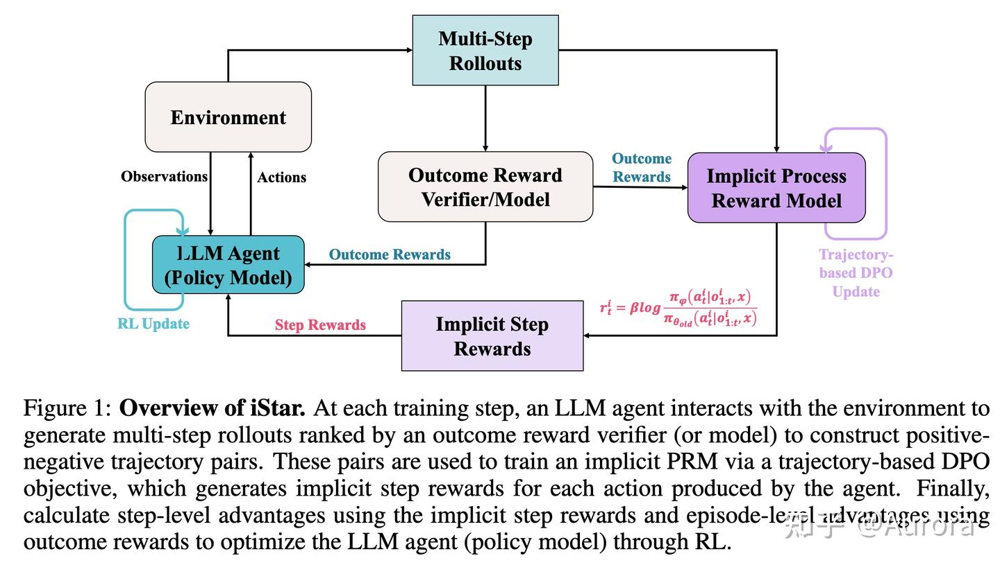

*alt text*

**5.2.2 隐式 Step Reward 与 PRM 训练**

**隐式 Step Reward。** Implicit PRM 不输出一个标量分数，而是直接用 log-ratio 作为步级奖励：

$$
r_\phi(o_{1:t}, a_t) = \beta \log \frac{\pi_\phi(a_t \mid o_{1:t}, x)}{\pi_{\theta_{\text{old}}}(a_t \mid o_{1:t}, x)}
$$

$o_{1:t}$ 是到第 $t$ 步为止的全部观测，$\pi_{\theta_{\text{old}}}$ 是上一轮策略快照作为参考模型。这个 reward 衡量的是：当前 PRM 对该步动作的偏好，比旧策略高出多少。关键设计是**以步（step）为单位**而非 token 为单位，在多轮长轨迹中显著降低方差。

**PRM 的 DPO 训练目标。** 给定从 $\pi_{\theta_{\text{old}}}$ 采样的轨迹对，PRM 用 multi-turn DPO 最大化偏好：

$$
\mathcal{J}_{\text{PRM}}(\phi) = -\mathbb{E}_{(\tau^+,\tau^-)\sim\pi_{\theta_{\text{old}}}}\!\left[\log \sigma\!\left(\beta \log \frac{\pi_\phi(\tau^+\mid x)}{\pi_{\theta_{\text{old}}}(\tau^+\mid x)} - \beta \log \frac{\pi_\phi(\tau^-\mid x)}{\pi_{\theta_{\text{old}}}(\tau^-\mid x)}\right)\right]
$$

参考模型用当前轮旧策略 $\pi_{\theta_{\text{old}}}$ 而非冻结的初始模型，使 PRM 奖励随策略演化持续自校准。论文证明该目标等价于以步级奖励函数参数化的 **Bradley-Terry 模型**——即从轨迹级 DPO 可以隐式地学出步级奖励，这是整个框架的理论基础：只要轨迹偏好来自步级 reward 的累加，DPO 反推出的参数就是步级 reward 的最优估计。

**5.2.3 复合 Advantage 与策略更新**

**Advantage 计算。** iStar 将 episode-level 与 step-level 两个信号线性叠加：

$$
A^E(\tau_i) = \frac{r_o(\tau_i) - \operatorname{mean}(R_o)}{\operatorname{std}(R_o)}, \qquad A^S(a_t^i) = \frac{r_\phi(a_t^i) - \operatorname{mean}(R_s)}{\operatorname{std}(R_s)}
$$

$$
A(a_t^i) = A^E(\tau_i) + \alpha \cdot A^S(a_t^i)
$$

$A^E$ 来自环境 outcome reward，$A^S$ 来自 PRM 的步级打分，$\alpha$ 为平衡系数，$R_s$ 是同批次所有步骤 reward 的集合。设计动机：$A^E$ 作为"门控"——只有整条轨迹的结果也是好的，步级正 reward 才会产生正的复合 advantage；若轨迹整体失败，即使某步 PRM 打分高也会被 $A^E$ 压制，从而防止策略单独优化 PRM 分数而忽略任务目标。

**策略更新目标。** 标准 PPO clip，无额外 KL 惩罚：

$$
\mathcal{J}_{\text{policy}}(\theta) = \mathbb{E}\!\left[\sum_i\sum_t \min\!\left(\rho_\theta(a_t^i)\,A(a_t^i),\;\operatorname{clip}(\rho_\theta(a_t^i),\,1-\varepsilon,\,1+\varepsilon)\,A(a_t^i)\right)\right]
$$

$\rho_\theta(a_t^i) = \pi_\theta(a_t^i) / \pi_{\theta_{\text{old}}}(a_t^i)$ 为重要性采样比率。该目标与 GRPO、RLOO、REINFORCE++ 等均兼容，只需替换 advantage 计算方式。

**方法边界**：**① 偏好噪声直接污染 PRM。** 轨迹排序依赖 outcome reward——若 verifier 有误差、任务奖励稀疏或轨迹结果分布高度集中，配对偏好质量差，DPO 反推出的步级 reward 会系统性偏移。**② PRM hack 风险未彻底消除。** $A^E$ 门控只是衰减了单独优化 PRM 的动机，并非消除：当 $A^E \approx 0$（轨迹结果均匀）时门控失效，策略仍有激励去拟合 PRM 的表面特征而非真正解决任务。

## 6\. 反事实 / Shapley

**核心思路**：把 credit 问题转化为"这一步的边际贡献是多少"。反事实方法让 LLM 想象"换个动作后续会怎样"；Shapley 方法用合作博弈论精确分配多 agent / 多工具间的联合贡献。两者都绕开了环境重放，理论上能做到语义级 credit，也因此计算/幻觉风险最高。

### 6.1 Hindsight [Credit Assignment](https://zhida.zhihu.com/search?content_id=273180744&content_type=Article&match_order=1&q=Credit+Assignment&zhida_source=entity) for Long-Horizon LLM Agents

**HCAPO**（arXiv `2603.08754`）：把 HCA 理论引入 LLM agent 训练，直接用 LLM 自身做反事实评分器，无需环境重放、无需额外 critic。针对的是 `GRPO` 在长时程任务上的两个根本缺陷：只有终态奖励导致关键步与冗余步无法区分；固定的初始状态 baseline 在任务推进过程中持续失配。

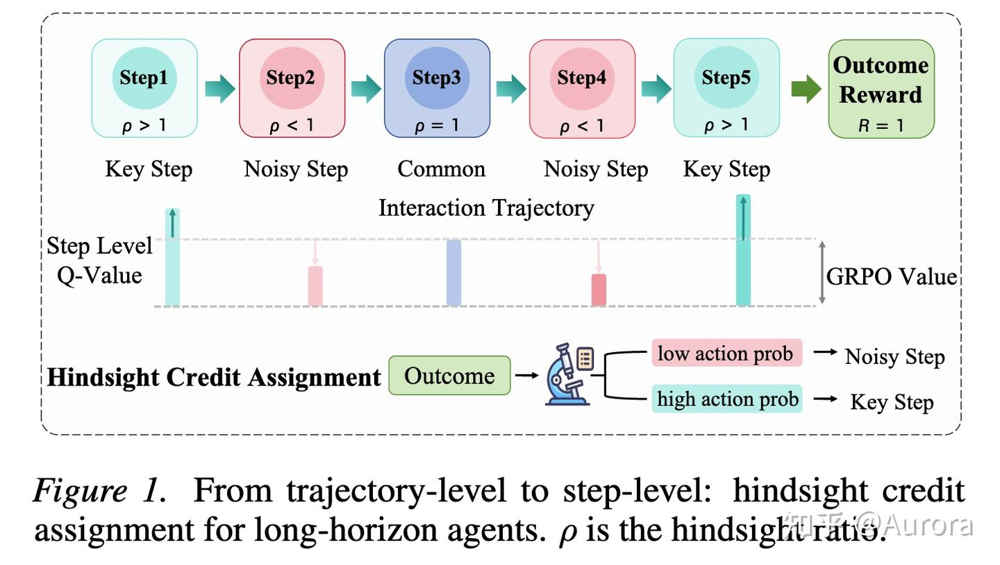

*alt text*

**HCA 理论基础**：标准多步 MC 展开直接用观测到的 $R_k$ 归因给 $a_t$，但 $R_k$ 实际上取决于 $k > t$ 的所有后续动作，与 $a_t$ 并没有直接因果关联。HCA 的修正是为每个未来奖励乘上一个因果权重：

$$
Q(s_t, a) \approx \hat{r}(s_t, a) + \sum_{k=t+1}^{T-1} \gamma^{k-t} \frac{h(a \mid s_t, s_k)}{\pi(a \mid s_t)} R_k + \gamma^{T-t} \frac{h(a \mid s_t, s_T)}{\pi(a \mid s_t)} V(s_T)
$$

其中 $h(a \mid s_t, s_k)$ 是 **hindsight 分布**——在已知"从 $s_t$ 出发最终到达了 $s_k$"这一后验信息的条件下，当初在 $s_t$ 处选择动作 $a$ 的概率。由贝叶斯定理：

$$
\frac{h(a \mid s_t, s_k)}{\pi(a \mid s_t)} = \frac{P(s_k \mid s_t, a)}{P(s_k \mid s_t)}
$$

这是一个似然比：动作 $a$ 使轨迹到达 $s_k$ 的概率，比平均策略高多少倍。可以证明（对所有起始于 $s_t$ 的轨迹取期望）：

$$
\mathbb{E}_\pi\!\left[\frac{h(a \mid s_t, s_k)}{\pi(a \mid s_t)} R_k \;\Big|\; s_t\right] = \mathbb{E}[R_k \mid s_t,\, a_t = a]
$$

这正是贝尔曼多步展开里的那一项，**所以 HCA Q 值是标准 Q 值的无偏估计**。直觉上：$h/\pi > 1$ 意味着 $a_t$ 对到达 $s_k$ 有正贡献，$R_k$ 的信用应放大；$h/\pi < 1$ 意味着不取 $a_t$ 也能到 $s_k$，$R_k$ 信用压缩。

经典 HCA 需要单独训练一个参数化模型来估计 $h$。HCAPO 的创新在于：对 LLM agent 来说，直接把 $s_{final}$（成功的最终状态）注入 prompt，让 LLM 自身扮演 hindsight 评分器，避免了额外模型的训练成本。

**6.1.1 Hindsight 重要性比率**

HCA 的核心直觉：若某步动作 $a_t$ 在"已知最终成功"这一条件下变得更可能被选出，说明它对成功有因果贡献。具体做法是把当前状态 $s_t$ 和最终成功状态 $s_{final}$ 同时输入 LLM，对原始动作重新打分：

$$
\pi_{hind}(a_t) = \exp\!\left(\frac{1}{T_{temp}\,|a_t|}\sum_{j=1}^{|a_t|}\log\pi_\theta(y_j \mid y_{<j},\, s_t,\, s_{final})\right)
$$

由于行为策略先验 $\pi(a_t|s_t)$ 不可直接获得，用轨迹内均值自归一化作为局部参考：

$$
\rho_t = \operatorname{clip}\!\left(\frac{\pi_{hind}(a_t)}{\bar\pi_{hind}},\; C_{min},\; C_{max}\right), \qquad \bar\pi_{hind} = \frac{1}{T}\sum_{k=1}^T \pi_{hind}(a_k)
$$

事后 Q 值将 $\rho_t$ 作为因果滤波器直接乘上折扣回报：

$$
Q_{i,t}^H = \rho_{i,t} \cdot G_{i,t}, \qquad G_{i,t} = \gamma^{T-t} R(\tau_i)
$$

$\rho_t > 1$ 的步骤信号被放大，冗余步骤被压缩。对于因果链紧密的推理步骤，可选做时序平滑 $\tilde Q_{i,t}^H = \alpha Q_{i,t}^H + (1-\alpha)Q_{i,t+1}^H$。

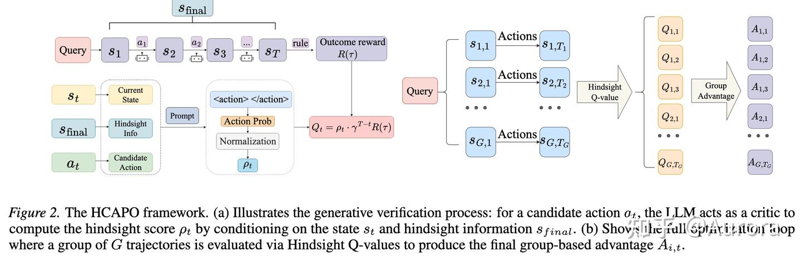

*alt text*

**6.1.2 双尺度复合 Advantage**

把宏观轨迹信号（GRPO）与微观步骤信号（hindsight）叠加：

$$
A_{i,t}^{HCAPO} = \underbrace{\frac{R(\tau_i)-\mu_R}{\sigma_R}}_{\text{Macro}} + \omega\cdot\underbrace{\frac{Q_{i,t}^H-\mu_H}{\sigma_H}}_{\text{Micro}}
$$

其中 $\mu_H,\sigma_H$ 是同一 group 在时刻 $t$ 处 hindsight Q 值的统计量。用跨轨迹的 $\mu_H$ 归一化有一个自然的好处：全局均值天然落在低价值区（突破前）和高价值区（突破后）之间，不需要手工标记，归一化本身就自动突出任务瓶颈。最终用 PPO clip 损失加 KL 正则训练：

$$
\mathcal{J}(\theta) = \mathbb{E}\!\left[\frac{1}{K}\sum_{i=1}^K\frac{1}{T_i}\sum_{t=1}^{T_i} \min\!\left(r_{i,t}A_{i,t}^{HCAPO},\; \operatorname{clip}(r_{i,t}, 1-\epsilon, 1+\epsilon)A_{i,t}^{HCAPO}\right) - \beta_{KL}\,\mathbb{D}_{KL}(\pi_\theta\|\pi_{ref})\right]
$$

无需环境重放，额外开销只是一次 forward pass；代价是 hindsight 评分依赖 LLM 对反事实的判断，若 $s_{final}$ 条件化不准确，$\rho_t$ 本身会引入噪声，credit 方向可能反转。

整体流程：

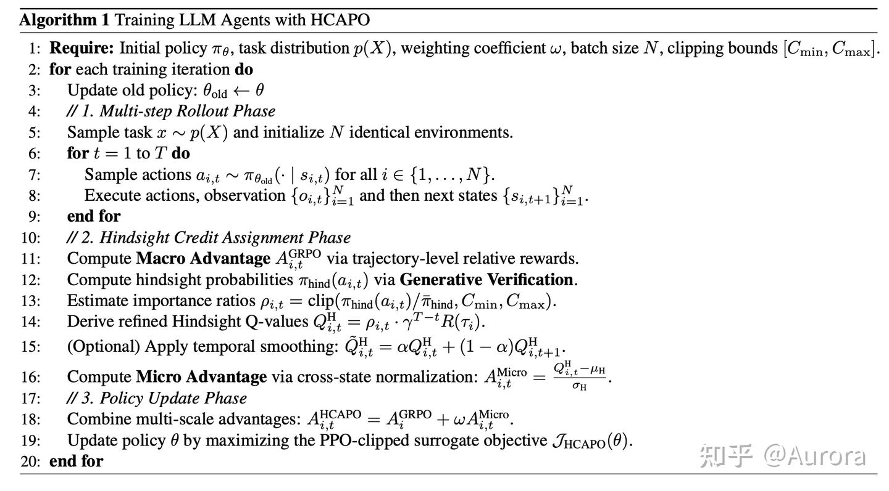

*alt text*

### 6.2 CriticSearch: Fine-Grained Credit Assignment for Search Agents via a Retrospective Critic

任务是多轮工具集成推理（Tool-Integrated Reasoning）：策略模型 $\pi_\theta$ 与搜索引擎交互，生成一条轨迹 $y = \{(a_1, c_1), \dots, (a_T, c_T)\}$，其中 $a_t$ 是第 $t$ 轮动作（搜索查询或最终答案），$c_t$ 是搜索引擎返回的观测。标准 GRPO 只在轨迹末尾给一个结果奖励，整条轨迹内所有 token 共享同一个 advantage——中间哪步搜索有效、哪步是噪声，完全无法区分。

CriticSearch 的核心做法是：引入一个冻结的 LLM 作为**事后批评者（retrospective critic）**，在轨迹结束后利用 ground-truth 答案对每一轮动作打 Good / Bad 标签，再把这个 turn 级信号与 GRPO 的 episode 级信号混合，构造出 hybrid advantage。

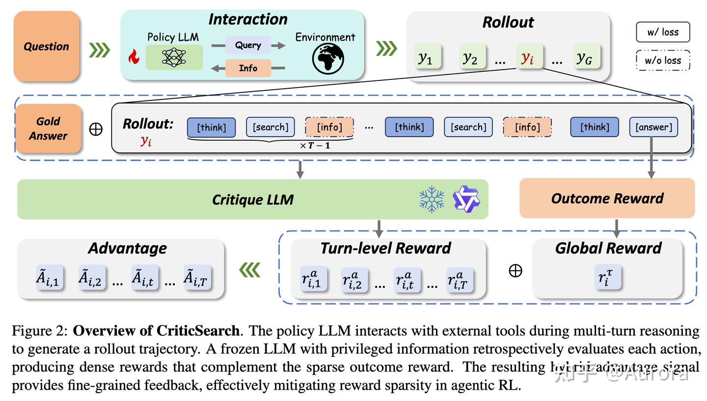

*alt text*

**6.2.1 事后批评者与 Turn 级信号**

批评者 $\mathcal{C}_\phi$ 是与策略同规模的 instruct 模型，训练中参数冻结。每条轨迹 $y_i$ 采样完毕后，将问题 $x$、完整轨迹 $y_i$、以及 ground-truth 答案 $o_{\text{gold}}$ 一并送入 $\mathcal{C}_\phi$，令其逐轮判断"该搜索动作是否对最终答案有贡献"，输出二值标签序列 $\{\ell_{i,t}\} \in \{\text{Good},\text{Bad}\}^T$。

事后视角的核心优势是**信息不对称**：前向决策时模型看不到答案，而批评者在回溯时同时持有轨迹全貌与正确答案，能以远低于训练 PRM 的成本给出有意义的 per-turn 信号。代价是评分完全依赖批评者的语义能力——若批评者对某类问题判断不准，标签噪声会直接污染 credit 方向。

将二值标签映射为 per-turn 奖励，再在轨迹内各轮之间归一化：

$$
r_{i,t}^{a} = \mathbf{1}[\ell_{i,t} = \text{Good}], \qquad A_{i,t}^{a} = \frac{r_{i,t}^{a}}{\displaystyle\sum_{u=1}^{T_i} r_{i,u}^{a} + \varepsilon}
$$

$\varepsilon > 0$ 防止全轨迹均为 Bad 时分母为零。归一化的语义是：同一条轨迹里，所有被判为 Good 的动作平分整条轨迹的 credit；Bad 动作得分为零。

**6.2.2 Hybrid Advantage 与策略优化**

结果奖励 $r_i \in \{1,\; 1{-}\lambda_f,\; \lambda_f,\; 0\}$ 按答案正确性与格式合规性赋值（$\lambda_f = 0.2$），用 GRPO 的 group-relative 归一化得到宏观 advantage：

$$
A_{i,t}^{\tau} = \frac{r_i - \mu_r}{\sigma_r}
$$

其中 $\mu_r,\sigma_r$ 是同一 group 内的均值与标准差。将宏观与微观信号线性混合：

$$
\tilde{A}_{i,t} = \alpha \cdot A_{i,t}^{a} + (1-\alpha) \cdot A_{i,t}^{\tau}, \quad \alpha = 0.25
$$

$A^\tau$ 给出轨迹整体质量的参考基线，$A^a$ 在此基础上区分同一轨迹内哪些动作真正有贡献——两者分工互补。$\alpha = 0.25$ 由 ablation 得出，过大会让 turn 级信号的标签噪声主导训练。

无需环境重放，批评者只做一次 inference，额外成本低；turn 级信号对搜索 agent 的动作边界天然对齐，不需要人工标注步骤质量。缺点是二值判断丢失了连续强度信息，且批评者冻结——当问题超出其知识范围时，标签准确率下降，credit 方向可能反转。

### 6.3 **SHARP**

面向多 agent / 多工具协作场景，SHARP 的出发点是把 Shapley 值的公理化思想引入 credit assignment：

$$
\phi_i = \sum_{S \subseteq N \setminus \{i\}} \frac{|S|!\,(|N|-|S|-1)!}{|N|!} \bigl[v(S \cup \{i\}) - v(S)\bigr]
$$

Shapley 值理论地位无可置疑，但 $|N|$ 稍大便不可行——枚举所有子集是指数代价。SHARP 的核心贡献，是用**反事实屏蔽**（counterfactual masking）把这个指数问题降为线性近似，同时把 Shapley 的公理化保证转化为可操作的奖励设计框架。

**6.3.1 场景建模**

SHARP 把"模型调用工具解题"建模成一条**工具集成轨迹**（`tool-integrated trajectory`）：

$$
\tau = \{a_1, s_1, a_2, s_2, \ldots, a_T, s_T\}
$$

其中 $a_t$ 是模型在第 $t$ 步生成的动作（文字输出或工具调用），$s_t$ 是工具返回的观测。

为处理多角色协作，SHARP 用**单个共享策略** $\pi_\theta$ 同时扮演两种角色，通过不同 system prompt 区分身份——这是一种 `self-play` 的实例化：

-   **Planner**：生成高层任务拆解。$a_t \sim \pi_\theta(\cdot \mid p_{\text{planner}}, q, a_{<t}, s_{<t})$
-   **Worker**：执行具体子任务。$a^j_t \sim \pi_\theta(\cdot \mid p_{\text{worker}}, q_{\text{subtask-}t}, a^j_{<t}, s^j_{<t})$

一个 query 对应一次 planner 执行和若干 worker 并行执行，全部轨迹的联合概率分解为：

$$
P_\theta(\tau) = P_\theta(\tau^0) \prod_{t=1}^{T} P_\theta(\tau^t \mid a_t)
$$

这个因式分解使整个多 agent 系统可以端到端优化。

**6.3.2 三元组合奖励**

SHARP 把奖励分解为三个成分，分别对应三条公理化原则：**全局对齐**、**边际归因**、**过程有效性**。

**① 广播准确性奖励（Broadcast Accuracy Reward）**

任务最终结果直接广播给所有参与的 agent：

$$
R^{\text{acc}}_i(\tau) \in \{0, 1\}
$$

这确保所有 agent 都朝完成任务的方向优化，但不区分各自的实际贡献。

**② 边际 Credit 奖励（Marginal Credit Reward）**

这是最关键的一项，也是 Shapley 思想的具体落地。SHARP 通过**反事实屏蔽**估算每个 worker $m$ 的边际贡献：

$$
\text{credit}_{i,m} = R^{\text{acc}}(\tau_i) - R^{\text{acc}}(\tau_{i \setminus m})
$$

即：把 agent $m$ 的输出从轨迹中抹去后，任务成功率的变化量。这是对 Shapley 值的一阶近似——只考虑"移除单个 agent"而非枚举所有子集，计算量从指数降至线性。

对 Planner 的边际 credit 汇总为其下辖所有 worker 的平均贡献：

$$
R^{\text{mc}}_{i,0} = \lambda \cdot \frac{1}{|\mathcal{M}_i|} \sum_{m \in \mathcal{M}_i} \max(\text{credit}_{i,m},\; 0)
$$

$\max(\cdot, 0)$ 截断负贡献，避免惩罚"没有独立贡献但也未拖累整体"的 worker。

**③ 工具过程奖励（Tool Process Reward）**
每个 worker 每步的工具交互有效性 $\varphi(a^m_{i,j}, s^m_{i,j}) \in \{0,1\}$，汇总为步均分：

$$
R^{\text{tool}}_{i,m} = \frac{1}{T_{i,m}} \sum_{j=1}^{T_{i,m}} \varphi\!\left(a^m_{i,j},\; s^m_{i,j}\right)
$$

**合并奖励**：三项加权求和：

$$
\bar{R}_{i,m} = \alpha \cdot R^b_{i,m} + \beta \cdot R^{\text{mc}}_{i,m} + \gamma \cdot R^{\text{tool}}_{i,m}
$$

实验中取 $\alpha = 0.9,\ \beta = 0.9,\ \gamma = 0.1$——结果 credit 与边际归因共同主导，过程奖励起辅助作用。

**6.3.3 GRPO 优化**

奖励确定后，SHARP 用改造版的 `GRPO` 优化策略。
**Group-Relative Advantage**：在同组 $G$ 条轨迹内对同一 agent 角色做归一化：

$$
\hat{A}_{i,m} = \frac{\bar{R}_{i,m} - \mu_m}{\sigma_m + \delta}
$$

其中 $\mu_m,\sigma_m$ 是角色 $m$ 在组内的均值与标准差，$\delta$ 防止除零。

**策略比率**：

$$
\mathcal{R}_{i,m} = \exp\!\left(\sum_j \log \pi_\theta(a^m_{i,j} \mid \mathrm{ctx}^m_{i,j}) - \sum_j \log \pi_{\theta_{\text{old}}}(a^m_{i,j} \mid \mathrm{ctx}^m_{i,j})\right)
$$

**Clipped Surrogate 目标**（与 PPO 形式一致）：

$$
\mathcal{R}^{\text{clip}}_{i,m} = \min\!\Bigl(\mathcal{R}_{i,m} \cdot \hat{A}_{i,m},\; \mathrm{clip}(\mathcal{R}_{i,m}, 1{-}\varepsilon, 1{+}\varepsilon) \cdot \hat{A}_{i,m}\Bigr)
$$

**总目标**对所有 query 和所有 agent 角色取期望：

$$
\mathcal{J}_{\text{SHARP}}(\theta) = \mathbb{E}\!\left[\frac{1}{G} \sum_{i=1}^{G} \frac{1}{|\{0\} \cup \mathcal{M}_i|} \sum_{m \in \{0\} \cup \mathcal{M}_i} \mathcal{R}^{\text{clip}}_{i,m}\right]
$$

参数更新：$\theta \leftarrow \theta + \eta \nabla_\theta \mathcal{J}_{\text{SHARP}}(\theta)$。

**优势**：反事实屏蔽把 Shapley 的指数枚举降为线性，三元奖励设计公理化清晰，共享策略的 self-play 方式避免了维护多组参数。**局限**：一阶近似丢掉 agent 之间的协同/替代效应，严格意义上不再是 Shapley 值；反事实推理需要在屏蔽某个 worker 后重新评估整条轨迹，长轨迹上额外开销不低；若 Planner 规划质量差但某个 worker 恰好弥补，credit 信号会失真。

## 7\. 训练稳定性基础设施

这一类工作**不直接做 credit 分配**，而是解决多轮 RL 训练本身能不能跑起来的问题。Credit 分不好，一部分原因就是根本没有稳定训起来——所以把它单独列出，是前提条件，而非 credit assignment 方法本身。

代表文章：

-   **RAGEN / StarPO**（2025）：长时程多轮 RL 存在 "`Echo Trap`"——模型反复生成相似的失败模式，方差塌陷，梯度爆炸。`StarPO-S` 通过**轨迹过滤 + 解耦 clip** 缓解这个问题，使 agent 场景下的 RL 训练首次能在较长 horizon 上稳定收敛。
