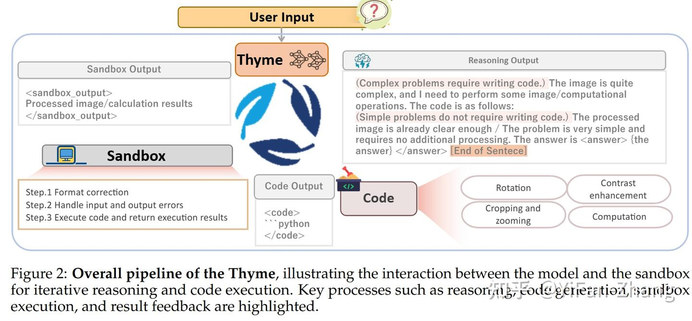
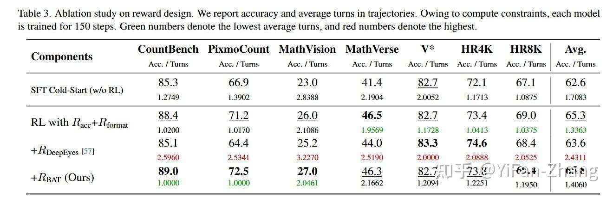
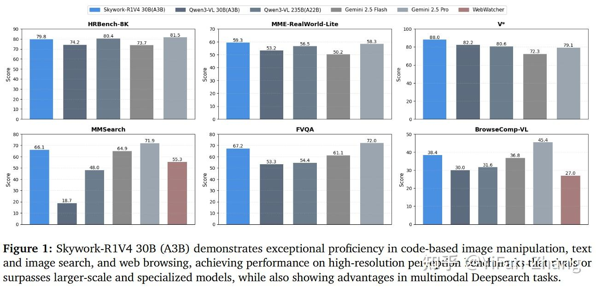
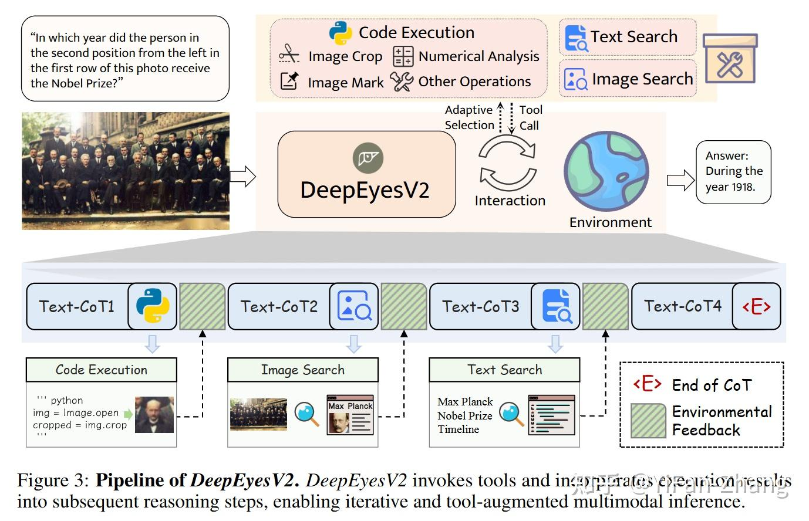
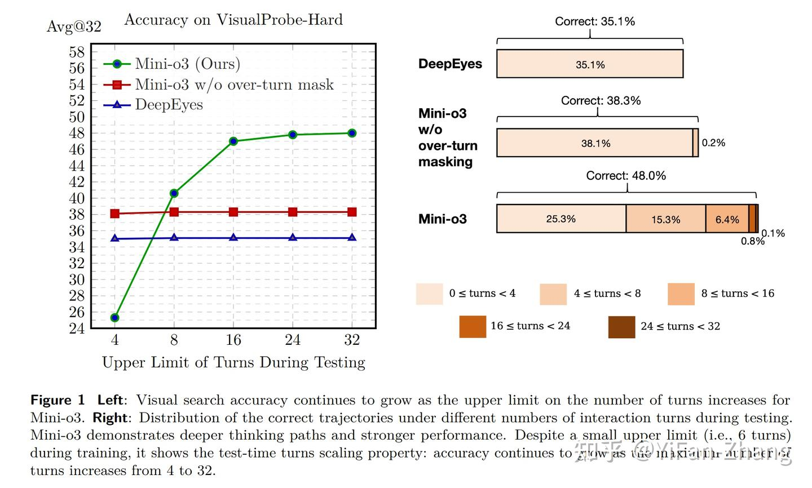
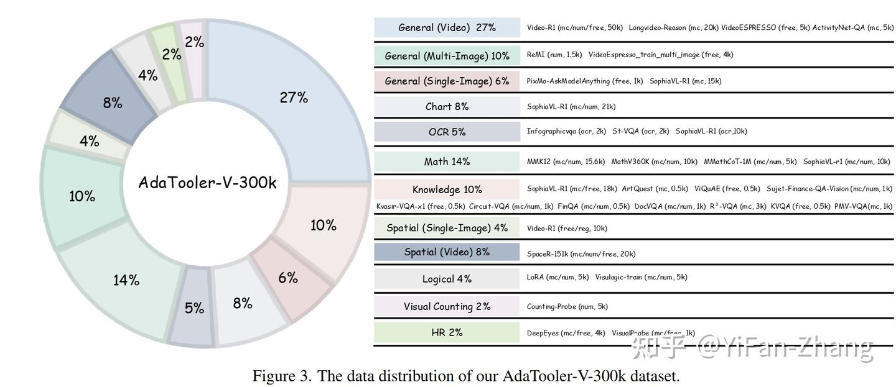

> 来源: [https://zhuanlan.zhihu.com/p/1985055659776049744](https://zhuanlan.zhihu.com/p/1985055659776049744)
> 作者: YiFan-Zhang​
> 简介: 知势榜科技互联网领域影响力榜答主
> 时间: 编辑于 2026-02-28 13:58・北京

之前写过很多了，最近包括[gemini](https://zhida.zhihu.com/search?content_id=267838258&content_type=Article&match_order=1&q=gemini&zhida_source=entity)都已经支持了这个功能，决定把近期积攒的一些文章都理一理，已经看过的就不在这里重述了，新的大概也还有10篇文章。我个人会将**带visual tool**的方法大致分为以下几类：

**Training-free methods** 基本上prompt够用了。代表性例子包括 [ViperGPT](https://zhida.zhihu.com/search?content_id=267838258&content_type=Article&match_order=1&q=ViperGPT&zhida_source=entity) 和 [VisProg](https://zhida.zhihu.com/search?content_id=267838258&content_type=Article&match_order=1&q=VisProg&zhida_source=entity)，它们预定义了视觉 API（如检测、分割）并依赖代码进行编排；[Visual Sketchpad](https://zhida.zhihu.com/search?content_id=267838258&content_type=Article&match_order=1&q=Visual+Sketchpad&zhida_source=entity) 则允许现成的MLLM在视觉草图板（框/线/掩码）上绘图以辅助后续推理。[PyVision](https://zhida.zhihu.com/search?content_id=267838258&content_type=Article&match_order=1&q=PyVision&zhida_source=entity) 则通过提示模型生成基于 PIL 的操作代码。近期纯 Prompt 的工作不多了

**基于代码的图像操作方法** 此类方法通过生成代码来执行视觉修改。例如，[Refocus](https://zhida.zhihu.com/search?content_id=267838258&content_type=Article&match_order=1&q=Refocus&zhida_source=entity) 生成代码来绘制检测框、掩码或高亮，从而聚焦注意力。然而，代码生成在更丰富操作（如迭代放大、旋转校正、对比度增强和数值计算）上的潜力尚未被充分挖掘。Thyme、Skywork-R1V4、PyVision-RL 以及 [DeepEyes-v2](https://zhida.zhihu.com/search?content_id=267838258&content_type=Article&match_order=1&q=DeepEyes-v2&zhida_source=entity)，Gemini 3 Flash, Kimi K2.5 等都属于这一类。

**单一外部工具方法 (主要是裁剪)** 诸如 Pixel Reasoner、DeepEyes、Mini-O3 和 Visual CoT，[Qwen3-VL](https://zhida.zhihu.com/search?content_id=267838258&content_type=Article&match_order=1&q=Qwen3-VL&zhida_source=entity) 等方法，将“裁剪与缩放 (Crop-and-zoom)”视为一种离散的外部工具来增强感知能力。好train，但是灵活性差。

**结合多模态搜索的方法** 包括 DeepEyes-v2、Skywork-R1V 以及 SenseNova-MARS 等工作。

视频领域的应用 最后一类主要集中在视频任务上，代表作有 [Video-Thinker](https://zhida.zhihu.com/search?content_id=267838258&content_type=Article&match_order=1&q=Video-Thinker&zhida_source=entity)、[VideoExplorer](https://zhida.zhihu.com/search?content_id=267838258&content_type=Article&match_order=1&q=VideoExplorer&zhida_source=entity)、[VideoZoomer](https://zhida.zhihu.com/search?content_id=267838258&content_type=Article&match_order=1&q=VideoZoomer&zhida_source=entity)、LongVT 和 [FrameThinker](https://zhida.zhihu.com/search?content_id=267838258&content_type=Article&match_order=1&q=FrameThinker&zhida_source=entity)。此外，还有一些涉及 3D、Spatial Reasoning以及Latent Reasoning的应用。

这篇文章主要是前两者，基于代码的和基于单一工具的。

[](https://link.zhihu.com/?target=https%3A//www.xiaohongshu.com/discovery/item/6979e04800000000280202f2%3Fsource%3Dwebshare%26xhsshare%3Dpc_web%26xsec_token%3DABg4o4j38bOBnce3F2uG3L4BwVpVCNUq-EGIGuGaKtsgk%3D%26xsec_source%3Dpc_share)

[Thyme全面开源：复现o3的大多Think with Image功能](https://zhuanlan.zhihu.com/p/1942175827547649963)

[Skywork-R1V4: 纯sft 30k数据激活agentic mllm](https://zhuanlan.zhihu.com/p/1979848119471608282)

[微信团队：think with image for ocr task](https://zhuanlan.zhihu.com/p/1982804172593194658)

[字节跳动:think with image很适合损坏图像感知](https://zhuanlan.zhihu.com/p/1982065721669345843)

[Deepeyes v2: 图像操作+搜索，agentic mllm](https://zhuanlan.zhihu.com/p/1971564951412924453)

[美团：3D版的think with image](https://zhuanlan.zhihu.com/p/1968671990681403733)

[直接预测vision token实现Think with image](https://zhuanlan.zhihu.com/p/1966113562880619373)

首先是基于代码的，Pyvision和Thyme应该是今年同期探索这个方向的了，前者纯prompt测试了下GPT等模型。Deepeyes当时已经比较火了，大家都觉得crop is enough。但是我们当时实际上是看了很多o3的case，他确实是think with image而不是think with crop，因此我们在Thyme里预定了几种工具比如旋转，对比度增强，裁剪，用code做计算等，然后冷启动加RL，在Skywork-R1V4的时候把数据升级了下，然后加入了search和web use的功能，但是visual tool核心还是code。

## \[1\] Thyme: Think Beyond Images



Thyme我觉得主要贡献有几个

1.  数据确实挺难造的，不同的功能要写不同的prompt去构造，清洗。但是Kimi给出了不一样的point，用纯文本数据去做冷启动（：不知道小模型可不可以
2.  沙盒挺难写的，设计沙盒是一个修修补补的过程，发现模型的box经常越界，就加ast遍历代码树提前fix，以及还有很多格式问题，超时问题。
3.  RL这些数据确实都是自己找的。

至于RL算法，GRPO-ATS，对于以后更强的模型或者更大的模型，我直觉上应该不会太有用，我们在skywork r1v4换到Qwen3 VL A3B的时候已经感觉到，code能力的大幅提升，就慢慢不需要太多code的补丁了。

## \[2\] [CodeV](https://zhida.zhihu.com/search?content_id=267838258&content_type=Article&match_order=1&q=CodeV&zhida_source=entity): Code with Images for Faithful Visual Reasoning via Tool-Aware Policy Optimization

主要的point在于很多case结果对了，但是中间工具用得很不靠谱——例如裁剪到完全不相关的区域、甚至根本不看工具输出，依然能“蒙”对答案。所以强调工具的faithful很重要，但是整个检查COT代价高，验证难度大。

因此第一步用了Thyme-SFT数据来SFT。然后RL做了一些技巧，除了acc之外还加上了**工具忠实分/**

-   **工具奖励** r\_{\\text{tool}}：对轨迹中每个工具步骤给分，再取平均
-   找出所有 <code> 的时间步集合 T\_{\\text{tool}}
-   聚合： r\_{\\text{tool}}(\\tau)=\\frac{1}{|T\_{\\text{tool}}|}\\sum\_{t\\in T\_{\\text{tool}}} r\_{\\text{tool}}^{t}
-   最关键的设计：**判分只看可核验的“非模型生成信息”**，例如 (Q, o\_t, metadata)
-   judge 不看 chain-of-thought，也不看代码文本本身
-   只回答一个更容易验证的问题：当前工具输出（例如裁剪图）是否提供了回答该问题所需的证据
-   rubric（判分准则）强调两点：

-   只要 crop 里“清楚包含相关对象/区域”，就应当得正奖励
-   不强求一次 crop 覆盖所有目标；多目标问题中，能先定位到其中一个目标也算有价值（鼓励逐步缩小范围的策略）

-   对“巨大但杂乱、目标很小不清晰”的裁剪倾向给低分
-   对明显滥用工具（例如把读写图像当草稿板、无意义操作）给负奖励
-   有些任务并不需要局部搜索（例如部分计数、描述类），此时强加密集工具奖励会诱发“为了拿分硬用工具”的作弊。因此这类任务默认让 rtool接近 0，只对明显红线行为给负奖励（无效坐标、重复 no-op crop、可避免的 sandbox 报错等），让最优策略自然学会“该不用工具就不用”。

### 一些实验finding

1.  数据清洗对 RL 是否“学得动”影响很大 训练 RL 数据来自 Thinklite-70K、DeepEyes-47K 等开源集合，但作者发现直接拿来用会引入噪声和无效样本，于是做了三层处理：先去掉依赖外部知识的问题（比如 OK-VQA 这类），再用 Qwen2.5-VL-32B 做自动检查并人工复核清理标签，最后还做了一个很实用的“去除过于简单样本”的策略：让 Qwen2.5-VL-7B 对每题采样回答 8 次，如果经验正确率高于 0.9 就丢掉。
2.  CodeV 在“基础感知能力”上没有因为强调工具过程奖励而退化，反而更强。在 VLMBlinds 这类偏“原始但很刁钻”的感知测试上，CodeV 得到 46.7，不仅比 Qwen2.5-VL-7B 和 Pixel-Reasoner 高约 3 分，还比 Thyme-VL-7B-RL 高约 8 分，并且略微超过 GPT-4o。
3.  “忠实性评估”揭露了一个很尖锐的事实：很多模型准确率不错，但工具使用几乎不可信
    在 V\* 和 HRBench-4K 上对比忠实工具使用率时，CodeV 始终最高；相对 Pixel-Reasoner 和 DeepEyes，很多设置下是两位数百分点的提升，最极端的情况能高出 30 多点。按作者给出的概括，CodeV 的忠实工具使用率大约是其他工具型 baseline 的 1.3 到 2 倍。更重要的是：忠实性提升并没有以牺牲最终准确率为代价，这支持了“过程级工具奖励能把模型从猜答案拉回证据链”的论点。
4.  Thyme 的一个反常现象很有启发：看起来像在用工具，实际上经常根本没用
    **Thyme 在忠实性评估上表现极低：（**在两个数据集上都只有个位数）。作者人工检查后发现原因很“尴尬但真实”：不到一成的 rollout 真正调用了视觉工具，更多时候是在纯文本里假设自己已经 crop 过了，写出装饰性的工具过程。这说明只看输出格式或只看最终准确率，会严重高估“智能体工具能力”，也解释了为什么必须单独做忠实性度量。
5.  只用“最终准确率奖励”会把模型重新推回不使用工具；过程奖励才是把工具用实的关键。从冷启动 SFT 开始做奖励设计消融时，单纯 accuracy outcome reward 只能带来小幅提升，但训练过程中策略会逐渐偏向纯文本。：TAPO 能更好地维持工具调用，而只用准确率奖励时工具调用更容易掉下去。

## \[3\] CodeDance: A Dynamic Tool-integrated MLLM for Executable Visual Reasoning

A了deepeyes不管啥场景都先用个tool，模式过度僵化了，在code场景下提升adaptive。

### 序列级奖励 R\_{seq}：用“组内难度信号”控制工具激励，避免刷工具（tool spamming）

如果只要工具调用成功就给奖励，模型会在简单题上疯狂调用工具来“薅奖励”，出现工具滥用和奖励投机。

为此用**组内准确率均值作为metric** \\mu\_{acc}

-   同一个输入会采样多条 rollouts，如果大多数 rollouts 已经能答对，说明题目偏简单或不需要工具；这时继续调用工具应该被抑制（这个想想是会有一些问题的，如果难题大部分都通过tool答对了会被抑制）。
-   如果组内大多数 rollouts 都答不对，说明题目困难；这时需要鼓励更多探索和工具调用。

具体做法是把工具奖励乘上一个随 \\mu\_{acc} 变化的缩放因子 d：

R\_{seq}= \\left(0.5+0.5\\cdot \\mathbb{I}\[R\_{acc}(\\tau)>0\]\\right)\\cdot d \\cdot \\frac{N\_{succ}(\\tau)}{N\_{total}(\\tau)}

-   N\_{succ}：轨迹中成功执行的工具调用次数
-   N\_{total}：轨迹中总工具调用次数 用 \\frac{N\_{succ}}{N\_{total}} 约束“调用要成功”，不是光调用数量堆上去。

缩放因子 d 的定义是（逻辑是：\\mu\_{acc} 高则 d 低，\\mu\_{acc} 低则 d 高）：

d=\\sigma(\\gamma(0.5-\\mu\_{acc}))-\\delta

-   \\sigma 是 sigmoid
-   \\gamma,\\delta 是超参，控制抑制/鼓励的力度

直观理解：

-   简单题（组内都答对）→ 工具奖励被压下去 → 避免多余调用
-   难题（组内答不对）→ 工具奖励被放大 → 鼓励靠工具探索证据

### 回合级奖励 R\_{turn}：惩罚代码执行失败，并用折扣回报做更稳定的信用分配

为了让模型“每一步代码都写对、能跑通”，作者给每一轮引入即时惩罚：如果该轮代码执行失败：r\_{turn,m}=-0.5；执行成功：r\_{turn,m}=0

然后把回合奖励做成折扣累积回报（让早期错误也承担后果）：

G\_{turn}^{m}=r\_{turn}^{m}+\\beta\\cdot G\_{turn}^{m+1}

再做 batch 归一化得到回合级 advantage（稳定训练，缓解熵坍塌）：

A\_{turn}^{m}=\\frac{G\_{turn}^{m}-\\mu\_{batch}}{\\sigma\_{batch}}

该设计的实际效果是：即使最后答案蒙对了，只要中间工具步骤乱写、频繁报错，也会被明确惩罚，减少“过程不可用”的投机路径。

**SFT数据的功能有三类**

1.  基础图像变换：裁剪、缩放等
2.  数学计算类：测量、代数、聚合统计等
3.  开放式视觉编辑：画框、画点、标注、绘制辅助线等

简单题鼓励直接回答，甚至不写推理过程（难易程度Qwen2.5-VL-7B来分的

### 实验finding



1.  SFT 数据从 5K 增加到 34K，数学、搜索、通用任务的平均准确率都稳步上涨，说明“工具选择 + 符号规划”很吃覆盖面。
2.  训练时最大 6 轮，但推理时把 max-turn 放到 10 还能继续涨（作者报告超过 6 轮仍有额外增益，哪怕幅度不大），说明策略具备一定“长时推理泛化”，不是只会在训练轮数内工作。（这个点很重要，后面会有一些其他paper也发现了这个点）
3.  没有 Rturn 时，策略熵很快下降（更快变得“确定/保守”），原因是：即便中间步骤乱写，偶尔也可能靠运气把最终答案蒙对，从而强化了捷径。
4.  RBAT（本文的自适应工具奖励）：整体最均衡在多个基准上取得更好的平均准确率，同时把平均轮数控制在较低水平，体现出“难题敢用工具、易题不乱用”的目标确实被学出来了。优于deepeyes的reward
5.  可执行代码带来的收益，不是“堆参数”能轻易替代的，CountBench 从 76.5 提到 91.2；PixmoCount 从 50.4 提到 77.1。这类任务本质上需要“定位—放大/标注—再统计”，把细粒度视觉核验交给代码执行，比单纯扩大模型更直接有效。

## \[4\] Skywork-R1V4: Toward Agentic Multimodal Intelligence through Interleaved Thinking with Images and DeepResearch

主打一个成本低，64卡\*A800，train 半天，在很多perception / MM deepreesarch的bench上就能拿到很不错的效果。说明SFT数据还是蛮重要的，比较有意思的点在于

1.  构造数据没用Qwen 3 VL，用的GLM 4.5 V，Gemini，前者agentic能力有点差，刷出来的数据pattern很奇怪。
2.  MM Deepresearch目前的bench都很好刷，Wikipedia搞一个knowledge graph，去random walk，然后把entity换成对应image，自己控制难度就行了。



## \[5\] DeepEyesV2: Toward Agentic Multimodal Model

从v1的crop也转为了code，加入了web search的工具，从v1的zero-rl，也变成了sft+rl的pipeline，同时给出了一个能同时考察**感知、搜索和推理**综合集成能力的真实场景基准**RealX-Bench**。



### 为什么没有冷启动不行以及如何sft

直接在 Qwen2.5-VL 上用强化学习（RL）训练工具使用能力，结果发现：

-   **早期：** 模型写出的代码全是 Bug，跑不通。
-   **中期：** 模型产生畏难情绪，直接放弃写代码，试图靠瞎猜蒙混过关。
-   强制给写代码的行为加分后，模型学会了hack——它每次都输出一个代码块，但里面全是注释或无意义的占位符，只为了骗取奖励分，完全不干实事。

最后这个现象，在thyme里也有类似观察，而且即使sft，rollout也有这种case。

**怎么筛出“难题 + 工具确实有用”的样本**

-   用 Qwen2.5-VL-7B 作为基线评估器，数据源V\*，arxivqa，pixmo counting，TallyQA，SeekWorld。。。。
-   每道题让模型生成 8 次回答
-   只保留“最多只对 2 次”的题（用概率方式过滤掉太简单的）

**工具收益评估**

-   再让模型在“允许工具调用”的设定下对每题生成 8 次
-   统计成功率并分类：

-   “用工具能做对”的样本：倾向留给后续 RL（因为 RL 适合学策略）
-   “用工具也做不对”的更难样本：倾向用于冷启动（配长推理轨迹，补推理模式和工具范式）

利用 GPT-4o、Gemini 2.5 Pro 等模型生成“思维链 + 代码/搜索调用”的完整轨迹。

RL的reward就是acc+format，没别的。

**一个新的benchmark**

-   总计 300 个 QA，覆盖生活、媒体、体育、知识、游戏五类域
-   按能力标注（可重叠）：

-   感知挑战 164
-   推理挑战 178
-   搜索挑战 211
-   三者同时困难（Integration）72

-   其中“三者同时难”的占比约 **24%**，这类题最能检验是否真能多工具协同。

### 实验发现

1.  RealX-Bench上：三种能力同时发挥的 Integration 子集尤其难，搜索整体能显著抬分，且 **文本搜索带来的收益普遍大于以图搜图**，侧面说明多数模型对“图搜返回的网页证据”消化得还不够好。
2.  冷启动数据（SFT）怎么配最有效

1.  只用“感知型工具轨迹”训练：感知/读图类基准涨得明显，但推理类不一定跟着涨。
2.  只用“推理/代码型轨迹”训练：提升有限，甚至会对某些感知任务有负影响，说明**感知工具模式和推理工具模式是两套习惯**，推理还更难学。
3.  加入 longcot数据后，推理和工具使用会明显变稳：论文给出的解释很朴素但很重要——**思考能力变强会直接带动工具使用质量**。
4.  三者（感知轨迹 + 推理轨迹 + Long CoT）混合训练综合最强，结论就是两点：冷启动数据要**多样**还要有足够的**长推理监督**打底

## \[6\] PyVision-RL: Forging Open Agentic Vision Models via RL

图像任务没差，视频任务有点意思

-   与常见的“均匀抽帧后塞进上下文”不同，作者强调视频最大的问题是视觉 token 成本过高，因此采用 **按需上下文构建（on-demand context construction）**：

-   整段视频 **只加载到 Python runtime**
-   MLLM 上下文里只放 system prompt，不预先塞大量帧
-   模型需要自己写 Python：按问题需要去采样/绘制帧，再把这些关键帧以“图片线索”的形式逐步加入上下文

-   这被称为 **agentic frame fetching**：模型像检索一样“去视频里取证据”

-   例如问题问“后半段演员在做什么”，就只采样后半段帧，而不是全局抽帧

RL算法上三个trick，

第一个是加累计工具奖励，统计本条 rollout 的工具调用次数 `n_tc`，工具奖励为 `0.1 * n_tc`。但只有在答案正确时才加上，避免奖励“无效调用”。

第二个是oversampling，过滤variance为0的group以及**交互损坏的 rollout**（代码运行报错、崩溃或产生无效输出的“坏”轨迹。）根据标准差排序，优先保留组内奖励标准差比较大的数据组。

第三个是近期 RL 稳定性工作，**移除了标准差归一化**，只做减去组内均值，目的是降低训练抖动、提高稳定性。

* * *

其次是纯裁剪相关的工作，这些会很容易训练因为不要求模型有很强的code能力，对感知的benchmark会比较有帮助一些。Deepeyes就不说了，zero-rl+tool reward，开源了不错的数据collection。

## \[7\] Mini-o3: Scaling Up Reasoning Patterns and Interaction Turns for Visual Search

如何能做到更长的思考loop，而不是1，2轮就停止（试错探索、目标保持、自我反思）。



SFT: 整了VisualProbe 训练 4000 对 Q/A，测试 500 对 Q/A。

-   先人工写少量“示范轨迹”（exemplars）：每回合怎么写 thought、怎么选 bbox、怎么根据观察调整策略
-   用具备 in-context learning 能力的现成VLM，带着这些示范进行模仿生成：对新问题按回合输出 thought 和 action，直到答题成功或到达回合上限
-   **只保留最终答对的轨迹**，用来做SFT
-   最终从 **6 个示范**合成了大约 **6000 条**冷启动轨迹

强化学习过程

-   默认图像预算约 12M 像素时，可用回合数会被严重压缩，作者把每张图像的最大像素数降到 **2M**（必要时更低）
-   如果某个输出**达到最大回合数**或**超过上下文长度**，系统会因为没有产生有效最终答案而把奖励设为 0，当一批样本里有些回答拿到正奖励时，那些“0奖励”的 over-turn 输出往往会被归一化成**负优势**，相当于被当成“明确的错误样本”去惩罚

-   over-turn 的“对错”其实未知（可能只差一步就能答对），硬惩罚等于引入标签噪声，训练不稳
-   训练回合上限通常不敢设太大（效率原因），导致 over-turn 在训练早期很常见（作者提到一开始能超过 20%），这种情况下惩罚会强烈驱动模型“提前作答”，回合数越来越短

-   方法就是 over-turn 的样本优势被置零，loss 不贡献梯度，相当于“训练时忽略它”，既不奖励也不惩罚。

### 实验finding

1.  Over-turn Masking非常有效：虽然模型在训练时被限制在最多 6 轮交互，但在测试时，随着允许的交互轮数增加（从 4 轮增加到 32 轮），模型的准确率持续上升。这意味着模型真正学会了“探索”和“思考”，而不是死记硬背训练时的步数。如果不使用这个策略，模型倾向于在测试时也只进行简短的 1-2 轮交互，导致性能无法随推理算力扩展。
2.  像素预算不是越大越好：它会强行改变模型的交互行为。高分辨率图像占用了太多的 Context（上下文）窗口，挤压了模型进行多轮“思考”的空间。将分辨率降低到 1M 或 2M 像素，虽然牺牲了单帧的清晰度，却换来了更多的交互轮数（平均 6-7 轮），最终的搜索准确率反而最高。这表明在受限的上下文长度下，**思考的深度比单次感知的精度更重要**。
3.  对比设置 6 轮上限和 12 轮上限，发现 6 轮上限的设置收敛速度更快。虽然理论上更高的轮数上限（12轮）能带来更高的性能天花板，但结合“超时屏蔽”技术，研究人员发现用较小的轮数预算（6轮）进行训练，不仅效率极高，而且在测试时依然能泛化出长达数十轮的推理路径，是一个极具性价比的训练策略。
4.  去掉 hard 难度的 RL 训练样本，VisualProbe-hard 直接掉**约 8.6 个点**（44.4 → 35.8）。说明如果强化学习阶段主要喂简单题，模型很难被逼出复杂的搜索与反思行为。
5.  没有 over-turn masking 时，答对基本集中在 **1–4 回合（69.4%）**，几乎不出现长链正确解。加了 over-turn masking 后，答对开始大量出现在更长区间：**8–16 回合占 12.2%**，甚至 **16–24 回合还有 1.9%**。这说明方法不只是把准确率抬高，而是让模型确实学会了“多轮试错也能走到正确答案”的路线。
6.  单次评估方差很高，不能稳定反映模型鲁棒性。因此使用 **Avg@K**：同一道题用温度 1.0 重复跑 K 次，取平均准确率。VisualProbe 和 V\* Bench 用 **Avg@32**，HR-Bench 用 **Avg@8**。这类多次采样平均的指标更能体现“策略是否稳定”，也更适合评估带随机采样的多轮代理。
7.  不做 cold-start SFT 时，hard 只有**25.4**，而且“答对样本的平均回合数”几乎坍塌到**1.0 回合**。这与作者的观察一致：底座模型缺少长轨迹代理数据的先验，直接RL很容易学成“少看两眼就猜”的短视策略。

## \[8\] Deep But Reliable: Advancing Multi-turn Reasoning for Thinking with Images

跟mini-o3的point类似，如何做到层次更深，更多轮的推理和自我验证。

**sft**采用自动化程序驱动 **o3/o4-mini 这类前沿视觉推理模型**执行一个过程：

-   模型先在原图上**迭代选择兴趣区域（ROI）**
-   多轮调用 zoom-in/crop 工具逐步放大
-   在“最终放大后的局部视角”上生成 QA 直观效果是：答案绑定在局部细节上，既更难（整图看不清），也更容易核验（局部证据明确）。

再进行人工轨迹过滤，筛掉：

-   格式不对的（工具调用格式错误等）
-   过程不合理的（无意义裁剪、明显跑偏）
-   答案不准确的

**rl过程**里认为视觉搜索失败时最常见的坏轨迹不是“完全不探索”，而是围绕同一个区域做来回微调（oscillatory micro-adjustments），看似多轮，实际上信息增益很低。

理想轨迹应该像“多尺度探索”：

-   先大范围粗定位
-   再逐步缩小范围精定位
-   不同轮次的裁剪框之间应该有明显变化，而不是高度重叠的抖动

因此提出一个基于 IoU 的冗余惩罚项。设一条轨迹为 \\tau，共有 T 次工具调用；第 t 轮 zoom-in 框为 b\_t（归一化到原图坐标；若该轮没用工具则为 None）。冗余惩罚定义为：

\\Gamma\_{\\text{rdn}}(\\tau)=-\\lambda \\frac{1}{T^2}\\sum\_{t<t'}\\max(0,\\text{IoU}(b\_t,b\_{t'})-\\epsilon)

含义很直观：

-   若两次裁剪框高度重叠（IoU 大于容忍阈值 \\epsilon），就累计惩罚
-   \\lambda 控制惩罚强度
-   用 T^2 归一化，避免工具调用次数不同导致尺度不公平

更关键的是它如何接入最终奖励。最终 reward 写成：

R(\\tau)=R\_{\\text{acc}}(\\tau)+\\mathbf{1}\\{R\_{\\text{acc}}(\\tau)=0\\land T>1\\}\\cdot \\Gamma\_{\\text{rdn}}(\\tau)

也就是说：

-   **只有当最终答错**，并且轨迹确实做了多轮工具调用（T>1）时，才会启动冗余惩罚
-   如果答对了，不会因为“框重叠”被惩罚（避免伤害成功策略）
-   这相当于在 RL 中加入对“失败轨迹质量”的评判：答错还不好好探索，就扣分更狠，从而逼模型形成更像“反思与纠错”的探索习惯

RL去掉了KL，最多允许5轮。

## \[9\] AdaTooler-V: Adaptive Tool-Use for Images and Videos

Deepeyes包括qwen agent的一个特性就是基本都要用一下tool，不adaptive，我们在thyme里尝试了用一些autothink的数据去sft，但是效果不是很理想。这篇文章也是adaptive的去用tool，**应该根据题目决定是否值得用**。提出了AT-GRPO 用离线的 \\Delta S 把“工具是否有增益”变成可学习信号，从而让模型在性能与推理成本之间学到更稳定的折中策略。

模型可以使用四种视觉工具：

1.  **CropImg:** 裁剪/缩放图片。
2.  **FrameAt:** 获取视频某一秒的单帧。
3.  **VideoClip:** 截取视频片段。
4.  **PathTracer:** 在图像上绘制轨迹或连接点（辅助空间推理）。
    这种设计允许模型灵活处理静态图像和动态视频。



**AdaTooler-V-300k：RL 主训练集，覆盖单图、多图、视频**

数据目标是让模型既有静态推理能力，也有视频的时序推理能力：

-   **图像类数据**：偏通用推理能力（数学、空间逻辑、知识问答、图表、计数等）
-   **视频类数据**：强化时间维度理解（事件进展、因果、动作依赖、帧间变化）

数据来自多个公开来源，并做了采样与配比

**AdaTooler-V-CoT-100k：SFT 冷启动数据（从 300k 自动生成再过滤）**

-   用 **Qwen2.5-VL-72B-Instruct** 自动给 300k 样本生成 CoT 推理文本
-   再通过一系列基于规则的过滤，去掉低质量或语义不一致的输出
-   过滤后得到高质量的 100k CoT 数据，用来做 SFT 初始化

主要的设计在于reward

**Tool Benefit Score（ΔS）：离线标注“工具有没有用”**

对每个 query q\_i，定义：

\\Delta S\_i = S^+(q\_i) - S^-(q\_i)

-   S^+：使用工具时的平均准确率
-   S^-：不使用工具时的平均准确率

用 **Qwen2.5-VL-72B-Instruct** 对同一题分别进行 **8 次“用工具”** + **8 次“不用工具”**，用平均准确率之差作为 \\Delta S。

-   \\Delta S > 0：工具对这题有真实增益（tool-helpful）
-   \\Delta S < 0：工具反而拖后腿（tool-unhelpful）

**自适应工具奖励 R^t\_i：按题目收益决定奖励方向与强度**

工具奖励被设计为：

R^t\_i = \\Delta S\_i \\cdot \\exp\\left(-\\gamma \\left(\\frac{n\_{tool}-n\_{max}}{n\_{max}}\\right)^2\\right)

-   n\_{tool}：该条推理轨迹里工具调用次数
-   n\_{max}：允许的最大工具次数
-   \\gamma：控制“随工具次数变化的平滑程度”，文中设为 2

它带来的训练导向是：

-   如果 \\Delta S < 0：题目本来不该用工具，那么调用越多，整体就越像“在做无用功”，会吃到更明显的惩罚信号
-   如果 \\Delta S > 0：题目确实需要工具，那么合理的工具调用会得到正向激励

选择指数/高斯衰减的形式，主要是为了让奖励对工具次数的变化更平滑，避免训练时梯度剧烈震荡。这种off-policy的方式相比于\[3\]这种online的方式谁好谁坏呢？

## **\[10\] MIRROR: Multimodal Iterative Reasoning via Reflection On Visual Regions**

A了一下目前think with image的reflection都乱扯，都是纯文本上的改写和自我说服，模型即使被要求反思，也常常不会真正回到图像里重新核对细节，不是一个**闭环的、基于视觉证据的验证过程。**这篇文章的全称是“基于视觉区域反思的多模态迭代推理”。

**从任务建模上开始和常规方法有区别**先给答案草稿，再自我挑错，然后回到图像里核对证据，最后根据新证据改答案，循环直到反思认为答案已经可靠。

-   输入：初始图像 I\_0 + 用户问题 q
-   模型：视觉语言模型 \\pi\_\\theta
-   输出：一个多轮轨迹 Y=\\{y\_1,\\dots,y\_K\\}

每一轮输出不是一句话，而是一个三元组：

-   a\_k：本轮给用户的文字答案
-   r\_k：反思内容（哪里不确定、哪里可能错、需要查什么）
-   v\_k：视觉工具 token（告诉系统要在图上标哪些区域来验证）

模型每轮生成的 v\_k 会触发一个视觉更新函数 G，把初始图像加工成带标注的图像：

-   I\_k = G(I\_0, v\_k)

下一轮推理时，模型不再只看原图，而是看“带标注的新图” I\_k 加上全部历史交互再生成下一轮三元组：

-   历史 h^{<k+1}=\\{a\_j,r\_j,v\_j\\}\_{j=1}^{k}
-   生成：y\_{k+1} \\sim \\pi\_\\theta(\\cdot \\mid I\_k, q, h^{<k+1})

循环停止条件是：反思认为当前答案已经被图像证据支撑（文本里描述为“反思验证通过”）。

**比较重要的是这个反思，其实会被显式做成一个工具调用，**用特殊结构的 token 表达，包含：

-   是否调用工具（flag）
-   要定位的目标（anchor：从反思里抽出的关键词/实体）
-   标注渲染参数（args：颜色、形状等，比如点、椭圆）

示例格式（原文给了模板）：

```text
<tool call>{
 name: "Visual Prompt Generator",
 flag: true/false
 anchor: "keywords..."
 args: {color: "red", shape: "point"}
}</tool call>
```

给到一个工具模块G去做，用 Molmo-7B 把 anchor（例如“隐藏的飞机”“所有可见字母”）定位为图上的点坐标。把这些点作为提示交给 SAM 2，生成更清晰的可视化标注（mask、bbox 等），并叠加回原图形成新图

**SFT数据** 真纯手工改造数据， 用 GPT-4V 模拟学生先给可能带错的答案；老师给分数 st 并逐步指出问题；学生根据反馈不断修正，直到得到正确答案；只有那些分数稳步上升、最终答对且视觉定位准确的对话轨迹才会被保留。还用了Qwen 2.5把teacher评价转化为了自我反思的预期。

核心finding就是纯文本反思也能带来一定的提升，但引入视觉工具后的提升幅度要大得多。但是通过额外模型��方式很难scaling up。。。

## \[11\] Zooming without Zooming: Region-to-Image Distillation for Fine-Grained Multimodal Perception

能不能保留“缩放带来的精度收益”，但把推理阶段的多轮缩放变成一次前向就完成（单次看图）？有点回应[Thinking with Images为什么（不）work？](https://zhuanlan.zhihu.com/p/2004556029116060422?share_code=TGUsZeMogtba&utm_psn=2005076200238913510)的感觉，目前很多crop，zoom in操作的子图可能并不是必要的。

一个有意思的数据pipeline“提出框 → 裁剪生成题 → 多教师投票出答案 → 映射回整图并加定位提示 → 难度过滤”的流水线走：

-   输入：无标注高分辨率图片池 D\_{raw}
-   对每张图 I：

1.  用 proposal 函数 P(I) 产出候选框集合 B（来自检测/分割）
2.  只保留满足 \\text{Area}(B)/\\text{Area}(I)\\le \\tau 的小框（实现中 \\tau=0.1），确保证据在整图里“足够小、足够容易被淹没”
3.  对每个小框：

1.  裁剪得到局部区域图 R，并进行一次 **2× resize 放大**，刻意把微细节变得更易读
2.  让问题生成器在 R 上生成至多 K 个“只能靠该局部回答”的感知问题
3.  再让多个教师模型只基于 R 回答同一个问题，做高一致性筛选后确定伪标签
4.  将该局部问答“蒸馏回整图”：在整图上叠框得到 I'，并把“只关注框内”这类空间约束追加到问题里得到 Q'，最终存成 (I',Q',A)

最后还会做一次整体的 rejection sampling（拒绝采样）进一步筛掉不合格样本。具体的

-   数据源：SA-1B、LAION、MetaCLIP、Visual Genome、CC12M、STPLS3D 这些数据集本身很多没有物体级标注，因此需要额外跑一套“先列物体，再分割出框”的自动流程。
-   候选框：先用 **Qwen3-VL-235B** 给图像生成“全面的物体清单/物体盘点”（object inventories）再把这些物体信息交给 **SAM3** 做精细分割与定位，得到更准的 bounding box B 和裁剪区域 R
-   用Qwen3-VL-235B生成问题，Qwen3-VL-235B + GLM-4.5V生成答案，每个答案生成器对同一问答 **各采样 4 次**，一共得到 8 个答案只保留“严格共识”的样本：多数答案必须达到 **\>6⁄8** 的一致性，否则直接丢弃使用
-   **Qwen3-VL-8B** 在 (I',Q') 上试答。如果它在 4 次尝试里能答对 **超过 2 次**，就认为样本偏简单，把它过滤掉 最终得到的训练集规模是 **74K** 条样本。

DAPO+两层reward来训练（先精确匹配不行llm as judge）。

**为什么推理时去掉框也能提升？**文中把框B看作一种“只在训练时可见的特权信息（privileged information）”：训练阶段框叠加会把模型内部注意力对齐到微区域证据上。种“被强制对齐”会在参数中沉淀成习惯，使得推理时即使没有框，模型也更容易在整图里主动定位到同类微证据（后续用注意力分析验证这一点）。

### 实验finding

1.  因为没有所谓的traj，rl很容易，74k能把效果拉的很高。（HR-Bench、VStar、CV-Bench、MME-RealWorld 等）上，ZwZ-4B、ZwZ-8B 甚至超过了多种更大规模的开源模型（例如 GLM-4.5V、Qwen3-VL-235B、Kimi-K2.5）。propose了一个point：细粒度感知的主要瓶颈并不只是“认不出来”，而是“整图视角下注意力和证据检索失败”。R2I 更像在补“检索/聚焦能力”。
2.  在速度–精度曲线里，ZwZ 大约 **10× 推理速度优势**（因为不需要多轮工具调用 + 重复视觉编码），但精度更高或相当。
3.  作者做了三种“把局部问答蒸馏回整图”的对照，结论很清晰：

1.  不给框（no-bbox）：性能明显下降，主要输在整图里指代不清、目标不明确
2.  把框坐标写进问题里（bbox-in-question）：也不够好，说明纯文本坐标对视觉对齐帮助有限
3.  把框直接叠在图片上（bbox-in-image）：效果最好
    这个现象很值得重视：**视觉侧的显式标记**更容易驱动视觉编码器/跨模态对齐模块学会“看哪里”，比让模型在文本里解析坐标更直接。

5.  可解释性指标也同步提升：注意力更集中在“标注的关键框”里；用相对注意力（Relative Attention）算了一个“注意力落在关键框内的比例”：各个尺度上，ZwZ 都比对应的 Qwen-VL baseline 更高
6.  DeepEyes、Thyme 做了“开工具的 agentic 模式 vs 不开工具的直接回答模式”的对照发现差别不大。

## \[12\] What Does Vision Tool-use Reinforcement Learning Really Learn?

think with image让模型变强可能来自三个方面，

-   **模型本体能力变强了**：即使不让用工具（tool-free），模型的视觉理解/推理也变好了；这类提升与“工具使用能力”无关。
-   **模型真的更会用工具了**：更会判断何时需要 zoom、裁剪更准、调用后能纠正原本会错的题。
-   **模型只是更不容易被工具坑到**：工具一旦可用，模型可能会乱调用、重复调用、被工具接口/提示词格式（schema）干扰，从而“本来会做对的题反而做错”。强化学习也许主要是在减少这种副作用，而不是学会“用工具解决难题”。

最主要的发现

-   目前的视觉工具 RL 带来的性能提升，**绝大部分源于模型内在能力的增强**（即不给工具，模型也变强了）。
-   在工具使用方面，RL 主要是在**减少工具带来的危害**（例如减少乱调用导致的错误、降低工具Prompt对模型的干扰），而不是真正大幅提升了利用工具修正错误的能力。

* * *

## 总结

总结下，前6篇都是基于code的\[1\]做了很多工作在沙盒，RL如何防止code写不好而塌缩, \[2\]强调的是faithful。工具是否用对对RL很重要。\[3\] 引入了code reward惩罚code写不对，同时根据batch内准确率来控制是否应该用tool，实现更好的auto think。\[4,5\] 引入了image/text search，网页浏览等工具，beyond the model knowledge。\[6\] 通过code操作video，同时提到了几个rl trick，比如oversample然后过滤掉交互失败的rollout和variance 为0的group。\[7,8\] 都是想scaling到更高的round，方法类似，都有个精细的sft，难度很高，前者过滤掉over-turn的样本，后者惩罚multi-turn中框非常接近的调用。多篇文章都观察到了，training的round fix，inference能自动scaling。\[9\]更关注 auto think，和\[3\]不一样的是，这里离线标注了用工具和不用工具的平均准确率之差作为 \\Delta S来指导单个样本是否该用tool。\[10\]显式建模了reflection的问题，但是需要用到额外的视觉模型。\[11\] 构造高难的感知任务数据，但是不学traj，直接从高难的perception data做RL，让模型内化think with image的能力。

会持续更新，如果大家觉得有类似有意思的paper也可以告诉我！

最后，欢迎大家关注github，聚合了Multimodal Large Language Models, Large Language Models, and Diffusion Models以及一些前沿研究方向的一些阅读笔记，非常欢迎大家补充完善

[](https://link.zhihu.com/?target=https%3A//github.com/yfzhang114/Awesome-Multimodal-Large-Language-Models)
